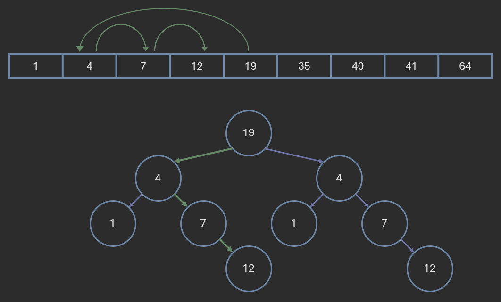

# AVL Trees

**Author:** *Brian Magnuson*

# Need for AVL Trees

Recall how we search for a node in a Binary Search Tree (BST). We start at the root and compare our target value with the current node. If the target value is equal to the current node key, we are done. If the target value is less than the current node key, we recursively search the left sub-tree. Otherwise, we search the right sub-tree.

This is reminiscent of binary search in a sorted array. We can find the middle element of the array and compare it with the target value. If the target value is less than the middle element, we search the left half of the array. Otherwise, we search the right half.



Based on this, we might expect BSTs to have a time complexity of O(log n) for search, insertion, and deletion. And indeed, these operations are O(log n) in the average case.

However, consider the case where we insert [1, 2, 3, 4, 5, 6] into a BST. We find that all the elements are inserted in a straight line. In this case, the tree is more like a linked list; the time complexity of search, insert, and delete operations becomes O(n). The fact is that BSTs can become unbalanced, resulting in worse time complexities.


If there were some way to ensure the tree is always balanced, we could guarantee O(log n) time complexity, giving us a more reliable and efficient data structure. As you will see in this lesson and in upcoming lessons, there are various self-balancing binary search trees that modify the BST structure to ensure it remains balanced.

What is the worst case time complexity of inserting an element into a BST?
- O(1)
- O(log n)
- O(n) (correct)
- O(n log n)
- O(n^2)


# AVL Tree Properties

**AVL trees**, named after their inventors Adelson-Velsky and Landis, are a type of self-balancing binary search tree.

Recall the current rules for a BST:

- For any node, all nodes in its left subtree have keys less than the node's key, and all nodes in its right subtree have keys greater than the node's key.

There are different ways to handle duplicate keys; one approach is to allow duplicate keys and store them in the right subtree. In future examples, we will ignore duplicate keys.

AVL trees add the following rules to the BST structure:

- For any node, a balance factor can be calculated as the difference between the heights of the left and right subtrees.
- For an AVL tree to be valid/balanced, the balance factor of every node must be in the range -1 to 1 inclusive.
- If an insertion/deletion operation results in a balance factor outside this range, rotations are performed to rebalance the tree.

I'll explain rotations later in this lesson. For now, let's focus on the balance factor.

# Balance Factor

We can calculate the **balance factor** by subtracting the height of the right subtree from the height of the left subtree, though this is merely a convention; we can subtract the height of the left subtree from the height of the right subtree as long as we are consistent. In our examples, we will use the following definition:

```
Balance Factor = Height of Left Subtree - Height of Right Subtree
```


In the above example BST, the balance factor of each node is written in parentheses. Remember, **for an AVL tree to be considered balanced, the balance factor of every node must be either -1, 0, or 1.**

Here are a few BSTs. Try to calculate the balance factor for each node and determine if the tree is balanced.


Is the above tree balanced?
- Yes (correct)
- No, there is an imbalance at 10
- No, there is an imbalance at 5
- No, there is an imbalance at 20

------


Is the above tree balanced?
- Yes
- No, there is an imbalance at 32 (correct)
- No, there is an imbalance at 16
- No, there is an imbalance at 24

------


Is this a valid AVL tree?
- Yes
- No, there is an imbalance at 48
- No, there is an imbalance at 8
- No, this isn't a binary search tree (correct)

You might wonder what happens when a tree has multiple imbalances or an imbalance of 3 or -3. We mentioned that we can fix these imbalances by performing rotations. However, **we generally handle imbalances as soon as they occur** (when a node is inserted or deleted). Rarely do we need to fix multiple imbalances. Converting a pre-built, unbalanced tree into a balanced tree is a complex operation that is outside the scope of this lesson.

# Rotations

A **rotation** is an operation that changes the structure of the tree while maintaining the BST semantics property. When an imbalance occurs due to insertion or deletion, we perform rotations to rebalance the tree. Rotations can be done in constant time, so they do not affect the time complexity of the operations.


For AVL trees, we have four types of rotations:

- Single rotations
  1. Left rotation
  2. Right rotation
- Double Rotations
  1. Left-right rotation
  2. Right-left rotation

To determine what rotation to perform, we need to calculate the balance factor of the node and its children. Here are the rules for determining the rotation:

- If the balance factor of a node is -2, the **node is right-heavy**. We then **observe** the **balance factor of the right child**.
  -   If the balance factor of the right child is -1, this is a right-right imbalance.
    -     We perform a **left rotation**.
  -   If the balance factor of the right child is 1, this is a right-left imbalance
    -     We perform a **right-left rotation**.
- If the balance factor of a node is 2, the **node is left-heavy**. We then **observe the balance factor of the left child**.
  -   If the balance factor of the left child is 1, this is a left-left imbalance
    -     We perform a **right rotation**.
  -   If the balance factor of the left child is -1, this is a left-right imbalance
    -     We perform a **left-right rotation**.

The left and right rotations are simple and involve applying a rotation to the imbalanced node. Here is an **example of a left rotation**:


Notice how before the rotation, there are three nodes in a straight line down to the right. This is a sign that a left rotation is needed. Remember to calculate the balance factor to determine if a rotation is needed.

Implementing a rotation in code involves carefully changing the pointers of the nodes. Without manual memory management, it can be easy to run into memory leaks or segmentation faults. If you're having trouble implementing rotations, consider using a pen and paper to draw out the tree and simulate the rotation. Here is an example of how to left rotate on a given `node`:

```cpp
Node* rotate_left(Node* node) {
    Node* grandchild = node->right->left;
    Node* new_parent = node->right;
    new_parent->left = node;
    node->right = grandchild;
    return new_parent;
}
```

The right rotation is similar to the left rotation but in the opposite direction. Here is an **example of a right rotation**:


The left-right and right-left rotations are a combination of two rotations. Here is an **example of a left-right rotation**:


In this example, a left rotation is performed at node '2', followed by a right rotation at node '6'. Notice how before the rotation, the three relevant nodes are in a zig-zag pattern. This is a sign that a left-right rotation is needed.

The right-left rotation is similar to the left-right rotation but in the opposite direction.

Since the left-right and right-left rotations are merely combinations of the left and right rotations, you could say there are only two types of rotations: left and right. Keep this fact in mind when implementing rotations in code.

# Insertion example

Let's go through an example of inserting nodes into an AVL tree and performing rotations to rebalance the tree. During this example, keep an eye on the balance factors of the nodes and see how the rotations are performed to maintain the balance.

We will insert the following nodes into an AVL tree in this order:

[32, 16, 8, 64, 48]

We'll start by inserting 32 and 16. The tree will look like this:


So far so good. Next, let's insert 8. This will cause the '32' node to have a balance factor of 2, indicating a left-heavy imbalance. We will need to perform a right rotation at the '32' node to rebalance the tree.


Now, let's insert 64. The tree will look like this:


This is still an AVL Tree. Finally, let's insert 48. This will cause the '32' node to have a balance factor of -2. 32's right child, 64, will have a balance factor of 1. This indicates a right-left imbalance. We will need to perform a right-left rotation at the '32' node to rebalance the tree.


Now you try it! In the following exercises, you will insert nodes into an AVL tree. Use pen and paper to draw the tree and perform rotations to rebalance it.

Insert the following nodes into an AVL tree in this order: [10, 20, 15, 5, 0].
Which of these is the correct pre-order traversal of the AVL tree after inserting the nodes?
- 10, 5, 0, 20, 15
- 10, 5, 0, 15, 20
- 15, 5, 0, 10, 20 (correct)
- 15, 5, 0, 20, 10

Insert the following nodes into an AVL tree in this order: [1, 2, 3, 4, 5, 6].
Which of these is the correct pre-order traversal of the AVL tree after inserting the nodes?
- 1, 2, 3, 4, 5, 6
- 2, 1, 4, 5, 6, 5
- 2, 1, 4, 3, 5, 6
- 4, 2, 1, 3, 5, 6 (correct)


# Time complexity

What is the time complexity of searching, inserting, and deleting in an AVL tree?
- O(1)
- O(log n) (correct)
- O(n)
- O(n log n)
- O(n^2)

# Other tips

Here are a few tips to keep in mind when working with AVL trees:

- When inserting a node, you may need to perform multiple rotations to rebalance the tree.
- Rotation functions involve manipulating multiple pointers. Be careful when implementing these functions to avoid memory leaks or segmentation faults.
- When checking the shape of the tree, you might be tempted to perform an in-order traversal. However, recall that AVL trees are BSTs, so the in-order traversal will be the same (in sorted order), regardless of whether the tree is balanced.
- Calculating the height of a node can be a costly operation. Consider storing height information in each node to avoid recalculating the height of the same subtree multiple times.
- Additionally, fix the height property of a node after relevant rotations.
