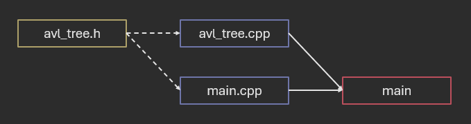
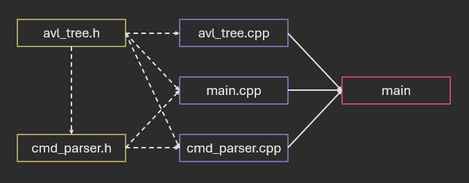
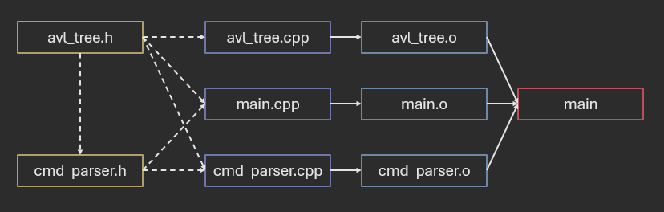
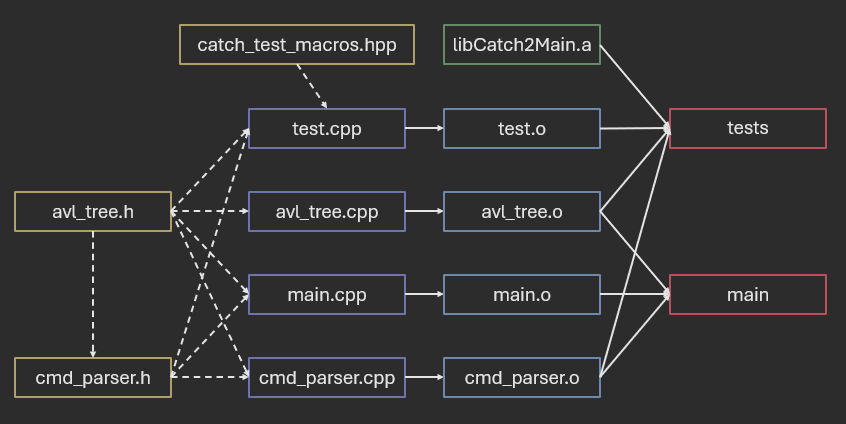

# Intro to CMake

**Author:** *Brian Magnuson*

In this lesson, we will be learning about CMake, a powerful, cross-platform build system that is used to build software projects.
If you're building a C++ project, you might've heard of CMake or have seen a `CMakeLists.txt` file in a project directory.
This lesson is optional, but it will be helpful if you want to understand how to build C++ projects using CMake.

In this lesson, we will cover:
- Building C++ (the hard way)
- CMake basics
- Using CMake with your IDE

This lesson won't teach you everything about CMake, but it will hopefully give you a good starting point, allowing you to read more about it on your own.

# Building C++ (The Hard Way)

In this first section, you'll learn that building a C++ project might be harder than you think. Most beginners only use a few files, so compiling them manually is not a big deal. But when you have a project with dozens of files, attempting to compile it all in a single command becomes painfully slow and tedious.

For demonstrative purposes, I'll be showing many `g++` commands. Don't worry about memorizing them (or even understanding them all). The point is to show you how difficult it can be to compile a project manually.

## Compiling a Single File

First, we'll start with the most basic C++ project: a project that has only one file, `main.cpp`. We'll create a graph to represent the project:


We represent our source files in purple (with a `.cpp` extension) and our executable in red (with no file extension). The solid arrow from `main.cpp` to `main` means that `main.cpp` is used to compile/link the `main` executable.

To compile this manually, you would run the following command:
```bash
g++ main.cpp -o main
```

Pretty basic. Next, let's add more files.

## Compiling Multiple Files

Next, let's add `avl_tree.cpp` and `avl_tree.h` to our project. We'll update our graph to reflect this change:


Here, we represent header files in yellow (with `.h` and `.hpp` extensions). The dashed arrows from the header file to the source files mean that the source files include the header file.

This makes sense; our `main.cpp` needs to use the functions defined in `avl_tree.cpp`, so it includes `avl_tree.h`. To compile this manually, you would run the following command:
```bash
g++ main.cpp avl_tree.cpp -o main
```

This isn't too bad. For added complexity, we'll add another source file, `cmd_parser.cpp` (short for command parser). We'll update our graph to reflect this change:



Here, the graph is starting to get a little more complex. Now we have `cmd_parser.cpp` and its header file, `cmd_parser.h`. Both of these files work closely with our avl tree, so they both include `avl_tree.h`.

The command to compile this manually would be:
```bash
g++ main.cpp avl_tree.cpp cmd_parser.cpp -o main
```

## Separating Compilation and Linking

So far, we've been able to compile everything in a single command. However, if there are a lot of files, compilation can take a long time. I've worked on projects with dozens of files, some thousands of lines long. Compiling everything in a single command can take a few minutes. Even if you think you can afford to wait a few minutes, you'll find that this gets in the way of rapid testing and iteration.

For larger projects, it can be faster to compile the source files individually and then link them together. This way, when the source files change, you only need to recompile the changed files. In this next graph, we'll separate the compilation and linking steps:



This graph is very similar to our last one, but we've a layer of object files between the source files and the executable. We represent the object files in blue (with a `.o` extension).

Now that we're compiling the source files individually, we'll need more commands to fully build the project:
```bash
g++ -c main.cpp -o main.o
g++ -c avl_tree.cpp -o avl_tree.o
g++ -c cmd_parser.cpp -o cmd_parser.o
g++ main.o avl_tree.o cmd_parser.o -o main
```

At this point, it might be too tedious to put these commands into a terminal one-by-one. You'll probably want to write a script or Makefile to run these commands for you.

You'll need to be careful about writing your Makefile, though, since not every file needs to be recompiled every time. Take a look at our graph again. If you change `main.cpp`, you only need to recompile `main.cpp`. If you change `avl_tree.cpp`, you only need to recompile `avl_tree.cpp`. But if you change `avl_tree.h`, you need to recompile everything that includes it.

If you're clever, you can design your Makefile to only recompile the files that need to be recompiled. But this can be difficult to get right, especially for beginners. And to top it off, we're not even done adding files to our project!

## Adding a Library

To add one final level of complexity, let's add a static library to our project. Static libraries are essentially archives of object files (which is why Unix-like systems give them a `.a` extension for "archive"). They allow code to be packaged up and reused in multiple projects.

For our simple project, there's a good reason why we'll want to add a library: testing. Many C++ testing frameworks are distributed as static libraries. We'll add the `catch2` library to our project. Historically, `catch2` has been distributed as a "header-only" library, meaning it only consisted of header files. Some of our course templates still use these versions of `catch2`. However, newer versions of `catch2` are distributed as a static library (version 3 and later).

As mentioned earlier, static libraries are archives of object files. We still need to include the proper header files in our project. `catch2`, like many libraries, provide both the header files and static libraries in the package. On Unix-like systems, these files are usually placed in `/usr/include` and `/usr/lib`, respectively. C++ compilers will automatically look in these directories for header files and libraries.

For testing, we'll create a new file, `test.cpp` that includes `catch2` and tests our `avl_tree` functions. This file will not be a part of our `main` executable, but rather a separate executable called `tests`. We'll update our graph to reflect this change:



Here, we represent the static library in green (with a `.a` extension).

You'll notice we now have two compilation targets: `main` and `tests`. Look closely at which files are used to compile each target. Notice how `tests` doesn't include `main.o` and `main` doesn't include `test.o` or `libCatch2Main.a`.

To compile this manually, you would run the following commands:
```bash
g++ -c main.cpp -o main.o
g++ -c avl_tree.cpp -o avl_tree.o
g++ -c cmd_parser.cpp -o cmd_parser.o
g++ main.o avl_tree.o cmd_parser.o -o main
g++ -c test.cpp -o test.o
g++ avl_tree.o cmd_parser.o test.o -lCatch2Main -lCatch2 -o tests
```

Our simple project has now gone from a single command to six commands. This also doesn't account for how libraries might be installed in non-standard locations. In such cases, you would need to specify the header locations with `-I` and the library locations with `-L`. Here is an example command:
```bash
g++ my_file.o -o my_executable -I/path/to/headers -L/path/to/libs -lmylib
```

Hopefully this can give you a sense of how difficult it can be to build a C++ project manually. This is where CMake comes in.

# CMake Basics

In my opinion, CMake can still be a little tedious to use, but not only does it make building C++ projects easier, it also makes things more elegant.

We've mentioned earlier that, if you're clever, you can design a Makefile that tracks dependencies and only recompiles the files that need to be recompiled.
CMake does this for you. You can think of it as a Makefile that generates Makefiles. Additionally, CMake can also generate build files for other build systems, like Visual Studio, Xcode, and Ninja. This allows the same project to be built on different platforms.

(This lesson is not finished)
