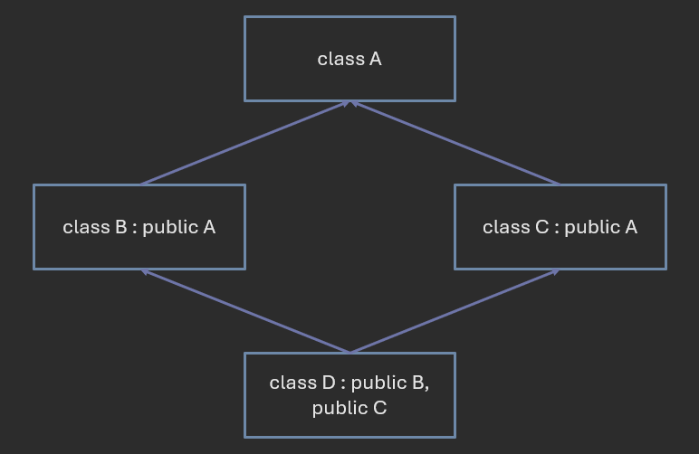

# C++ Classes

**Author:** *Brian Magnuson*

In this lesson, we'll continue where we left off in our C++ review.
We'll be discussing classes, which are a fundamental part of object-oriented programming (OOP).

In this lesson, we will cover:
- Class basics
- Constructors
- Member functions
- Copy constructors and copy assignment operators
- Destructors
- Static members
- Inheritance
- Abstract classes

# Class Basics

A class is usually defined in a header file, and its function implementations are defined in a separate source file. Some people prefer to define each class in its own header/source file pair. This can help keep your code organized and make it easier to find things.

Here's an example of a simple class definition:
```cpp
class MyClass {
    int z; // private by default
public:
    int x;
    int y;
};
```
Here, our class has two public member variables, `x` and `y`. These variables can be accessed and modified from outside the class.

To use our class, we can create an instance of it like this:
```cpp
MyClass obj;
obj.x = 5;
obj.y = 10;

std::cout << obj.x << " " << obj.y << std::endl; // Output: 5 10
```
The `.` operator is used to access the members of an object. Outside of the class definition, we can only access public members, i.e., members declared after the `public:` access specifier.

By default, members of a class are private, meaning they can only be accessed from within the class itself. To make members public, we use the `public:` access specifier. We can also use `private:` to declare private members after a public section.

There is another way to declare a custom composite type in C++: using a `struct`. The *only* difference between a `class` and a `struct` is that members of a `struct` are public by default, while members of a `class` are private by default.
```cpp
struct MyStruct {
    int x; // public by default
    int y; // also public by default
private:
    int z;
};
```

By specifying which members we want to make public or private, we can control how our class is used. This feature is known as **encapsulation**. Encapsulation allows us to hide certain features of our class from the outside world, preventing unwanted access and modification.

For your C++ projects in this course, you will be expected to utilize encapsulation to protect your class members.

# Constructors

Suppose we have the following classes:
```cpp
class Vector2D {
public:
    int x = 0;
    int y = 0;
};
class Character {
public:
    Vector2D position;
    int health;
    int power;
};
```

We can instantiate a `Character` in one of these ways:
```cpp
Character player_1 = Character();
Character player_2; // More concise
```

Both of these methods call the class's **default constructor**. A **constructor** is a special member function that instantiates an object of a class. A default constructor is a constructor that takes no arguments.

Since we didn't define any constructor for `Character`, C++ provides a default constructor for us. The automatic default constructor calls the default constructors of all the class's members, except for primitive types like `int`, which are not initialized. Using `player_1.health` at this point would be undefined behavior.

To define our own constructor, we can do this:
```cpp
class Character {
public:
    Point position;
    int health;
    int power;
    Character() {
        health = 100;
        power = 10;
    }
};
```

Constructors and destructors do not have a return type.

We can also declare the constructor outside the class definition:
```cpp
class Character {
public:
    Point position;
    int health;
    int power;
    Character();
};

Character::Character() {
    health = 100;
    power = 10;
}
```

To define class members outside the class definition, we use the scope resolution operator `::`. This operator is used to define functions that are declared inside a class. Remember, it's a good idea to put your function implementations in a separate source file.

You can also define your constructor like this:
```cpp
Character::Character() : health(100), power(10) {}
```

This method effectively does the same thing, but by using an initializer list like this, you can initialize members that cannot be assigned a value in the constructor body (such as `const` members).

You can also write constructors that take arguments:
```cpp
class Character {
public:
    Point position;
    int health;
    int power;
    Character(int h, int p) : health(h), power(p) {}
};
```

However, if you do not also have a default constructor, C++ will NOT provide one for you.

To instantiate a `Character` with this constructor, you would use one of these methods:
```cpp
Character player_1 = Character(100, 10);
Character player_2(100, 10); // More concise
```

# Member Functions

Member functions are functions that are part of a class. They can access the class's private members and are called using the `.` operator on an object of the class.

Here's an example of a class with a member function:
```cpp
class Character {
    Point position;
    int health = 100;
    int power = 10;
public:
    void move(int x, int y);
};

void Character::move(int x, int y) {
    position.x += x;
    position.y += y;
}
```

And we can use it like this:
```cpp
Character player;
player.move(5, 10);
```

Even though `position` is private, the `move` function can access it because it's a member of the `Character` class.

If `player` happened to be a pointer, we would have to dereference it to call the member function. The syntax for this is a bit messy which is why C++ provides a special operator `->` for this purpose:
```cpp
Character* player = new Character();
// (*player).move(5, 10);
player->move(5, 10);
```

All non-static member functions have access to a special pointer called `this`, which points to the object on which the function was called. Earlier, we did not need it because `position` unambiguously referred to the `position` member. However, if we had a parameter with the same name as a member, we would need to use `this` to access the member:
```cpp
void Character::take_damage(int health) {
    this->health -= health;
}
```

Notice that we have to use the `->` operator here since `this` is a pointer.

Both of these member functions, `move` and `take_damage` change, or **mutate**, the state of the object. Sometimes, we don't want to mutate the object. And in some cases, we *can't* mutate the object.
```cpp
const Character player;
// player.move(5, 10); // Error: Cannot call non-const member function on const object
```

This helps make sure we don't accidentally change the state of an object when we shouldn't. But not every member function will mutate the object. In these cases, we need to tell the compiler that the function won't change the object's state by using the `const` keyword:
```cpp
bool Character::is_alive() const {
    return health > 0;
}
```

By marking the function as `const`, we disallow any modifications to `this` inside the function. We can then call this function on a `const` object:
```cpp
const Character player;
player.is_alive(); // OK
```

It is good practice to mark member functions as `const` if they do not modify the object's state.

On rare occasions, you will want to create a member function that returns a reference to a member variable for the caller to access and possibly modify. In these cases, you may need both a `const` and non-`const` version of the function. This is the case for many STL containers, like `std::vector`.

# Copy Constructors and Copy Assignment Operators

There are two ways to create a copy of an object in C++: the copy constructor and the copy assignment operator.
```cpp
Character player_1;
Character player_2 = player_1; // player_2 is copy-constructed from player_1
Character player_3;
player_3 = player_1; // player_3 is copy-assigned from player_1
```

The difference between the two is that one is used to create a new object, while the other is used to assign an existing object.

The copy constructor and copy assignment operator have these signatures:
```cpp
Character(const Character& other);
Character& operator=(const Character& other);
```

If you do not define a copy constructor or copy assignment operator, C++ will provide a default implementation for you. This implementation will simply copy each member of the object one by one.

If one of your members is a pointer, this default implementation will copy the pointer, not the object it points to. In other words, both objects will point to the same memory location. This is known as a **shallow copy**. This can be problematic if one of your objects will deallocate the memory it points to. The other object will be left with a dangling pointer.
```cpp
class Character {
    char* name;
};
```

To fix this, you need to define your own copy constructor and copy assignment operator. This is known as a **deep copy**.
```cpp
Character(const Character& other) {
    name = new char[strlen(other.name) + 1];
    strcpy(name, other.name);
}
Character& operator=(const Character& other) {
    if (this != &other) {
        delete[] name;
        name = new char[strlen(other.name) + 1];
        strcpy(name, other.name);
    }
    return *this;
}
```

Notice how the copy assignment operator has to return `*this`.

On the rare occasion that you want to prevent copying of your object, you can delete the copy constructor and copy assignment operator:
```cpp
class Character {
    Character(const Character& other) = delete;
    Character& operator=(const Character& other) = delete;
};
```

You can also do this with the default constructor and destructor.

There is another special set of member functions called **move constructors** and **move assignment operators**. These are used to transfer ownership of resources from one object to another. We won't cover them in this lesson.

# Destructors

A **destructor** is another special member function. It is used to clean up resources that the object has acquired during its lifetime. It is automatically called under the following circumstances:
- If the object is allocated on the stack, the destructor is called when the object goes out of scope.
- If the object is allocated on the heap, the destructor is called when `delete` is called on the object.

Like the constructor, it has no return type. It also does not take any arguments.
```cpp
class Character {
    char* name;
public:
    Character(const char* n) {
        name = new char[strlen(n) + 1];
        strcpy(name, n);
    }
    /* copy constructor and copy assignment operator here */
    ~Character() {
        delete[] name;
    }
};
```

A common rule of thumb is that for the copy constructor, copy assignment operator, and destructor, if you need to define one, you probably need to define all three.

If you don't define a destructor, C++ will provide a default implementation for you. This implementation will not delete any resources that the object has acquired, which can lead to memory leaks.

# Static Members

A **static member** is a member of a class that belongs to the class itself, not any particular instance of the class. Static members are shared among all instances of the class. They are declared with the `static` keyword.
```cpp
class Character {
    static int num_characters; // A static member variable
public:
    // A static member function
    static int get_num_characters() {
        return num_characters;
    }
    /* Constructor, destructor, etc. */
};
```

Please note that this use of the keyword `static` is different from the use of `static` in a global context (how C users might be familiar with it).

A static member variable cannot be initialized inside the class definition unless it is a `const` integral type. Instead, you must initialize it outside the class definition. You can do this in the source (`.cpp`) file.
```cpp
int Character::num_characters = 0;
```

To access a static member, you use the scope resolution operator `::`, or use an instance of the class.
```cpp
Character::num_characters++;
Character::get_num_characters();
player.get_num_characters(); // Also valid, but less obvious
```

# Inheritance

Let's say you want to create a new class that is similar to an existing class, but with some additional features. You can use **inheritance** to achieve this.
```cpp
class Player : public Character {
    int score;
public:
    Player(int h, int p, int s) : Character(h, p), score(s) {}
};
```

Here, we write `Player : public Character`. This means that `Player` inherits from `Character`. This allows `Player` to access all of `Character`'s members and member functions. We can also add new members and member functions to `Player` like `score`.

We interpret public inheritance as an "is-a" relationship. In this case, a *`Player` is a `Character`*.
There are different types of inheritance in C++: **public**, **protected**, and **private**. You probably won't need to use the latter two in this course, so we will focus on public inheritance.

If the members of `Character` are private, `Player` will not be able to access them. If we want `Player` to access them, but maintain some level of encapsulation, we can use the `protected:` access specifier:
```cpp
class Character {
protected:
    int health;
    int power;
};
```

This makes it so that only `Character` and its derived classes can access these members.

Inheritance allows us to create new classes while reusing existing code. This is a key feature of OOP. Inheritance also allows for **polymorphism**.

Suppose we want to change the behavior of the `take_damage` function for a `Player`. We can override the function in the `Player` class:
```cpp
class Player : public Character {
    int score;
public:
    Player(int h, int p, int s) : Character(h, p), score(s) {}
    void take_damage(int damage) {
        health -= damage / 2;
    }
};
```

Now, when we call `take_damage` on a `Player`, it will use the `Player` version of the function, not the `Character` version.

In C++, pointers of a base class to point to objects of a derived class. In our case, we can make a `Character*` point to a `Player` object. After all, a `Player` is a `Character`.
```cpp
Character* player = new Player(100, 10, 0);
```

This has a few caveats.
First, we cannot access `score` through `player` because C++ does not know if `score` exists in this kind of character. If we're careful, we can cast `player` to a `Player*` to access `score`.
```cpp
Player* player = dynamic_cast<Player*>(character);
if (player) {
    std::cout << player->score << std::endl;
}
```

Dynamic casting is a way to safely cast a pointer of a base class to a pointer of a derived class. If the cast fails, `dynamic_cast` will return `nullptr`.

Second, if we try to call `take_damage` on `player`, it will call the `Character` version of the function. To fix this, we need to make the function `virtual` in the base class:
```cpp
class Character {
public:
    virtual void take_damage(int damage); // Add the virtual keyword
};
```

When you make a function `virtual`, you are telling the compiler that this function can be overridden by derived classes. While we're at it, we should also mark the overriding function with the `override` keyword:
```cpp
class Player : public Character {
public:
    void take_damage(int damage) override; // Add the override keyword
};
```

The `override` keyword is not strictly necessary, but it ensures that the function is overriding the correct function in the base class.

Now, when we call `take_damage` on a `Character*`, it will call the correct version of the function.
```cpp
Character* player = new Player(100, 10, 0);
player->take_damage(10); // Calls Player::take_damage
```

Third, when we delete a `Character*`, only the `Character` destructor will be called. This is bad since `Player` has its own resources to clean up. To fix this, we need to make the destructor `virtual` in the base class:
```cpp
class Character {
public:
    virtual ~Character();
};
```

Polymorphism is tricky, but it can be a powerful tool when used correctly. We can have a collection of `Character*` pointers that point to different types of characters and call the correct functions on them.
```cpp
std::vector<Character*> characters;
characters.push_back(new Player(100, 10, 0));
characters.push_back(new Character(100, 10));
for (Character* character : characters) {
    character->take_damage(10);
}
```

It is possible for a class to inherit from multiple classes. The derived class will inherit all the members and member functions of the base classes. This is known as **multiple inheritance**. We will not go too in-depth on this topic. However, multiple inheritance can lead to a potential problem called the **diamond problem**.



Simply put, you cannot instantiate a derived class properly if it has two base classes that both inherit from the same class. To fix this, you can use **virtual inheritance**. You can read more about the diamond problem [here](https://www.geeksforgeeks.org/diamond-problem-in-cpp/).

# Abstract Classes

Earlier, we explained how the `virtual` keyword allows a function in a base class to be overridden by a derived class. In addition to the `virtual` keyword, we can add the pure specifier `= 0` to a function to make it a **pure virtual function**.
```cpp
class Entity {
public:
    virtual void update() = 0;
    virtual ~Entity() {}
};
```

By using the pure specifier, we indicate that this function has *no implementation* in this class. You cannot write a body for a pure virtual function.

When a class has at least one pure virtual function, it becomes an **abstract class**. Abstract classes cannot be instantiated. They are used as a base class for other classes that will provide implementations for the pure virtual functions.
```cpp
class Character : public Entity {
public:
    void update() override {
        // Update character
    }
};
```

If we choose not to override `update`, then `Character` will also be an abstract class. To make a concrete class, we must override all pure virtual functions.

You can still create pointers of an abstract class type, so the rules of polymorphism still apply.

Abstract classes are useful in a variety of situations:
- It may not always make sense to give every base class function an implementation. The class is too abstract.
- You might want to prevent a base class from being instantiated. The user must use a derived class.
- You need to enforce a derived class to implement a certain function with certain inputs and outputs. In this way, you create an interface for outside users to follow and a *contract* that derived classes must adhere to.
  - This is the basis of how interfaces work in other languages.

# Practice

Let's go through a few practice problems to check your understanding of classes in C++.

Consider the following code:
```cpp
class MyClass {
    int x;
};
```
Which of the following statements are true?
- `x` is a public member variable
- `MyClass` does not have a constructor
- When constructed, `x` will be uninitialized
- `MyClass` is not copyable
- None of these are true

<details>
<summary>Answer</summary>
When constructed, `x` will be uninitialized
</details>

---

Consider the following code:
```cpp
int main() {
    MyClass obj;
    MyClass* obj_ptr = new MyClass();
    return 0;
}
```
Which of these objects will have their destructor called when `main` returns?
- Neither of them
- `obj` only
- `obj_ptr` only
- Both `obj` and `obj_ptr`

<details>
<summary>Answer</summary>
`obj` only
</details>

---

Consider the following code:
```cpp
class MyClass {
    int x;
public:
    MyClass(int x) : x(x) {}
};
```
Which of the following statements NOT true?
- `MyClass` is default-constructible
- `MyClass` is copy-constructible
- `MyClass` is copy-assignable
- All of these are true

<details>
<summary>Answer</summary>
`MyClass` is default-constructible
</details>

---

Consider the following code:
```cpp
int MyClass::get_x() const {
    return x;
}
```
What does the `const` keyword do in this context?
- The integer returned by `get_x` must be captured by a `const` variable
- The `get_x` function cannot be called on a `const` object
- The implementation of `get_x` cannot be changed
- The `get_x` function cannot modify the object's state
- It does nothing since the function does not return a reference

<details>
<summary>Answer</summary>
The `get_x` function cannot modify the object's state
</details>

---

Consider the following code:
```cpp
class MyClass {
    std::vector<int> data = {1, 2, 3};
public:
    int& at(int i) {
        return data.at(i);
    }
};
int main() {
    const int& x = MyClass().at(0);
    return 0;
}
```
What is the issue with this code?
- `data` cannot be initialized in the class definition
- `at` is not a `const` member function
- `MyClass` is not instantiated correctly
- `data` is not cleaned up when after `main` returns

<details>
<summary>Answer</summary>
`at` is not a `const` member function
</details>

---

Consider the following code:
```cpp
MyClass obj;
MyClass obj2 = obj;
```
Which function was called as a result of the second line?
- The default constructor
- The copy constructor
- The copy assignment operator
- The destructor

<details>
<summary>Answer</summary>
The copy constructor
</details>

---

What is the output of this code?
```cpp
struct Dog {
    virtual void bark() {std::cout << "Woof!" << std::endl;}
};
struct BigDog : Dog {
    void bark() override {std::cout << "WOOF!" << std::endl;}
};
int main() {
    Dog* dog_ptr = new BigDog();
    dog_ptr->bark();
    delete dog_ptr;
    return 0;
}
```
- `Woof!`
- `WOOF!`
- `Woof!WOOF!`
- (compiler error)
- (runtime error due to ambiguity)

<details>
<summary>Answer</summary>
`WOOF!`
</details>

# Conclusion

That's it for this lesson! We've covered nearly everything you need to know about C++'s syntax and object-oriented programming in C++. We hope you've enjoyed these lessons and feel more comfortable with C++.

# References

- [C++ Reference](https://en.cppreference.com/w/cpp)
- [GeeksForGeeks](https://www.geeksforgeeks.org/c-plus-plus/)
