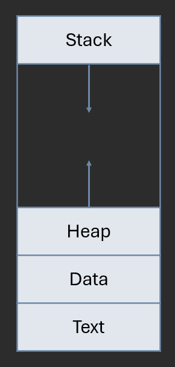

# C++ Memory and Arrays

**Author:** *Brian Magnuson*

In this lesson, we'll continue where we left off in our C++ review. 

In this lesson, we'll cover the following topics:
- Memory Model
- Pointers
- Arrays
- Heap Memory Management
- Heap-Allocated Arrays
- Smart Pointers

# Memory Model

The memory used by a process is often organized into segments:
- **Text Memory**: Contains the executable code.
- **Data Memory**: Contains global and static variables.
- **Stack Memory**: Contains local variables and function call information.
- **Heap Memory**: Contains dynamically allocated memory.



The C++ standard does not use the words "stack memory" and "heap memory" and instead uses the terms "automatic storage duration" and "dynamic storage duration". 

To avoid confusion, we'll use the terms "stack memory" and "heap memory" in this lesson and future lessons. This is also to avoid confusion between the terms "dynamic array" and "dynamically-allocated array", which are two different things.

In practice, the memory used by a process is often shuffled around by the operating system. This is primarily to avoid users from accessing memory that they shouldn't be accessing, such as text memory. However, it is useful to think of memory in this segmented manner.

Whenever you create a local variable in a function, it is stored in the stack memory. 
```cpp
void foo() {
    int x = 5;
}
```
The memory for the variable is allocated when the function is called and deallocated when the function returns.

Functions in C++ can call themselves, which is known as **recursion**. Each recursive call creates a new stack frame. If the recursion goes too deep, the stack will overflow and the program will crash.
```cpp
void foo(int x) {
    if (x == 0) {
        return;
    }
    std::cout << foo(x - 1) << std::endl;
}
```

Here, if you call this function with a value of `-1`, the function may recurse very deeply and cause a stack overflow.

We'll discuss heap memory later in this lesson.

# Pointers

A **pointer** is a variable whose value is an address in memory. You can create a pointer to any type by using the type followed by an asterisk `*`. You can get the address of a variable by using the `&` operator in front of the variable name.
```cpp
int x = 5;
int* p = &x;
```

Some people also prefer to put the asterisk next to the variable name: `int *p`. This is a matter of personal preference. I prefer to put the asterisk next to the type name.

If you were to print `p`, you would get the address of `x`. This could be any address in memory, so knowing the exact number is usually not useful.

You can dereference a pointer by using the `*` operator in front of the pointer name. This will give you the value at the address stored in the pointer.
```cpp
std::cout << *p << std::endl; // 5
```

The variable `p` does not store the value `5`. Only `x` stores the value of `5`. We can use dereferencing to change the value of `x` through the pointer.
```cpp
*p = 10;
std::cout << x << std::endl; // 10
```

You might notice that this behavior is similar to using references. Indeed, you can use pointers in a similar fashion. However, pointers allow you to do a few more things such as pointer arithmetic and heap memory allocation. These can be dangerous if not used correctly.

Typically, you should use references unless you have a reason to use pointers.

You can add `const` in front of the pointer type. This does not make the pointer constant, but rather prevents users from modifying the value through the pointer.
```cpp
int y = 5;
const int* q = &x;
*q = 10; // Not allowed
q = &y; // Allowed
```

You can also use const after the asterisk to make the pointer itself constant.
```cpp
int* const r = &x;
r = &y; // Not allowed
*r = 10; // Allowed
```

And you can also use both. But it's a little overkill.
```cpp
const int* const s = &x;
```

You can also create a pointer to a pointer. This is sometimes useful when you want to modify a pointer in a function.
```cpp
int** pp = &p;
```

You can also create a `void*` pointer. This is arguably the most dangerous pointer type because it can point to any type. You can cast a `void*` pointer to any other pointer type.
```cpp
void* vp = &x;
int* ip = static_cast<int*>(vp);
```

You should avoid using `void*` pointers whenever possible. People may use them to get around type checking, but this can easily lead to bugs and there are many safer alternatives such as `std::any` and `std::variant` (These are part of the C++17 standard).

Pointers are usually initialized to the address of a variable. However, you can also assign them to `nullptr` to indicate that they are not pointing to anything.
```cpp
int* p = nullptr;
```

`nullptr` and `NULL` are sometimes used interchangably, though both are effectively the same as `0`. Whenever you have a pointer, but no memory address to point to, you should always use `nullptr`.

Finally, on the topic of dereferencing, you should never dereference a pointer to memory that you don't own. This includes `nullptr`. Attempting to do so can lead to undefined behavior. In many cases though, your operating system will give the process a `SIGSEGV` signal and terminate the program. This is also known **segmentation fault**. A segmentation fault occurs whenever you try to access memory that you don't own.

# Arrays

An **array** is a contiguous block of memory that stores elements of the same type. You can create an array using any of the following syntaxes:
```cpp
int arr1[5]; // Array of 5 integers
int arr2[] = {1, 2, 3, 4, 5}; // Array of 5 integers
int arr3[5] = {1, 2, 3, 4, 5}; // Array of 5 integers
```

Arrays require a size that can be determined at compile time (though some compilers allow variable-length arrays as an extension). The second line above infers the size of the array from the number of elements in the initializer list.

You can access elements of an array using the subscript operator `[]`. The index starts at 0.
```cpp
std::cout << arr2[0] << std::endl; // 1
```

There are few ways to get the size of an array. The first way is to use the `sizeof` operator. This actually gives you the size of the array in bytes, so you need to divide by the size of the type to get the number of elements.
```cpp
sizeof(arr2) / sizeof(arr2[0]); // 20 / 4 = 5
```

***This only works for stack-allocated arrays with a size known at compile time.***

C++'s standard library provides an `std::array` wrapper class which provides a size member function.
```cpp
std::array<int, 5> arr4 = {1, 2, 3, 4, 5};
std::cout << arr4.size() << std::endl; // 5
```

Aside from this, the only reliable way to get the size of an array is to keep track of it yourself. And even this can be error-prone. Because of this, we recommend to use `std::vector` whenever possible.

The `std::vector` class is a dynamic array that can grow and shrink in size. It is part of the C++ standard library and is much safer than using raw arrays.
```cpp
std::vector<int> vec = {1, 2, 3, 4, 5};
vec.push_back(6); // Can't do this with raw arrays!
std::cout << vec.size() << std::endl; // 6
vec.pop_back();
std::cout << vec.size() << std::endl; // 5
```

Array-type variables, under the hood, are actually pointers to the first element of the array. This is why you can pass arrays around despite the fact that arrays can be of any size.

If you try to perform arithmetic on an array, you can access elements before and after the first element.
```cpp
int arr[] = {1, 2, 3, 4, 5};
std::cout << *(arr + 1) << std::endl; // 2
int* ptr = arr;
std::cout << *(ptr + 1) << std::endl; // 2
```

Whenever you add to an array or pointer, you are actually adding increments of the size of the type. Here, we add 1 to the pointer, but we are actually moving over `1 * sizeof(int)` bytes, which is 4 bytes.

You can also use this method to access elements *before* the first element or *after* the last element. This can result in undefined behavior and is one of the most common ways to misuse pointers and can potentially lead to security vulnerabilities or a segmentation fault.
```cpp
int var = 6;
int arr[] = {1, 2, 3, 4, 5};
std::cout << *(arr - 1) << std::endl; // Undefined behavior (but it might also print 6)
```

It goes without saying, but ***you should never access memory that you don't own***.

# Memory Management

Sometimes, you will need to allocate memory on the heap. This is useful for a few reasons:
- The stack is thought of as being limited in size while the heap is much larger, so it is suitable for allocating large amounts of memory.
- You can allocate memory on the heap and keep it around after the function returns.
- You may need to allocate an amount of memory that is not known at compile time (a requirement for pretty much any data structure).

To allocate a single value on the heap, you can use the `new` operator along with the type and any arguments needed for the constructor.
```cpp
int* p = new int(5);
MyObject* obj = new MyObject();
```

Note that `p` is a pointer. We've already used pointers to store addresses to stack memory. Here, we're storing the address of heap memory. You can't easily tell the difference between stack memory and heap memory just by looking at the pointer.

Additionally, `p` is still a stack-allocated variable. The memory for `5` is allocated on the heap, not the pointer. This means that `p` can fall out of scope, just like any other variable. However, the memory for `5` *will not* be deallocated. So as long as we keep the value of `p` around, we can access the memory for `5`.

If we, perhaps by accident, lose the pointer to the memory, then `5` is no longer accessible. The memory will be deallocated eventually when the process terminates, but if we keep allocating memory without freeing it, we can run out of memory. This is known as a **memory leak**. Programs that leak memory for long periods of time can consume all available memory and eventually crash.

To deallocate memory, you can use the `delete` operator. This will deallocate the memory and call the destructor if the type has one.
```cpp
delete p;
delete obj;
```
C++ does not provide garbage collection like Java or Python. Whenever you allocate memory with `new`, you must deallocate it with `delete`. Perhaps the worst part about this is that you cannot deallocate memory more than once. This is known as a **double free** and is also an error. So you can't just delete every pointer whenever you feel like it.

Calling `delete` on a pointer to an class/struct object will also call the destructor for that object before deallocating the memory. If you set up your destructors wisely, calling `delete` on a pointer to an object can set off a chain of deletes that cleans up all the memory associated with that object.

Another important point is that `delete` does not remove the pointer from scope. Usually this isn't a problem since you might not use the pointer again and the pointer will fall out of scope. However, this can be a problem if you have many pointers to the same object and you run `delete` on one of them. The other pointers will still point to the memory, but the memory is no longer valid. This is known as a **dangling pointer**. If you have a pointer to deallocated memory, you should set the pointer to `nullptr`. 
```cpp
p = nullptr;
obj = nullptr;
```

Attempting to dereference a null pointer is still an error, but at least you can check if the pointer is null before dereferencing it.

# Heap-Allocated Arrays

We'll finish this lesson by discussing heap-allocated arrays. This is similar to allocating a single value on the heap, but uses a slightly different syntax.
```cpp
int* arr = new int[5];
int* arr2 = new int[5] {1, 2, 3, 4, 5};
MyObject* objs = new MyObject[5];
```

Note: the third line only works for objects that are default-constructible. If the object is not default-constructible, you should either define a default constructor, use an initializer list, or override the `new[]` operator.

You can access elements of the array using the subscript operator `[]` just like with stack-allocated arrays.
```cpp
std::cout << arr2[0] << std::endl; // 1
```

Just like with stack allocated arrays, you should keep track of the size of the array yourself. The `sizeof` operator will not work for heap-allocated arrays. You should not try to access memory outside the bounds of the array.

To deallocate a heap-allocated array, you should use the `delete[]` operator.
```cpp
delete[] arr;
delete[] arr2;
delete[] objs;
```

Do not use `delete[]` with an object allocated with `new` or use `delete` with an array allocated with `new[]`. This can lead to undefined behavior.

If you are creating your own data structure and you intend to use heap-allocated arrays, you can use `delete[]` in the destructor of the class. This will ensure that the memory is deallocated when the object is destroyed.

Most STL containers such as `std::vector` allocate memory on the heap. You don't need to use `new[]` or `delete[]` with these containers. The containers will handle memory management for you. For this reason, you should prefer to use STL containers whenever possible (unless we tell you otherwise for, say, a programming problem).

# Practice

Consider the following code:
```cpp
int i = 7;
int* p = &i;
```
Which of the following does NOT evaluate to 7?
- `i`
- `*p`
- `p` (correct)
- `*(&i)`
- (all of these evaluate to 7)

---

What is the output of the following code?
```cpp
#include <iostream>
int main() {
    int arr[] = {1, 2, 3, 4, 5};
    for (int i = 1; i < 4; i++) {
        std::cout << arr[i];
    }
    return 0;
}
```
- 12345
- 1234
- 234 (correct)
- 2345
- (results in undefined behavior/segmentation fault)

---

What is the output of the following code?
```cpp
#include <iostream>
int main() {
    int* p = new int(5);
    std::cout << *(p + 1) << std::endl;
    return 0;
}
```
- 0
- 5
- 6
- (results in undefined behavior/segmentation fault) (correct)

---

What is the error in the following code?
```cpp
#include <iostream>
int main() {
    int* p = new int[5] {1, 2, 3, 4, 5};
    std::cout << p[3] << std::endl;
    delete p;
    return 0;
}
```
- `p` should have the type `int[]`, not `int*`.
- The syntax after the `new` operator is incorrect for an array.
- The access to `p[3]` is out of bounds.
- The `delete` operator should be `delete[]` (correct)

# Smart Pointers

Before we wrap things up, I should take a moment to explain smart pointers. Smart pointers are wrappers around raw pointers that provide automatic memory management. They are defined in the `<memory>` header and are part of the C++11 standard.

C++ offers two main types of smart pointers: `std::shared_ptr` and `std::unique_ptr`.

A `std::shared_ptr` can be initialized using the pointer's constructor or using the `std::make_shared` function (which accepts the arguments needed to construct the allocated object).
```cpp
std::shared_ptr<int> p1(new int(5));
std::shared_ptr<int> p2 = std::make_shared<int>(5);
```

Shared pointers use a memory management strategy called **reference counting**.
They keep track of how many shared pointers are pointing to a particular object. When the last shared pointer pointing to an object is destroyed, the object is deallocated.


One way to think about this is to imagine a group of people watching TV together. The first person to enter the room turns on the TV. Each person that enters the room has access to the TV remote. Then, when the last person leaves the room, they turn off the TV.

People who first learn about shared pointers might be tempted to use them for everything to avoid leaking memory. However, ***it is still possible to create memory leaks with shared pointers***. If you have a cycle of shared pointers, the reference count will never reach zero and the memory will never be deallocated.


One way to think about this is to imagine two people watching TV, and each person will only leave the room if the other person leaves first. In this setup, neither person will leave the room first, so the TV will never be turned off.

This can easily happen with cyclic graphs, doubly-linked lists, or any other data structure that has pointers pointing to each other.

To get around this, C++ offers `std::weak_ptr`, a pointer that does not increment the reference count. You can read more about weak pointers [here](https://en.cppreference.com/w/cpp/memory/weak_ptr).

An `std::unique_ptr` is similar to an `std::shared_ptr`, but with one crucial difference: *it cannot be copied*. This also means that there is no need for reference counting since there can only ever be one `std::unique_ptr` pointing to an object. When the `std::unique_ptr` is destroyed, the object is deallocated.
```cpp
std::unique_ptr<int> p1(new int(5));
std::unique_ptr<int> p2 = std::make_unique<int>(5);
```

Since `std::unique_ptr` cannot be copied, you cannot easily pass it to a function that takes a pointer by value. The only way to keep the pointer around is to pass it by reference, or to use `std::move` to transfer ownership of the pointer. You can also release the pointer from the `std::unique_ptr`, though this negates the purpose of using a smart pointer in the first place.

Rust developers may find these concepts familiar as it uses a similar system of ownership and borrowing for its pointers.

For this course, you will not be expected to use smart pointers, and the projects that require memory management are fairly easy to manage manually. However, it's good to know about smart pointers for when you work on larger projects.

# Conclusion

That's all for this lesson. We've covered the memory model, pointers, arrays, and heap memory management. In the next lesson, we'll discuss classes and object-oriented programming.
