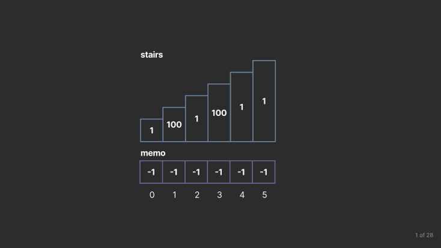

# Dynamic Programming

## Table of Contents

1. [Introduction](#introduction)
2. [Min Cost Climbing Stairs (1-Dimensional)](#min-cost-climbing-stairs-1-dimensional)
3. [Unique Paths 2-Dimensional](#unique-paths-2-dimensional)
4. [Conclusion](#conclusion)
5. [References](#references)

## Introduction

Dynamic programming (dp) is an algorithmic paradigm referring to:

1. an optimal substructure,
2. overlapping subproblems.

*Optimal substructure* refers to breaking down the problem into a recursive formulation such that the problems can be broken down into overlapping subproblems. If an optimal substructure is not found a problem is not solvable via dynamic programming.

*Overlapping subproblems* means the set of subproblems should be *small* and the problem requires solving them a large number of times. We can *memoize* the overlapping subproblems in a cache (typically an array or hash table) to be referenced when solving problems so we do not waste resources re-calculating solutions.

A classic example is the Fibonacci sequence, $F_i=F_{i-1}+F_{i-2}$ with base case $F_0=1, F_1=1$. The fibonacci sequence is a classic dynamic programming problem, so we won't be solving it in this lesson, just displaying the brute force nature of the naïve solution. The code below calculates the 30th fibonacci number and counts the number of times we call the function `fib` with a `steps` variable.

```c++
#include <iostream>

using namespace std;

int fib(int n, int &steps)
{
    steps++;
    if (n == 0)
        return 0;
    else if (n == 1)
        return 1;
    return fib(n - 1, steps) + fib(n - 2, steps);
}

int main()
{
    int steps = 0;
    int result = fib(40, steps);
    cout << "Result: " << result << endl;
    cout << "Steps: " << steps << endl;
}
```

The output of running the program gives the following output:

```txt
Result: 102334155
Steps: 331160281
```

Although we're only calculating the 40th fibonacci number, this results in over 300 million steps! The set of subproblems only includes 40 problems ($F_0$ to $F_{39}$), we're doing much more than 40 steps. Each function call `fib(n, steps)` is $O(1)$ so the issue arises in that we're doing redundant calculations when revisiting subproblems.

The runtime can better be quantified through its time complexity of $O(1.618^n)$ where $n$ is the $n$-th fibonacci number. That is an *exponential* time complexity! Many of the brute force algorithms previously covered in this course covered have been polynomial.

An exponential aglgorithm is impractical in real-world use, so we'd need to reduce the time complexity for this algorithm to be useful. When you would like to **reduce time complexity** and there are **redundant calcuations**, dynamic programming should be a promising candidate. Dynamic programming can reduce the fibonacci sequence algorithm to *O(n)*, a vast improvement from an exponential complexity.

### Dynamic Programming Approaches

Since dynamic programming involves expressing the problem as a recursive formulation, there are 2 ways to approach these problems:

#### Top Down (Memoization)

Top down dynamic programming (memoization) is a direct result of the recursive formulation. A general outline is listed below:

1. Begin at a problem
2. Break it into subproblems
3. If subproblem has been solved (use memoized value)
4. Otherwise, solve subproblem (go back to step 1) and store result in cache

#### Bottom Up (Tabulation)

Bottom up dynamic programming (tabulation) typically follows the outline:

1. Begin at a subproblem (usually base case)
2. Solve the subproblem and store result
3. Solve larger problem and use subproblem result to solve

#### Top Down vs Bottom Up

Top down is typically more straight-forward to implement than bottom up since it is a direct implementation of the recursive formula. You begin at the overall problem, and solve the subproblems necessary for the overall problem. However, since top down is generally recursive, the space allocated for stack space may be too much.

Bottom up can be less efficient at times since you may iterate solve subproblems not necessary for solving the larger problem. It may also be more difficult to implement because you have to figure out the order to solve the subproblems.

### Dynamic Programming Problems

Dynamic programming problems are typically classified based on the dimension of the table used to memoize the problem. You will typically run into 1-dimensional and 2-dimensional problems, although 3-dimensional, 4-dimensional, etc. problems exist (we will not be going into those during this course).

## Min Cost Climbing Stairs (1-Dimensional)

We will practice 1-dimensional dynamic programming on the problem [746. Min Cost Climbing Stairs](https://leetcode.com/problems/min-cost-climbing-stairs/). Feel free to attempt the problem via top down programming before looking at the solution.

### Problem Statement

You are given an integer array cost where `cost[i]` is the cost of `i`th step on a staircase. Once you pay the cost, you can either climb one or two steps.

You can either start from the step with index 0, or the step with index 1.

Return the *minimum cost* to reach the top of the floor.

**Example 1**:

```txt
Input: cost = [10,15,20]
Output: 15
Explanation: You will start at index 1.
- Pay 15 and climb two steps to reach the top.
The total cost is 15.
```

**Example 2**:

```txt
Input: cost = [1,100,1,1,1,100,1,1,100,1]
Output: 6
Explanation: You will start at index 0.
- Pay 1 and climb two steps to reach index 2.
- Pay 1 and climb two steps to reach index 4.
- Pay 1 and climb two steps to reach index 6.
- Pay 1 and climb one step to reach index 7.
- Pay 1 and climb two steps to reach index 9.
- Pay 1 and climb one step to reach the top.
The total cost is 6.
```

### 1D Brute Force Solution

A naïve solution would be to try all possible paths starting from the first step and choose the path with the minimum cost. The only base case is when we've reached the end of the stair case, we should return 0 in this case because there are no more steps to climb. The solution is given below:


```c++
int bruteForce(vector<int>& cost, int step) {
    if (step >= cost.size()) return 0;
    return cost[step] + min(bruteForce(cost, step + 1), bruteForce(cost, step + 2));
}

int minCostClimbingStairs(vector<int>& cost) {
    return min(
        bruteForce(cost, 0),
        bruteForce(cost, 1)
    );
}
```

### 1D Brute Force Time Complexity

The time complexity is $O(2^n)$, where $n$ is the number of steps in the staircase (more precisely, the time complexity is $O(1.618^n)$ as the logic is the same as the fibonacci sequence). To visualize this, observe the decision tree shown below on an example with 5 steps:


The value in each node represents the subproblem being solved (i.e. 4 represents the call `bruteForce(cost, 4)`). Observe that we revisit subproblems such as 2 and 3 and recalculate their results. A *rough* estimate of the number of subproblems solved is $2^n$ as the decision tree is approximately complete.

An exponential time complexity is infeasible in practice, so we should attempt to reduce the time complexity. The subproblems are clearly overlapping since we revisit them often making this problem a candidate for a dynamic programming solution.

### 1D Brute Force Space complexity

The space complexity is $O(n)$, where $n$ is the number of steps in the staircase. Although we do not explicitly allocate memory, the path explored recursively is stored on the call stack. Each path explored will contain at most $n$ steps since we begin at the first step $0$ and end at $n-1$. Thus, the call stack will be at most $n$ steps deep.

### 1D DP Solution

We first need to discover an optimal substructure that has overlapping subproblems. Let `dp(i)` be a function that returns the minimum cost to climb the staircase starting at step `i`. Observe that at step `i`, we must go to either steps `i+1` or `i+2`. We can come up with a simple recursive formula

$$
\text{dp}(i) = \begin{cases}
    0 & \text{if } i \geq \text{cost.length} \\
    \text{cost}[i]+\min(\text{dp}(i+1), \text{dp}(i+2)) & \text{otherwise }
\end{cases}
$$

with 0 being returned as the base case if we have reached the end of the staircase (if there are no steps to return, the cost is 0). Otherwise, calculating the cost of starting at step `i` is the sum of the current step `cost[i]` and the minimum cost of starting at step `i+1` or `i+2`.

The recursive formula also has overlapping subproblems. If we consider steps $i$ and $i+1$ such that $i\geq0$ and $i+1 < \text{cost.length}$, we see

$$
\text{dp}(i)=\text{cost}[i]+\min(\text{dp}(i+1),\text{dp}(i+2))
$$
$$
\text{dp}(i+1)=\text{cost}[i+1]+\min(\text{dp}(i+2),\text{dp}(i+3)).
$$

The problems are distinct but share the same subproblem of $\text{dp}(i+2)$. Thus, this is a perfect candidate for dynamic programming!

### 1D Top Down Solution

Top down is usually a straightforward application of the recursive formula. We begin with the main function `minCostClimbingStairs`. First, we construct our memo which will be the size of `cost` and hold and previously calculated results. We fill it with `-1` to denote that a solution has not yet been calculated. We then call our `dp` function and return the minimum cost of beginning at step 0 or 1.

```c++
int minCostClimbingStairs(vector<int>& cost) {
    vector<int> memo(cost.size(), -1);
    return min(
        dp(cost, memo, 0), // Minimum cost starting at step 0
        dp(cost, memo, 1)  // Minimum cost starting at step 1
    );
}
```

Next, we implement `dp`, which should reflect the logic in our recursive formula. It accepts the `cost` and `memo` vectors and current `step`. We first check the case in the recursive formula, and return 0 if the step is out of bounds (implying we've reached the top of the staircase). Next, if the subproblem has been solved, we return the stored result. Otherwise, calculate the solution to the problem and solve the subproblems.

```c++
int dp(vector<int>& cost, vector<int>& memo, int step) {
    // End of stair case
    if (step>= cost.size()) return 0;

    // Previously calculated result
    if (memo[step] != -1) return memo[step];

    // Calculate cost
    return memo[step] = cost[step] + min(
        dp(cost, memo, step+1), // Visit next step
        dp(cost, memo, step+2)  // Skip a step
    );
}
```

Below is a visualization of our solution on the example where `cost=[1, 100, 1, 100, 1, 1]`,



#### 1D Top Down Time Complexity

The solution has a time complexity of $O(n)$ where n is the size of `cost`. The function `dp` begins with two $O(1)$ condition checks. Observe that each index `i` is visited *at most* twice. Once from the index `j=i-1` via the call `dp(cost, memo, j+1)` and another with the index `k=i-2` via the call `dp(cost, memo, k+2)`. Next, note that we visit every subproblem beginning at index `i=0` to `i=n` and solve each one. When we visit `dp` again, we do a constant amount of work. Therefore, the total time complexity is $O(n + 2\cdot n) = O(n)$.

#### 1D Top Down Space Complexity

The space complexity is $O(n)$ because we allocate a vector `memo` to be of size `n`. The cost of the recursive calls is also $O(n)$ because the `dp` begins at `index=0` and ends at `index=n` before unwinding.

### 1D Bottom Up Solution

Let `n=cost.size()`. We can formulate a bottom up solution by stating the base case `index >= n` should return a cost of 0. From there, we can calculate the case of `dp(n-1)` trivially, by adding 0 to `cost[n-1]` and iterate backwards through `cost`. Therefore, at each step `i`, we have calculated all the results from `i+1` to `n` and can calculate `dp(i)`. The code is given below

```c++
int minCostClimbingStairs(vector<int>& cost) {
    vector<int> memo(cost.size()+2, 0); // add 2 extra spots to handle memo[n] and memo[n+1]
    for (int i = cost.size() - 1; i >= 0; --i) {
        memo[i] = cost[i] + min(memo[i+1], memo[i+2]);
    }
    return min(memo[0], memo[1]);
}
```

We create `memo` with a size of `n+2` and fill the array with 0. When the indexes `n+1` and `n+2` are called in `memo`, 0 will be returned and the base case is respected.

#### 1D Bottom Up Time Complexity

The time complexity is $O(n)$. The time complexity is more straightforward to calculate in this case. We allocate a vector of size `n+2` which has a time complexity of $O(n)$. Next, we loop through all elements of `cost` and and do constant work which gives an $O(n)$ time complexity. Lastly, we compare two elements in an array which is $O(1)$. Therefore, this function has a time complexity of $O(n+n) = O(n)$.

#### 1D Bottom Up Space Complexity

The space complexity is $O(n)$, the only extra space taken is with `memo` which has a size of `n+2`.

**Note**: This bottom-up solution can be reduced to $O(1)$ space, this is left as a challenge to the reader.

## Unique Paths (2-Dimensional)

2-Dimensional problems can be more involved and challenging than 1-Dimensional because there is an extra layer of complexity. We will practice with another LeetCode problem [62. Unique Paths](https://leetcode.com/problems/unique-paths/). For an extra challenge, attempt to solve the question before reviewing the solution.

### Unique Paths

There is a robot on an `m x n` grid. The robot is initially located at the top-left corner (i.e., `grid[0][0]`). The robot tries to move to the bottom-right corner (i.e., `grid[m - 1][n - 1]`). The robot can only move either down or right at any point in time.

Given the two integers `m` and `n`, return the number of possible unique paths that the robot can take to reach the bottom-right corner.

The test cases are generated so that the answer will be less than or equal to `2 * 10^9`.

**Example 1:**

```txt
Input: m = 3, n = 7
Output: 28
```

**Example 2:**

```txt
Input: m = 3, n = 2
Output: 3
Explanation: From the top-left corner, there are a total of 3 ways to reach the bottom-right corner:
1. Right -> Down -> Down
2. Down -> Down -> Right
3. Down -> Right -> Down
```

### 2D Brute Force Solution

A naïve solution is to explore all possible paths. At each step, we have two choices: move down or move right. Two base cases arise:

1. The finish line is reached
2. We move out of bounds

In both cases, the path has ended and we should exit the function. The code is given below:

```c++
void bruteForce(int m, int n, int i, int j, int& total) {
    if (i == m - 1 && j == n - 1) {
        total++;
        return;
    }

    if (i >= m || j >= n) return;

    bruteForce(m, n, i + 1, j, total); // Explore down
    bruteForce(m, n, i, j + 1, total); // Explore right
}

int uniquePaths(int m, int n) {
    int total = 0;
    bruteForce(m, n, 0, 0, total);
    return total;
}
```

### 2D Brute Force Time Complexity

The time complexity is $O\left(\frac{(n+m-2)!}{(n-1)!(m-1)!}\right)$ where $m$ and $n$ are the number of rows and colums, respectively. The fraction in the time complexity ironically gives a mathematical formula for the number of paths and hints that we can do this problem without DP (but we'll do it for practice anyway ;). We will not go into the proof because it is beyond the scope of the lesson.

However, even if one is not familiar with combinatorics it is clear that the solution does not give a friendly time complexity. Similar to the climbing stairs problem, we are evaluating two paths at each step (going down and going right) and we may also revisit subproblems. Poor time complexity and redundant calculations are a large indicator to use dynamic programming.

### 2D Brute Force Space Complexity

The space complexity is $O(m+n)$ where $m$ and $n$ are the number of rows and columns, respectively. We allocate stack space for each recursive call. When we reach the base case, we have formed a path from $(0, 0)$ to $(m-1, n-1)$ which involves $n-1$ down steps and $m-1$ right steps, simplifying to $O(m+n)$ total steps.

### 2D DP Solution

We will begin again by finding a recursive formula with overlapping subproblems. Let $\text{dp}(i, j)$ denote the number of paths starting from indexes $i$ and $j$. We want to solve $\text{dp}(0, 0)$. We can identify two base cases:

1. 1 if $i = m - 1$ and $j = n - 1$
2. 0 if $i \geq m$ or $j \geq n$.

The first base case is if we are at the finish line and the second case is if we are out of bounds.

The problem states we can only move down or to the right. Consider indexes `i` and `j`, since we start at the top-left corner it is clear that "down" is `grid[i+1][j]` and "right" is `grid[i][j+1]`. Then, for a position `grid[i][j]` the number of paths from `(i, j)` to the finish is `dp(i+1, j) + dp(i, j+1)`. This sums all of the paths based on all possible decisions, traveling down or traveling route.

The recursive formula can be expressed as such:

$$
\text{dp}(i, j) = \begin{cases}
    1 & i = m-1, j=n-1 \\
    0 & i \geq m \text{ or } j \geq n \\
    \text{dp}(i+1, j) + \text{dp}(i, j+1) & \text{otherwise}
\end{cases}
$$

### 2D Top Down Solution

We can express a bottom up solution by first considering the overall problem. We begin at `i=0`, `j=0`. Similar to the previous problem, this is a straightforward implementation of the recursive formula and we can implement the solution as

```c++
int topDownHelper(int i, int j, int m, int n, vector<vector<int>>& memo) {
    if (i == m-1 && j == n-1) return 1;
    if (i >= m || j >= n) return 0;
    if (memo[i][j] != -1) return memo[i][j];

    return memo[i][j] = (
        topDownHelper(i+1, j, m, n, memo) + // move down
        topDownHelper(i, j+1, m, n, memo)   // move right
    );
}
```

The function `topDownHelper` accepts the current indexes, the bounds, and our memo table. We check the first two base cases, then check if the problem has already been solved. Next, we solve the subproblems, then store and return the result.

Our main function would look like such

```c++
int uniquePaths(int m, int n) {
    vector<vector<int>> memo(m, vector<int>(n, -1));
    return topDownHelper(0, 0, m, n, memo);
}
```

We create our memo and fill it with -1 to denote unsolved problems, then call our helper. Below is a gif of the solution in action:


#### 2D Top Down Time Complexity

The time complexity of this solution is $O(m\cdot n)$ where $m$ and $n$ are the number of rows and columns, respectively. The first statement in main allocates space for the memo which is $O(m\cdot n)$ because we make an $m \times n$ grid.

Next, we call our top down recursive function. The same logic as the 1-dimensional top down solution applies here, the time complexities of the first two if statements are $O(1)$. For the next section of code, it is important to note that we only visit a position `grid[i][j]` *at most twice*. Once when we go down from `grid[i-1][j]` and another when we go right from `grid[i][j-1]`. The first call will not return a memoized value, instead the subproblems will be solved and the result will be memoized. The second call, will return the memoized value. Therefore, each position `grid[i][j]` is visited twice and the statement `return topDownHelper(0, 0, m, n, memo);` in the main function is $O(2\cdot m\cdot n)=O(m\cdot n)$.

#### 2D Top Down Space Complexity

The space complexity of this solution is $O(m\cdot n)$ because we allocate `memo` to be the size of the grid. Note that the recursive calls do *not* add up to $m\cdot n$. Since we are traversing paths from `grid[0][0]` to `grid[m-1][n-1]`, that results in $O(m+n-2) = O(m+n)$ recursive calls.

### 2D Bottom Up Solution

Out top down solution should begin from the base case `i=m-1` and `j=n-1` and looks as such

```c++
int uniquePaths(int m, int n) {
    vector<vector<int>> memo(m+1, vector<int>(n+1, 0));
    memo[m-1][n-1] = 1;
    for (int i = m - 1; i >= 0; --i) {
        for (int j = n - 1; j >= 0; --j) {
            memo[i][j] += memo[i+1][j] + memo[i][j+1];
        }
    }
    return memo[0][0];
}
```

Again, we begin by declaring our memo table with size `m+1` and `n+1` filling it with 0s so when we visit an out of bounds index, we get 0. Next, we set `memo[m-1][n-1] = 1` for the finish line base case. Then we iterate through the grid starting at the finish line (base case) and ending at the start position (overall problem). With each iteration, we add the result of all paths going down and to the right from the current position to the current position `memo[i][j]`. Lastely, we return the overall problem `memo[0][0]`.

#### 2D Bottom Up Time Complexity

The time complexity is $O(m\cdot n)$. We begin by allocating a vector of size $(m+1) \times (n+1)$ which has a time complexity of $O(m\cdot n)$. Next, we iterate through the grid and do constant work for calculating `memo[i][j]` before returning `memo[0][0]`. Iterating through the grid requires $O(m\cdot n)$ iterations. Therefore, the time complexity is $O(m\cdot n)$.

#### 2D Bottom Up Space Complexity

The space complexity is $O(m\cdot n)$, the only space allocated is with `memo` which is an $(m+1) \times (n+1)$ grid.

**Note**: The space complexity of the bottom-up solution can be reduced to $O(n)$, this is left as a challenge to the reader.

## Conclusion

Dynamic programming is a powerful algorithmic paradigm that can be used to solve problems with optimal substructure and overlapping subproblems. We covered 1-dimensional and 2-dimensional dynamic programming problems in this lesson. The key to solving dynamic programming problems is to break the problem into a recursive formulation and memoize the results to avoid re-calculating subproblems. The time complexity of dynamic programming problems can be calculated by analyzing the number of subproblems and the number of times each subproblem is visited. The space complexity can be calculated by analyzing the size of the memo table and the number of recursive calls.

## References

- [COP3530 Instructional Content](https://github.com/COP3530/Instructional-Content)
- [Dynamic Programming Wikipedia](https://en.wikipedia.org/wiki/Dynamic_programming)
- [Fibonacci Sequence Time Complexity](https://evoniuk.github.io/posts/fibonacci.html)
- [70. Climbing Stairs](https://leetcode.com/problems/climbing-stairs/)
- [746. Min Cost Climbing Stairs](https://leetcode.com/problems/min-cost-climbing-stairs/)
- [62. Unique Paths](https://leetcode.com/problems/unique-paths/)

Lesson content written with AI assistance.

This work by Matthew DeGuzman is licensed under [CC BY-SA 4.0](https://creativecommons.org/licenses/by-sa/4.0/).

Find a mistake? Open an issue on [GitHub](https://github.com/COP3530/edugator-content/issues)!
