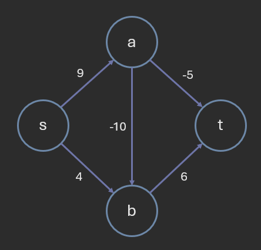
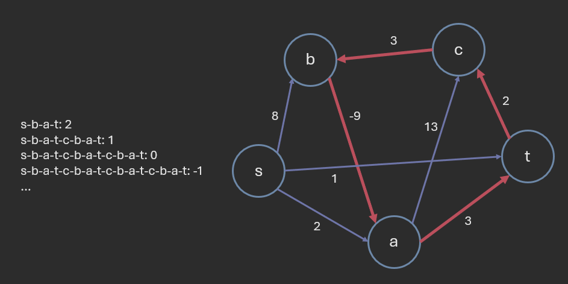
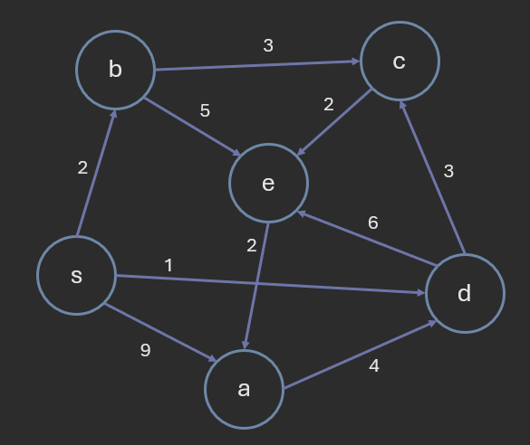
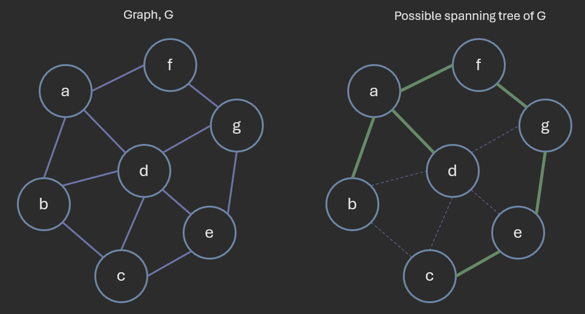
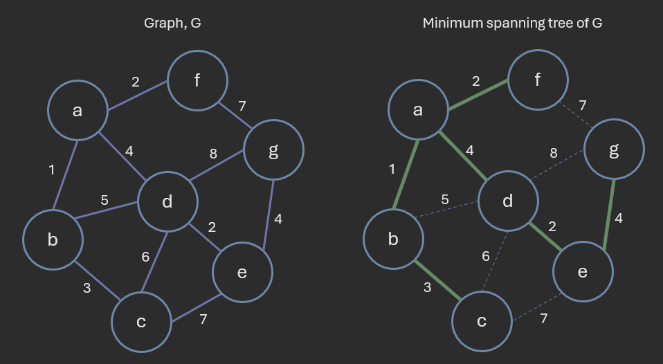
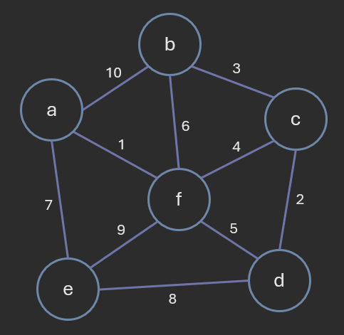
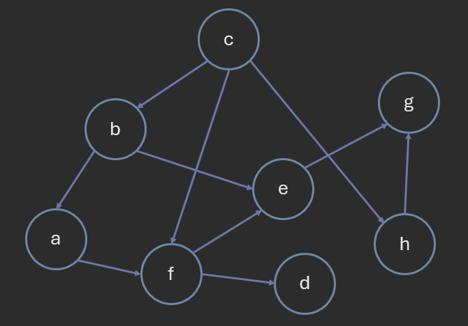

# Graph Algorithms

**Author:** *Brian Magnuson*

In this lesson, we will be discussing various graph algorithms and their applications.

We will cover the following topics:
- Shortest Path Algorithms
- Minimum Spanning Tree Algorithms
- Topological Sorting

We will also be describing the time complexities of these algorithms. However, please note that, due to the nature of graphs and the relationships between the number of vertices and edges, these time complexities may be written in different ways.
In other words, do not treat the stated time complexities as absolute. They are meant to give you an idea of the algorithm's performance.

# Shortest Path Algorithms

Shortest path algorithms are used to find the shortest path between two nodes in a graph.

Finding the shortest path has a variety of applications, such as:
- Routing in computer networks
- Navigation in GPS systems
- Finding the shortest path in a social network

There are several algorithms to solve this problem.
The algorithm we use may depend on the type of graph we are working with.

These algorithms generally work with both directed and undirected graphs. 
Undirected graphs may be treated as directed graphs by considering each edge as two directed edges.

## Unweighted Graphs: Breadth-First Search (BFS)

In an unweighted graph, we assume that each edge has the same weight/distance/cost.
In other words, finding the shortest path is a matter of finding the path with the fewest edges.
For this kind of graph, we can simply use a breadth-first search (BFS) algorithm.


In the above example, we start by performing BFS, marking visited edges and vertices yellow. Edges traversed that point to visited vertices are marked red.
Once the target vertex is reached, we can use a predecessor table to reconstruct the path (in green).

If we only need to find the length of the shortest path, we can just count the number of steps in the BFS without using a predecessor table.

```
func reconstruct_path(predecessors, start, end):
    path = []
    current = end
    while current is not None:
        path.append(current)
        current = predecessors[current]
    path.reverse()
    return path

func bfs(graph, start, end):
    queue = [start]
    visited = set()
    predecessors = {start: None}

    while queue:
        node = queue.pop(0)
        if node == end:
            return reconstruct_path(predecessors, start, end)
        visited.add(node)

        for neighbor in graph[node]:
            if neighbor not in visited and neighbor not in queue:
                queue.enqueue(neighbor)
                predecessors[neighbor] = node

    return None
```

Assuming that set and dictionary operations are O(1), the BFS algorithm runs in O(V + E) time, where V is the number of vertices and E is the number of edges.

## Graphs With Positive Weights: Dijkstra's Algorithm

In a graph with positive weights, the shortest path is the path with the lowest total weight.
Dijkstra's algorithm is a popular algorithm for finding the shortest path in such graphs.

Dijkstra's algorithm, named after Edsger W. Dijkstra, works using a concept called "edge relaxation".
When we "relax" an edge, we check if the path to a vertex through that edge is shorter than any previously found path.


In the above example, we track the current known distance to each vertex.
The source vertex 's' is initialized with a distance of 0, and all other vertices are initialized with infinity.
When we relax the edge with weight 8, we compare the current distance to the previous node (0 in this case) plus the edge weight (8) to the current distance to the target node (infinity).
Since 0 + 8 < infinity, we update the distance to the target node to 8.

In theory, if we keep relaxing edges, we will eventually reach a point where all distances are at their minimum.
However, this is not efficient in practice.
If the graph only has positive edge weights, we can strategically relax edges to find the shortest path.

Dijkstra's algorithm works like this:
1. Create a dictionary to store the shortest distance to each vertex and the predecessor of each vertex.
2. Initialize the distance to the source vertex to 0 and all other vertices to infinity.
3. Pick an unvisited vertex with the smallest distance and relax all its edges.
4. If the distance to a neighbor is updated from 3, update the predecessor.
4. Mark the chosen vertex as visited.
5. Repeat until all vertices are visited.
6. Use the predecessor table to reconstruct the shortest path.

We sometimes describe Dijkstra's algorithm as a **greedy algorithm** because it always picks the unvisited vertex with the smallest distance. Greedy algorithms do not always yield the optimal solution, but in this case, it does.
The exact proof for this is beyond the scope of this lesson.

Using Dijkstra's algorithm, we can find the shortest distances to all other nodes in a graph.
However, if our only concern is finding the shortest path to the target node,
we can stop once we pick the target node.


In the above example, we mark visited nodes yellow. We relax all outgoing edges from the current node, updating our table of distances and predecessors.
Once we reach the target node, we can use the predecessor table to reconstruct the shortest path.

We always pick the unvisited node with the smallest distance.
We can do this efficiently using a priority queue.

```
func dijkstra(graph, start, end):
    distances = {node: float('inf') for node in graph}
    predecessors = {node: None for node in graph}
    distances[start] = 0
    visited = set()
    queue = [(0, start)]

    while queue:
        current_distance, current_node = heapq.heappop(queue)
        if current_node in visited:
            continue
        visited.add(current_node)

        if current_node == end:
            return reconstruct_path(predecessors, start, end)

        for neighbor, edge_weight in graph[current_node].items():
            if neighbor not in visited:
                new_distance = current_distance + edge_weight
                if new_distance < distances[neighbor]:
                    distances[neighbor] = new_distance
                    predecessors[neighbor] = current_node
                    heapq.heappush(queue, (new_distance, neighbor))

    return None
```

Note that in the above code, a node may be pushed to the queue multiple times.
However, if the node is already visited, we pop it from the queue and ignore it.

Without priority queues, the algorithm runs in O(V^2) time, where V is the number of vertices, assuming that set and dictionary operations are O(1) and the graph is simple.

Picking the node with the smallest distance taks O(V) time. Visiting each node takes O(V) time. Additionally, every edge is relaxed once, taking O(E) time.
This brings the worst case time complexity to O(V^2 + E). Since the graph is simple, E is at most V^2, so we can simplify this to O(V^2).

With priority queues, the algorithm runs in O((V + E) log V) time, where V is the number of vertices and E is the number of edges. If we assume that V is upper bounded by E, we can alternatively write the time complexity as O(E log V).

Extracting the node with the smallest distance takes O(log V) time (since heap properties need to be maintained). This is done for every node, so this takes O(V log V) time.
Each time an edge is relaxed, we push the neighbor to the queue, which takes O(log V) time. This is done for every edge, so this takes O(E log V) time.
This brings the worst case time complexity to O((V + E) log V).

## Graphs With Negative Weights and No Negative Cycles: Bellman-Ford Algorithm

Sometimes, we may have a graph with negative edge weights.
Negative edge weights may not seem intuitive at first, but they can be useful in certain applications such as:
- Financial networks
- Game theory
- Network flow problems



In a graph with negative edge weights, Dijkstra's algorithm may not work.
In the above example, Dijkstra's algorithm would assume that the shortest path to 'b' is through 's' since it has the smallest distance after the edges from 's' are relaxed. However, the actual shortest path to 'b' is through 'a'. Thus, Dijkstra's algorithm fails to find the shortest path.

Assuming that the graph has no negative cycles, we can use the Bellman-Ford algorithm, named after Richard Bellman and Lester Ford, Jr.

A **negative weight cycle** is a cycle in the graph where the sum of the edge weights is negative.
If a graph has a negative weight cycle, the shortest path cannot be determined since we can keep traversing the cycle to reduce the path length indefinitely.



The Bellman-Ford algorithm takes longer to run than Dijkstra's algorithm, but is simpler to implement. It can also be used even if there are no negative edge weights.

1. Create a dictionary to store the shortest distance to each vertex and the predecessor of each vertex.
2. Initialize the distance to the source vertex to 0 and all other vertices to infinity.
3. Relax ALL edges in the graph.
4. Repeat step 3 for V - 1 times, where V is the number of vertices.
5. Relax ALL edges in the graph one more time.
6. If a vertex's distance is updated from step 5, the graph has a negative cycle. The shortest path cannot be determined.
7. Else, use the predecessor table to reconstruct the shortest path.


In the above example, we have 4 nodes. Thus, we run for 4 iterations total, relaxing all edges in the graph. The last iteration is used to check for negative cycles.
In this case, there are no updates in the last iteration, so the graph has no negative cycles.

```
func bellman_ford(graph, start, end):
    distances = {node: float('inf') for node in graph}
    predecessors = {node: None for node in graph}
    distances[start] = 0

    for _ in range(len(graph) - 1):
        for node in graph:
            for neighbor, edge_weight in graph[node].items():
                if distances[node] + edge_weight < distances[neighbor]:
                    distances[neighbor] = distances[node] + edge_weight
                    predecessors[neighbor] = node

    for node in graph:
        for neighbor, edge_weight in graph[node].items():
            if distances[node] + edge_weight < distances[neighbor]:
                return "Graph has a negative cycle"

    return reconstruct_path(predecessors, start, end)
```

The Bellman-Ford algorithm runs in O(VE) time, where V is the number of vertices and E is the number of edges, assuming that set and dictionary operations are O(1) and the graph is simple.
Relaxing all edges takes O(E) time. This is done for V - 1 iterations, so this takes O(VE) time.
The last iteration takes an additional O(E) time.
Thus, the worst case time complexity is O(VE).

The algorithm may be optimized by skipping over vertices whose distances have not changed in the previous iteration.
This variation of the algorithmw was introduced by Edward F. Moore in 1959 and is referred to as the *Bellman-Ford-Moore algorithm*.

------



Using Dijkstra's algorithm, calculate the shortest distances from 's' to all other nodes and each node's predecessor.
Which of the following shows the correct output?
- a: (9, s), b: (2, s), c: (5, b), d: (1, s), e: (7, b)
- a: (2, e), b: (2, s), c: (3, d), d: (1, s), e: (6, d)
- a: (8, e), b: (2, s), c: (5, b), d: (1, s), e: (6, d)
- a: (9, s), b: (2, s), c: (4, d), d: (1, s), e: (7, d)
- a: (8, e), b: (2, s), c: (4, d), d: (1, s), e: (6, c)

<details>
<summary>Answer</summary>
a: (8, e), b: (2, s), c: (4, d), d: (1, s), e: (6, c)
</details>

------

```
s: 0, None
u: 14, w
v: 16, u
w: 6, s
x: 8, w
```

Consider the above possible output of Dijkstra's algorithm.
What is the weight of the edge from 'w' to 'u' in the graph?
- 6
- 8
- 14
- 16
- This cannot be determined from the given information.

<details>
<summary>Answer</summary>
8
</details>

------

# Minimum Spanning Tree Algorithms

For a connected, undirected graph, a **spanning tree** is a subset of the edges that connects all vertices without forming any cycles.
A spanning tree is a "tree" because it is a connected graph with no cycles.



A graph may have many spanning trees. The above example shows just one example of a spanning tree.

For a connected, undirected, weighted graph, a **minimum spanning tree (MST)** is a subset of the edges that connects all vertices with the minimum total weight, without forming any cycles.
Not all graphs have a unique MST; some graphs may have multiple, valid MSTs.



Finding the minimum spanning tree has a variety of applications, such as:
- Road construction
- Telecommunications
- Power grid design
- Network design

As an example, when designing a road network, we may want to connect all cities with the minimum total cost.
We can use a minimum spanning tree algorithm to find the optimal solution.

In this section, we will discuss two popular algorithms for finding the minimum spanning tree:
- Prim's Algorithm
- Kruskal's Algorithm

## Prim's Algorithm

Prim's algorithm works like this:
1. Create an empty set, S, to store visited vertices.
2. Pick an arbitrary vertex and add it to S.
3. Consider all edges between S and V-S (the set of vertices not in S).
4. Pick the edge with the smallest weight and add it to the MST (if there are multiple edges with the same weight, pick any).
5. Add the connected vertex to S.
6. Repeat steps 3-5 until all vertices are in S.
7. Return the MST.


In the above example, the vertices in set S are green and the vertices in V-S are pink.
We start by picking an arbitrary vertex 'a' and adding it to S.
We then consider all edges between S and V-S, that is, edges between green and pink vertices (in yellow).
We pick the edge with the smallest weight and add it to the MST.

Notice how some edges are removed from consideration as we add vertices to S.

```
func prim(graph):
    mst = []
    visited = set()
    queue = [(0, list(graph.keys())[0], None)]  # (weight, vertex, predecessor)

    while queue:
        weight, current_node, predecessor = heapq.heappop(queue)
        if current_node in visited:
            continue
        visited.add(current_node)
        if predecessor is not None:
            mst.append((predecessor, current_node, weight))

        for neighbor, edge_weight in graph[current_node].items():
            if neighbor not in visited:
                heapq.heappush(queue, (edge_weight, neighbor, current_node))

    return mst
```

In the above pseudocode, we represent edges as 3-tuples (predecessor, current_node, weight). Some variations of the algorithm instead store vertices and adjust the shortest distance to each vertex in the priority queue.

When using an priority queue, the algorithm runs in O(E log V) time, where E is the number of edges and V is the number of vertices, assuming that set and dictionary operations are O(1) and the graph is simple.

Extracting the edge with the smallest weight takes O(log E) time. This is done for every edge, so this takes O(E log E) time. Since E is at most V^2, we can alternatively write this as O(E log (V^2)), which, due to the properties of logarithms, is O(E log V).

## Kruskal's Algorithm

Kruskal's algorithm works like this:
1. Sort all edges in the graph by weight.
2. For each edge in the list of edges, add it to the MST if it does not form a cycle.
3. Repeat step 2 until all vertices are in the MST.


In the above example, we start with the edges sorted by weight.
We then add the edge with the smallest weight to the MST.
Notice how, toward the beginning of the algorithm, our MST is mostly disconnected.
It becomes more connected as we add more edges.

You might be curious how we can detect if adding an edge forms a cycle.
We can do this using the concept of **disjoint sets**.

Two sets are considered disjoint if they have no elements in common.
We can use disjoint sets to track the connected components of the graph.
If an edge connects two vertices in the same set, it forms a cycle.


Optimized versions of Kruskal's algorithms make use of data structures dedicated to disjoint sets, sometimes called **disjoint-set** or **union-find** data structures. Understanding these data structures is beyond the scope of this lesson. You can read more about them [here](https://en.wikipedia.org/wiki/Disjoint-set_data_structure).

We can write the pseudocode for Kruskal's algorithm like this:

```
class DisjointSet:
    # Finds the set containing the given node
    func find(node) -> set

    # Unites two sets
    func union(set1, set2)

func kruskal(graph):
    mst = []
    disjoint_set = DisjointSet()
    edges = sorted(graph.edges, key=lambda edge: edge.weight)

    for edge in edges:
        set1 = disjoint_set.find(edge.node1)
        set2 = disjoint_set.find(edge.node2)

        if set1 != set2:
            mst.append(edge)
            disjoint_set.union(set1, set2)

    return mst
```

The time complexity of Kruskal's algorithm is O(E log E), where E is the number of edges, assuming that set and dictionary operations are O(1) and the graph is simple.

Sorting the edges takes O(E log E) time.
Each edge is processed once, taking O(E) time.
The time complexities of union and find are O(log E) and O(1), respectively, so the total time complexity is O(E log E).

------



Using Prim's algorithm, calculate the minimum spanning tree of the above graph starting from vertex 'd'.
Which of the following shows the correct order of vertices visited?
- d, c, b, f, a, e
- d, c, b, f, e, a
- d, c, b, a, f, e
- d, c, f, e, a, b
- d, c, b, e, f, a

<details>
<summary>Answer</summary>
d, c, b, f, a, e
</details>

------


Using Kruskal's algorithm, determine the order in which the edges are added to the minimum spanning tree.
- (a, f), (c, d), (b, c), (c, f), (d, f)
- (a, f), (c, d), (b, c), (c, f), (a, e)
- (a, f), (c, d), (b, c), (c, f), (e, f)
- (a, f), (c, f), (c, d), (c, b), (a, e)
- (a, f), (c, f), (b, c), (d, f), (a, e)

<details>
<summary>Answer</summary>
(a, f), (c, d), (b, c), (c, f), (a, e)
</details>

------

# Topological Sorting

Our last topic is topological sorting.

A **topological sort** is a linear ordering of the vertices in a directed acyclic graph such that for every directed edge, u to v, vertex u comes before vertex v in the ordering.

It is different from the traditional sorting algorithms we have seen so far, which sort elements based on their values.
Additionally, not all graphs have a single unique topological sort.

Topological sorting has a variety of applications, such as:
- Task scheduling
- Dependency resolution
- Course scheduling
- Build systems

As an example, when planning a college course plan, we may have prerequisites for certain courses.
We can use topological sorting to determine the order in which we should take the courses.

Naturally, topological sorting only works with directed acyclic graphs. A topological sort is not possible if the graph has a cycle.

There is a simple algorithm for topological sorting:
1. Pick a vertex with no incoming edges and add it to the topological sort.
2. Remove the vertex and all its outgoing edges from the graph.
3. Repeat steps 1-2 until all vertices are in the topological sort.
4. If there are still vertices left in the graph, the graph has a cycle.


In the above example, we start by counting the in-degrees of each vertex.
We then pick a vertex with no incoming edges and add it to the topological sort.
We remove the vertex and all its outgoing edges from the graph, adjusting the in-degrees of the remaining vertices.
We repeat this process until all vertices are in the topological sort.

```
func topological_sort(graph):
    in_degrees = {node: 0 for node in graph}
    for node in graph:
        for neighbor in graph[node]:
            in_degrees[neighbor] += 1

    queue = [node for node in graph if in_degrees[node] == 0]
    topological_order = []

    while queue:
        node = queue.pop(0)
        topological_order.append(node)

        for neighbor in graph[node]:
            in_degrees[neighbor] -= 1
            if in_degrees[neighbor] == 0:
                queue.append(neighbor)

    if len(topological_order) != len(graph):
        return "Graph has a cycle"

    return topological_order
```

The time complexity of topological sorting is O(V + E), where V is the number of vertices and E is the number of edges, assuming that set and dictionary operations are O(1) and the graph is simple.

Counting the in-degrees takes O(E) time.
Each vertex is added to the queue once (when its in-degree is 0), so this takes O(V) time.

------



Which of the following is NOT a valid topological sort of the above graph?
- c, b, f, h, a, e, d, g
- c, b, a, f, e, h, d, g
- c, h, b, a, f, e, g, d
- c, h, b, a, f, d, e, g
- All of these are valid topological sorts.
- None of these are valid topological sorts.

<details>
<summary>Answer</summary>
c, b, f, h, a, e, d, g
</details>

------

# Conclusion

In this lesson, we have discussed three useful categories of graph algorithms: shortest path algorithms, minimum spanning tree algorithms, and topological sorting.
We have discussed various algorithms for each category, their applications, and their time complexities.

# References

- [COP 3530 Instructional Content](https://github.com/COP3530/Instructional-Content)
- [Wikipedia: Dijkstra's algorithm](https://en.wikipedia.org/wiki/Dijkstra%27s_algorithm)
- [Wikipedia: Bellman-Ford algorithm](https://en.wikipedia.org/wiki/Bellman%E2%80%93Ford_algorithm)
- [Wikipedia: Prim's algorithm](https://en.wikipedia.org/wiki/Prim%27s_algorithm)
- [Wikipedia: Kruskal's algorithm](https://en.wikipedia.org/wiki/Kruskal%27s_algorithm)
- [Wikipedia: Disjoint-set data structure](https://en.wikipedia.org/wiki/Disjoint-set_data_structure)

Graphics by Brian Magnuson.

Lesson content written with AI assistance.

This work by Brian Magnuson is licensed under [CC BY-SA 4.0](https://creativecommons.org/licenses/by-sa/4.0/).

Find a mistake? Open an issue on [GitHub](https://github.com/COP3530/edugator-content/issues)!
