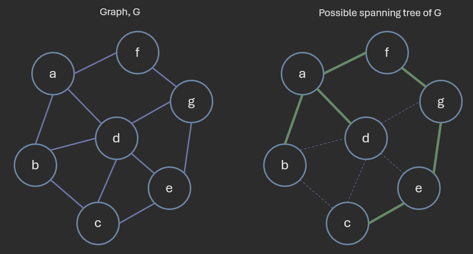
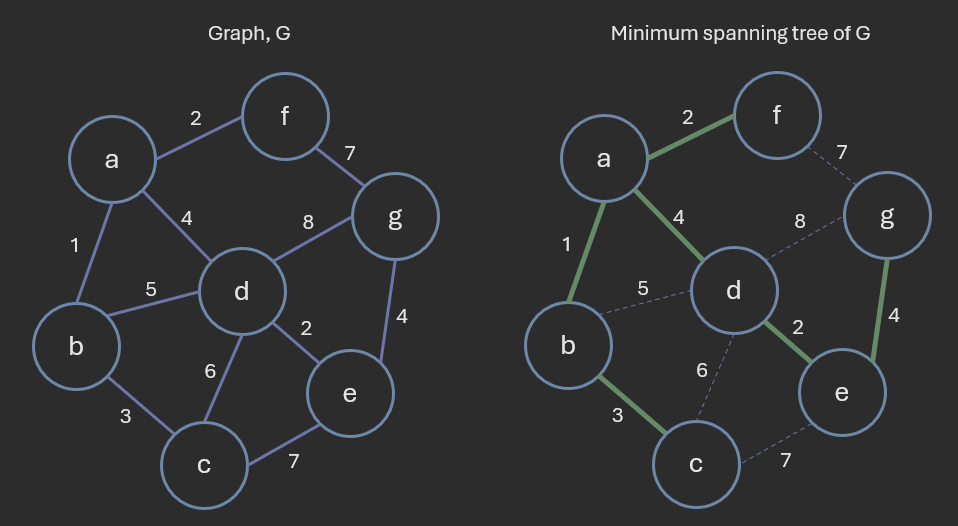
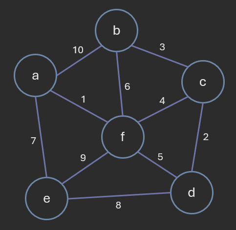

# Graph Algorithms: Minimum Spanning Trees

**Author:** *Brian Magnuson*

In this second lesson in this 3-part series of graph algorithms, we will be discussing minimum spanning trees (MSTs).

We will cover the following topics:
- Introduction to MSTs
- Prim's Algorithm
- Kruskal's Algorithm

We will also be describing the time complexities of these algorithms. However, please note that, due to the nature of graphs and the relationships between the number of vertices and edges, these time complexities may be written in different ways.
In other words, do not treat the stated time complexities as absolute. They are meant to give you an idea of the algorithm's performance.

# Introduction to MSTs

For a connected, undirected graph, a **spanning tree** is a subset of the edges that connects all vertices without forming any cycles.
A spanning tree is a "tree" because it is a connected graph with no cycles.



A graph may have many spanning trees. The above example shows just one example of a spanning tree.

For a connected, undirected, weighted graph, a **minimum spanning tree (MST)** is a subset of the edges that connects all vertices with the minimum total weight, without forming any cycles.
Not all graphs have a unique MST; some graphs may have multiple, valid MSTs.



Finding the minimum spanning tree has a variety of applications, such as:
- Road construction
- Telecommunications
- Power grid design
- Network design

As an example, when designing a road network, we may want to connect all cities with the minimum total cost.
We can use a minimum spanning tree algorithm to find the optimal solution.

In this lesson, we will discuss two popular algorithms for finding the minimum spanning tree:
- Prim's Algorithm
- Kruskal's Algorithm

# Prim's Algorithm

Prim's algorithm works like this:
1. Create an empty set, S, to store visited vertices.
2. Pick an arbitrary vertex and add it to S.
3. Consider all edges between S and V-S (the set of vertices not in S).
4. Pick the edge with the smallest weight and add it to the MST (if there are multiple edges with the same weight, pick any).
5. Add the connected vertex to S.
6. Repeat steps 3-5 until all vertices are in S.
7. Return the MST.


In the above example, the vertices in set S are green and the vertices in V-S are pink.
We start by picking an arbitrary vertex 'a' and adding it to S.
We then consider all edges between S and V-S, that is, edges between green and pink vertices (in yellow).
We pick the edge with the smallest weight and add it to the MST.

Notice how some edges are removed from consideration as we add vertices to S.

```
func prim(graph):
    mst = []
    visited = set()
    queue = [(0, list(graph.keys())[0], None)]  # (weight, vertex, predecessor)

    while queue:
        weight, current_node, predecessor = heapq.heappop(queue)
        if current_node in visited:
            continue
        visited.add(current_node)
        if predecessor is not None:
            mst.append((predecessor, current_node, weight))

        for neighbor, edge_weight in graph[current_node].items():
            if neighbor not in visited:
                heapq.heappush(queue, (edge_weight, neighbor, current_node))

    return mst
```

In the above pseudocode, we represent edges as 3-tuples (predecessor, current_node, weight). Some variations of the algorithm instead store vertices and adjust the shortest distance to each vertex in the priority queue.

When using an priority queue, the algorithm runs in O(E log V) time, where E is the number of edges and V is the number of vertices, assuming that set and dictionary operations are O(1) and the graph is simple.

Extracting the edge with the smallest weight takes O(log E) time. This is done for every edge, so this takes O(E log E) time. Since E is at most V^2, we can alternatively write this as O(E log (V^2)), which, due to the properties of logarithms, is O(E log V).

# Kruskal's Algorithm

Kruskal's algorithm works like this:
1. Sort all edges in the graph by weight.
2. For each edge in the list of edges, add it to the MST if it does not form a cycle.
3. Repeat step 2 until all vertices are in the MST.


In the above example, we start with the edges sorted by weight.
We then add the edge with the smallest weight to the MST.
Notice how, toward the beginning of the algorithm, our MST is mostly disconnected.
It becomes more connected as we add more edges.

You might be curious how we can detect if adding an edge forms a cycle.
We can do this using the concept of **disjoint sets**.

Two sets are considered disjoint if they have no elements in common.
We can use disjoint sets to track the connected components of the graph.
If an edge connects two vertices in the same set, it forms a cycle.


Optimized versions of Kruskal's algorithms make use of data structures dedicated to disjoint sets, sometimes called **disjoint-set** or **union-find** data structures. Understanding these data structures is beyond the scope of this lesson. You can read more about them [here](https://en.wikipedia.org/wiki/Disjoint-set_data_structure).

We can write the pseudocode for Kruskal's algorithm like this:

```
class DisjointSet:
    # Finds the set containing the given node
    func find(node) -> set

    # Unites two sets
    func union(set1, set2)

func kruskal(graph):
    mst = []
    disjoint_set = DisjointSet()
    edges = sorted(graph.edges, key=lambda edge: edge.weight)

    for edge in edges:
        set1 = disjoint_set.find(edge.node1)
        set2 = disjoint_set.find(edge.node2)

        if set1 != set2:
            mst.append(edge)
            disjoint_set.union(set1, set2)

    return mst
```

The time complexity of Kruskal's algorithm is O(E log E), where E is the number of edges, assuming that set and dictionary operations are O(1) and the graph is simple.

Sorting the edges takes O(E log E) time.
Each edge is processed once, taking O(E) time.
The time complexities of union and find are O(log E) and O(1), respectively, so the total time complexity is O(E log E).

------



Using Prim's algorithm, calculate the minimum spanning tree of the above graph starting from vertex 'd'.
Which of the following shows the correct order of vertices visited?
- d, c, b, f, a, e
- d, c, b, f, e, a
- d, c, b, a, f, e
- d, c, f, e, a, b
- d, c, b, e, f, a

<details>
<summary>Answer</summary>
d, c, b, f, a, e
</details>

------


Using Kruskal's algorithm, determine the order in which the edges are added to the minimum spanning tree.
- (a, f), (c, d), (b, c), (c, f), (d, f)
- (a, f), (c, d), (b, c), (c, f), (a, e)
- (a, f), (c, d), (b, c), (c, f), (e, f)
- (a, f), (c, f), (c, d), (c, b), (a, e)
- (a, f), (c, f), (b, c), (d, f), (a, e)

<details>
<summary>Answer</summary>
(a, f), (c, d), (b, c), (c, f), (a, e)
</details>

------

# Conclusion

In this lesson, we discussed minimum spanning trees (MSTs) and two popular algorithms for finding them: Prim's algorithm and Kruskal's algorithm.
In the next lesson, we will discuss topological sorting.

# References

- [COP 3530 Instructional Content](https://github.com/COP3530/Instructional-Content)
- [Wikipedia: Prim's algorithm](https://en.wikipedia.org/wiki/Prim%27s_algorithm)
- [Wikipedia: Kruskal's algorithm](https://en.wikipedia.org/wiki/Kruskal%27s_algorithm)
- [Wikipedia: Disjoint-set data structure](https://en.wikipedia.org/wiki/Disjoint-set_data_structure)

Graphics by Brian Magnuson.

Lesson content written with AI assistance.

This work by Brian Magnuson is licensed under [CC BY-SA 4.0](https://creativecommons.org/licenses/by-sa/4.0/).

Find a mistake? Open an issue on [GitHub](https://github.com/COP3530/edugator-content/issues)!
