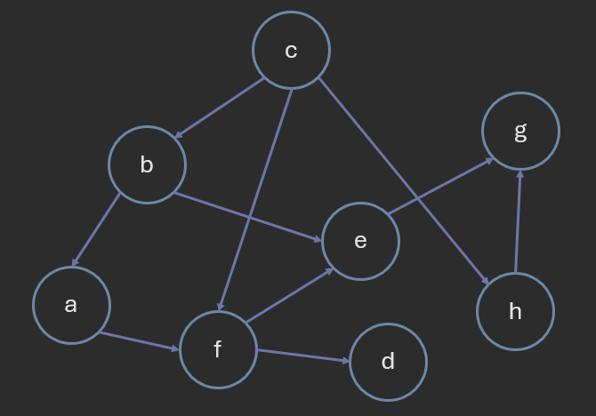

# Graph Algorithms: Topological Sort

**Author:** *Brian Magnuson*

In this final lesson in this 3-part series of graph algorithms, we will be discussing topological sort.

# Topological Sorting

A **topological sort** is a linear ordering of the vertices in a directed acyclic graph such that for every directed edge, u to v, vertex u comes before vertex v in the ordering.

It is different from the traditional sorting algorithms we have seen so far, which sort elements based on their values.
Additionally, not all graphs have a single unique topological sort.

Topological sorting has a variety of applications, such as:
- Task scheduling
- Dependency resolution
- Course scheduling
- Build systems

As an example, when planning a college course plan, we may have prerequisites for certain courses.
We can use topological sorting to determine the order in which we should take the courses.

Naturally, topological sorting only works with directed acyclic graphs. A topological sort is not possible if the graph has a cycle.

There is a simple algorithm for topological sorting:
1. Pick a vertex with no incoming edges and add it to the topological sort.
2. Remove the vertex and all its outgoing edges from the graph.
3. Repeat steps 1-2 until all vertices are in the topological sort.
4. If there are still vertices left in the graph, the graph has a cycle.


In the above example, we start by counting the in-degrees of each vertex.
We then pick a vertex with no incoming edges and add it to the topological sort.
We remove the vertex and all its outgoing edges from the graph, adjusting the in-degrees of the remaining vertices.
We repeat this process until all vertices are in the topological sort.

```
func topological_sort(graph):
    in_degrees = {node: 0 for node in graph}
    for node in graph:
        for neighbor in graph[node]:
            in_degrees[neighbor] += 1

    queue = [node for node in graph if in_degrees[node] == 0]
    topological_order = []

    while queue:
        node = queue.pop(0)
        topological_order.append(node)

        for neighbor in graph[node]:
            in_degrees[neighbor] -= 1
            if in_degrees[neighbor] == 0:
                queue.append(neighbor)

    if len(topological_order) != len(graph):
        return "Graph has a cycle"

    return topological_order
```

The time complexity of topological sorting is O(V + E), where V is the number of vertices and E is the number of edges, assuming that set and dictionary operations are O(1) and the graph is simple.

Counting the in-degrees takes O(E) time.
Each vertex is added to the queue once (when its in-degree is 0), so this takes O(V) time.

------



Which of the following is NOT a valid topological sort of the above graph?
- c, b, f, h, a, e, d, g
- c, b, a, f, e, h, d, g
- c, h, b, a, f, e, g, d
- c, h, b, a, f, d, e, g
- All of these are valid topological sorts.
- None of these are valid topological sorts.

<details>
<summary>Answer</summary>
c, b, f, h, a, e, d, g
</details>

------

# Conclusion

In this lesson, we discussed topological sorting, a linear ordering of the vertices in a directed acyclic graph.
With this, we conclude our series on graph algorithms.

# References

- [COP 3530 Instructional Content](https://github.com/COP3530/Instructional-Content)

Graphics by Brian Magnuson.

Lesson content written with AI assistance.

This work by Brian Magnuson is licensed under [CC BY-SA 4.0](https://creativecommons.org/licenses/by-sa/4.0/).

Find a mistake? Open an issue on [GitHub](https://github.com/COP3530/edugator-content/issues)!
