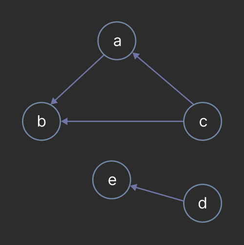

## Table of Contents

1. [Introduction](#introduction)
2. [Terminology](#terminology)
3. [Graph Types](#graph-types)
4. [Implementation](#implementation)
5. [Traversals](#traversals)
6. [Conclusion](#conclusion)


## Introduction

Graphs are a fundamental data structure in computer science with a wide range of theoretical and practical applications. A graph is an non-linear ordered data structure.

We've already seen a few examples of graphs in previous lessons. For example, trees — acyclic undirected graphs (we'll get into what that means in the next section).

### Definition

A **graph** $`G`$ is a set of vertices (also called nodes) $`V`$ and a set of pairs called edges $`E`$. The set of pairs may be ordered or unordered if you're working with directed or undirected graphs, respectively.


In the above example, the vertices are $`V = \{a, b, c, d, e\}`$ and the edges are $`E = \{\{a, b\}, \{b, c\}, \{c, d\}, \{d, e\}\}`$. Note that the edges are unordered pairs, meaning that the edge $`\{a, b\}`$ is the same as the edge $`\{b, a\}`$.

Consider the tree below:


The set of vertices and edges are:

- A. $`V = \{a, b, c, d, e, f, g\},`$ $`E = \{\{a, b\}, \{a, c\}, \{d, c\}\}`$
- B. $`V = \{a, b, c, d\},`$ $`E = \{\{a, b\}, \{a, c\}, \{d, c\}, \{b, c\}\}`$
- C. $`V = \{a, b, c, d\},`$ $`E = \{\{a, b\}, \{c, b\}, \{c, d\}\}`$
- D. $`V = \{a, b, c, d\},`$ $`E = \{\{a, b\}, \{b, c\}\}`$

<details>
<summary>Answer</summary>
C.
</details>

### Undirected Graph

A graph is **undirected** if the edges are a set of *unordered* pairs. This means that if there is an edge between vertices $`a`$ and $`b`$, then there is also an edge between $`b`$ and $`a`$. The edges in an undirected graph are represented visually as lines.


### Directed Graph

A graph is **directed** if the edges are a set of *ordered* pairs. Unlike undirected graphs, an edge is an ordered pair $`(v_1, v_2)`$ meaning that there is an connection from $`v_1`$ to $`v_2`$ but not necessarily from $`v_2`$ to $`v_1`$. The edges in a directed graph are represented as arrows starting from the source vertex and pointing to the destination vertex.



The set of vertices and edges are:

- $`V = \{a, b, c, d, e\}`$
- $`E = \{(a, b), (c, b), (c, a), (d, e)\}`$


## Terminology

Below are a list of common terms used when discussing graphs:

### Vertex (Node)

A single element in a graph.

### Edge

A connection between two vertices.

### Degree

The number of edges connected to a vertex. In a directed graph, the terminology is split into **in-degree** and **out-degree**. The in-degree of a vertex is the number of edges pointing to it and the out-degree is the number of edges pointing from it.

### Weight

A value assigned to an edge. Edges *only* have weights in weighted graphs. The graph below shows integer values associated with each edge. The notion of weights is important in many graph algorithms such as Dijkstra's algorithm for finding the shortest path between two vertices.


### Adjaency

Two vertices $`v_1`$ and $`v_2`$ are **adjacent** if there is an edge between them. In the directed graph on the right, the vertex $`a`$ is adjacent to $`b`$ but $`b`$ is not adjacent to $`a`$. However, on the right, $`a`$ and $`b`$ are adjacent to each other because an edge in an edge in an undirected graph is a symmetric relation between vertices.


### Neighbor

A vertex $`v_2`$ is a **neighbor** of $`v_1`$ if $`v_1`$ is adjacent to $`v_2`$.

### Simple Graph

A **simple graph** is a graph with no self-loops or multiple edges between the same pair of vertices. In other words, there is at most one edge between any two vertices and no edge from a vertex to itself.

The graph below is not *simple* because there is a self-loop on vertex $`a`$ and two edges between vertices $`a`$ and $`b`$.


### Path

A **path** is a sequence of vertices in which each vertex is adjacent to the next. The length of a path is the number of edges in the path. Consider the graph below, a path highlighted by the green edges is $`a, b, d, f, b`$. Note that path is allowed to revisit vertices such.


### Simple Path

A **simple path** is a path where *only* the first and last vertex may be the same.

Consider the graph on the left with the path $`a, b, d, f, b`$. This is *not* a simple path because the vertex $`b`$ appears twice but is not the first vertex. The path on the right, $`a, b, c, a`$ *is* a simple path. Although the vertex $`a`$ appears twice, it is the first and last vertex which is acceptable.


### Cycle

A **cycle** is a simple path where the first and last vertex are the same.

The graph below has a cycle $`a, b, c, a`$.


### Connected

Two vertices $`v_1`$ and $`v_2`$ are **connected** if there exists a path between them.

The vertices $`a`$ and $`b`$ are connected in the graph below because the path $`a, b`$ exists. However, the vertices $`a`$ and $`e`$ are not connected because there is no path between them.


## Graph Types

We've already discussed mentioned several graph types: directed, undirected, simple, and connected. We will discuss a few more now that we are familiar with the terminology.


### Weighted Graph vs Unweighted Graphs

Each edge in a weighted graph has a value associated with it. The graph below is a weighted graph where each edge has an integer value, but it is not imperative that the value be an integer it may be a float value as well. In this course, we will stick to integer values for simplicity.


An unweighted graph, on the other hand, does not have values associated with its edges. The graph below is an example of an unweighted graph.


### Connected vs Disconnected

A graph is **connected** if *every* pair of vertices is connected.

For example, the graph on the left is connected because there is a path between every pair of vertices. However there exists no path between $`a`$ and $`e`$ in the graph on the right, thus, it is disconnected.


### Acyclic vs Cyclic

A graph is **acyclic** if it does not contain any cycles and is *cyclic* if it contains a cycle.

The graph on the left contains a cycle $`a, b, c, a`$ and is therefore cyclic. The graph on the right does not contain any cycles and is acyclic.


### Dense vs Sparse

The **density** of a graph is the ratio of the number of edges to the number of possible edges, $`|E| / |V|^2`$. A graph is **dense** if its density is near 1 and **sparse** if its density is near 0.

A dense graph implies that most vertices are connected to each other whereas a sparse graph implies that most vertices are not connected to each other. The density of a graph typically dictates the data structure used to represent it.


#### Proving the Maximum Number of Edges

Consider a graph $`G`$ with $`n=|V|`$ vertices, the maximum number of edges in $`G`$ occurs when each vertex is adjacent to every other vertex. Each vertices $`v`$ has a degree of $`n-1`$, thus, there are $`n(n-1)/2`$ edges in the graph. We divide by 2 because each edge is counted twice, once for each vertex it is adjacent to.

Note, in the case of a directed graph, the maximum number of edges is $`n(n-1)`$ because each vertex has an in-degree and out-degree of $`n-1`$.

Therefore, the maximum number of edges in a graph is ~$`|V|^2`$.

## Implementation

When implementing a graph, we must consider the density of the graph and the efficiency of common operations such as adding and removing vertices and edges, checking for adjacency, and traversing the graph.

First consider a base class for the following graph implementations:

```c++
template <typename T>
class Graph {
public:
	virtual void addVertex(T v) = 0;
	virtual bool isAdjacent(T v1, T v2) = 0;
	virtual void addEdge(T v1, T v2) = 0;
	virtual vector<T> getNeighbors(T v) const = 0;
	virtual void printGraph() = 0;
};
```

The class is an abstract template class so it can be used with any type of vertex and will be overridden by the implementations we talk about.

**Note**: When implementing a graph, it is not necessary to implement a base class. This is just for demonstration purposes to display common operations on common implementations.

### Adjacency Matrix

An **adjacency matrix** represents a graph a 2D matrix where the rows and columns represent the vertices of the graph. The value at $`(i, j)`$ is 1 if there is an edge between vertex $`i`$ and vertex $`j`$, and 0 otherwise.


The code for an undirected graph represented as an adjacency matrix may look like the following:

```c++
template <typename T>
class AdjacencyMatrix : public Graph<T> {
	unordered_map<T, int> _vertexToIndex;
	unordered_map<int, T> _indexToVertex;
	vector<vector<bool>> _adjacencyMatrix;

public:
	AdjacencyMatrix() {}

	void addVertex(T v) override {
		if (_vertexToIndex.find(v) != _vertexToIndex.end()) {
			return;
		}

		_vertexToIndex[v] = _adjacencyMatrix.size();
		_indexToVertex[_vertexToIndex[v]] = v;

		// add new row and column for the new vertex
		for (auto& row : _adjacencyMatrix) {
			row.push_back(false);
		}
		_adjacencyMatrix.push_back(vector<bool>(_adjacencyMatrix.size() + 1, false));
	}

	void addEdge(T v1, T v2) override {
		this->addVertex(v1);
		this->addVertex(v2);

		int i = _vertexToIndex.at(v1);
		int j = _vertexToIndex.at(v2);

		_adjacencyMatrix[i][j] = true;
	}

	bool isAdjacent(T v1, T v2) override {
		int i = _vertexToIndex.at(v1);
		int j = _vertexToIndex.at(v2);

		return _adjacencyMatrix[j][i];
	}

	vector<T> getNeighbors(T v) const override {
		int i = _vertexToIndex.at(v);
		vector<T> neighbors;

		for (int j = 0; j < _adjacencyMatrix.size(); ++j) {
			if (_adjacencyMatrix[i][j]) {
				neighbors.push_back(_indexToVertex.at(j));
			}
		}

		return neighbors;
	}

	void printGraph() override {
		for (int i = 0; i < _adjacencyMatrix.size(); ++i) {
			cout << _indexToVertex[i] << ": ";
			for (int j = 0; j < _adjacencyMatrix.size(); ++j) {
				if (_adjacencyMatrix[i][j]) {
					cout << _indexToVertex[j] << " ";
				}
			}
			cout << endl;
		}
	}
};
```

#### addVertex

Time Complexity - $`O(V)`$

**V** - number of vertices

Adds a vertex to the graph by adding a new row and column to the adjacency matrix. Adding a new column requires appending a new element to each row and adding a new row requires creating a new row with $`V+1`$ elements. Therefore, the time complexity is $`O(V)`$.


#### addEdge

Time Complexity - $`O(1)`$

Adds an edge between two vertices by setting the value at $`(i, j)`$ and $`(j, i)`$ to true. The time complexity is $`O(1)`$ because accessing the indices of the vertices from a hash map is constant and setting values of elements in an array is also constant.

#### isAdjacent

Time Complexity - $`O(1)`$

Checks if `v2` is adjacent to `v1` by checking the value at $`(j, i)`$. The time complexity is $`O(1)`$ because accessing the indices of the vertices from a hash map is constant and checking the value of an element in an array is also constant.

#### getNeighbors

Time Complexity - $`O(V)`$

**V** - number of vertices

Iterates through the row of the vertex in the adjacency matrix and adds the neighbors to a list. The time complexity is $`O(V)`$ because the number of neighbors is proportional to the number of vertices in the graph.

#### Space Complexity

The space complexity of an adjacency matrix is $`O(V^2)`$ where $`V`$ is the number of vertices. The adjacency matrix stores all possible connections between vertices, thus, the space complexity is $`O(V^2)`$.

#### When to use

An adjacency matrix is an *excellent* choice when the graph is **dense** because it stores all possible connections between vertices. This makes checking for adjacency between two vertices $`v_1`$ and $`v_2`$ very efficient because it is a constant time operation. However, if the graph is **sparse**, an adjacency matrix may be inefficient because it stores all possible connections between vertices even if they do not exist.

### Adjacency List

An **adjacency list** represents a graph as a collection of lists. Each list contains the vertices that are adjacent to a given vertex


Consider the graph above and the adjacency list located on the left. Each vertex is listed, and each vertex's neighbors are listed in a list.

The code for an adjacency list will not be released as it will be used for project 2.

#### addVertex

Time complexity: $`O(1)`$

Add (`v`, `vector<T>()`) pair to the hash map if `key` does not exist in the hash map.

#### addEdge

Time complexity: $`O(1)`$

Adds an edge between `v1` and `v2` by adding `v2` to `v1`'s list of neighbors and vice-versa. Since a hash map of keys to vectors is often used, accessing an list and adding a new element to a vector is $`O(1)`$ on average.

#### isAdjacent

Time complexity: $`O(V)`$

**V** - number of vertices

Checks if two vertices are adjacent to each other. Accesses the list of adjacent vertices for `v1` and searches for `v2`. If a vector is used, the time complexity for searching is $`O(V)`$ in the worst case where $`V`$ is the number of vertices in the graph.

#### getNeighbors

Time complexity: $`O(V)`$

**V** - number of vertices

Returns a copied list of adjacent vertices for a given vertex.

#### Space Complexity

The space complexity of an adjacency list is $`O(V + E)`$ where $`V`$ is the number of vertices and $`E`$ is the number of edges. The adjacency list stores all of the vertices (V) as well as a list of adjacent vertices. Each adjacent vertex represents an edge, thus, the total space complexity is $`O(V + E)`$.

#### When to use

An adjacency list is an *excellent* choice when the graph is **sparse** because it only stores the edges that exist. Unlike an adjacency matrix which stores all possible connections, an adjacency list only stores those that exist. Note that if the graph is dense, an adjacency list with optimizations on `isAdjacent` may perform similar (if not *slightly* worse) to an adjacency matrix due to the overhead of hashing, but this may only become apparent in very large graphs.


### Edge List

An edge list represents a graph as a list of edges. Each edge is a pair of vertices. In the example below, the graph is represented as a list of pairs where each pair represents a directed edge. Note that there is an edge from $`a`$ to $`b`$ and the resulting pair is `(a, b)` but there is no edge in the list representing $`b`$ to $`a`$.


The code for a *directed* graph represented as an edge list may look like this:

```c++
template <typename T>
class EdgeList : public Graph<T> {
	vector<pair<T, T>> _edges;

public:
	EdgeList() {}
	EdgeList(vector<pair<T, T>> edges) : _edges(edges) {}

	void addVertex(T v) override {
		// Do nothing
	}

	bool isAdjacent(T v1, T v2) override {
		for (auto edge : _edges) {
			if (edge == pair<T, T>{v1, v2}) {
				return true;
			}
		}
		return false;
	}

	void addEdge(T v1, T v2) override {
		_edges.push_back(pair<T, T>{v1, v2});
	}

	vector<T> getNeighbors(T v) const override {
		vector<T> neighbors;
		for (auto edge : _edges) {
			if (edge.first == v) {
				neighbors.push_back(edge.second);
			}
		}
		return neighbors;
	}

	void printGraph() override {
		for (auto edge : _edges) {
			cout << edge.first << " -> " << edge.second << endl;
		}
	}
};
```

#### addVertex

Since the edge list only stores edges, this method does nothing.

#### isAdjacent

Time complexity: $`O(E)`$

**E** - number of edges

The method iterates through `_edges` and checks if the given pair exists. Note that the time complexity can be reduced to $`O(1)` if an `unordered_set` is used to store the edges.

#### addEdge

Time complexity: $`O(1)`$

Adds an edge to the end of `_edges`.

#### getNeighbors

Time complexity: $`O(E)`$

Iterates through `_edges` and adds the second element of the pair to a list if the first element matches the given vertex.

#### getEdges

Time complexity: $`O(1)`$

Returns a reference to `_edges`.

#### Space Complexity

The space complexity of an edge list is $`O(E)`$ where $`E`$ is the number of edges. The edge list stores all of the edges in the graph.

#### When to use

An edge list is an *excellent* choice when the graph is **sparse** because it only stores the edges that exist. However, an edge list is not as efficient as an adjacency list because it does not store the vertices and their neighbors. The time complexity of `isAdjacent` and `getNeighbors` is $`O(E)`$ where $`E`$ is the number of edges in the graph. Therefore, an edge list is not as efficient as an adjacency list for these operations.

In a future module, we will discuss more advanced graph algorithms and algorithms such as Bellman-Ford and Kruskal's algorithm which are typically implemented using an edge list since they iterating through the edges is a core part of those algorithms.

## Traversals

There are several ways to traverse a graph. The two most common methods are Depth First Search and Breadth First Search, both introduced in the trees module. The difference between traversing a tree and a graph is that a graph may contain cycles, so it is important to keep track of visited vertices to avoid infinite loops.

### Depth First Search (DFS)

A **Depth First Search** (DFS) is a graph traversal algorithm that explores as far as possible along each branch before backtracking. The algorithm starts at a vertex and explores as far as possible along each branch before backtracking. The algorithm is implemented using a stack or recursion.

Here is the code for a depth-first traversal of a graph using recursion:

```c++
template <typename T>
void _dfs(const Graph<T>& g, const T& source, unordered_set<T>& visitedVertices, vector<T>& results) {
	visitedVertices.insert(source);
	results.push_back(source);

	vector<T> neighbors = g.getNeighbors(source);
	for (T neighbor : neighbors) {
		if (visitedVertices.find(neighbor) == visitedVertices.end()) {
			_dfs(g, neighbor, visitedVertices, results);
		}
	}
}

template <typename T>
vector<T> dfs(const Graph<T>& g, T source) {
	unordered_set<T> visitedVertices;
	vector<T> results;
	_dfs(g, source, visitedVertices, results);
	return results;
}
```

The above code is a generic recursive implementation of a depth-first traversal with our abstract class `Graph`, so this code should work on any graph implementation we discussed earlier.

The main `dfs` function accepts a graph and a source vertex to begin the dfs from. It initializes a set of visited vertices and a vector to store the results. The helper function `_dfs` is called with the graph, source vertex, visited vertices, and results.

The recursion begins with the `_dfs` function which inserts the source vertex into `visitedVertices` and to `results`. The neighbors of the source vertex are retrieved and iterated through. If the neighbor has not been visited, the `_dfs` function is called recursively with the neighbor as the source vertex.

Representing the graph as an adjacency matrix, the code is tested with the following code:

```c++
int main() {
	AdjacencyMatrix<char> graph;

	graph.addEdge('a', 'b');
	graph.addEdge('b', 'c');
	graph.addEdge('c', 'a');
	graph.addEdge('f', 'b');
	graph.addEdge('c', 'd');
	graph.addEdge('d', 'f');
	graph.addEdge('e', 'd');

	graph.printGraph();
	vector<char> result = dfs(graph, 'a');

	cout << "\nDFS: \n";
	for (char c : result) {
		cout << c << " ";
	}

	return 0;
}
```

and has the following output:

```text
e: d
d: f
c: a d
b: c
f: b
a: b

DFS:
a b c d f
```

The following gif demonstrates a depth-first traversal of a graph:


Note that not all vertices will be visited if the graph is not connected.

#### Time Complexity

The time complexity of a depth-first traversal is $`O(V + E)`$ where $`V`$ is the number of vertices and $`E`$ is the number of edges. The time complexity is $`O(V + E)`$ because the algorithm traverses the entire graph by visiting each vertex and edge *once*.

### Breadth First Search (BFS)

Breadth First Search (BFS) is a graph traversal algorithm that explores all vertices at the present depth before moving on to the vertices at the next depth. The algorithm starts at a vertex and explores all of its neighbors before moving on to the neighbors of its neighbors.

BFS is often implemented iteratively using a queue. Below is the code for a breadth-first traversal of a graph using a queue:

```c++
template <typename T>
vector<T> bfs(const Graph<T>& g, T source) {
	unordered_set<T> visitedVertices;
	vector<T> results;
	queue<T> q;

	visitedVertices.insert(source);
	q.push(source);

	while (!q.empty()) {
		T current = q.front();
		q.pop();
		results.push_back(current);

		for (const T& neighbor : g.getNeighbors(current)) {
			if (visitedVertices.find(neighbor) == visitedVertices.end()) {
				visitedVertices.insert(neighbor);
				q.push(neighbor);
			}
		}
	}

	return results;
}
```

The above code is a generic iterative implementation of a breadth-first traversal with our abstract class `Graph`, so this code should work on any graph implementation we discussed earlier. The bfs implementation is similar to the bfs implementation for trees except we check if a vertex has already been visited before adding it to the queue to revisiting vertices and infinite cycles.

A BFS finds the shortest path in terms of edges visited from a source vertex to a destination vertex. Note that the shortest path found with a BFS may not be the shortest *weighted* path in a weighted graph, we must make use of more advanced algorithms such as Dijkstra's algorithm for that (we will explore this more in a future module).

The following gif demonstrates a breadth-first traversal of a graph:


Representing the graph as adjacency matrix, the code is tested with the following code:

```c++
int main() {
	AdjacencyMatrix<char> graph;

	graph.addEdge('a', 'b');
	graph.addEdge('a', 'c');
	graph.addEdge('a', 'd');
	graph.addEdge('d', 'g');
	graph.addEdge('g', 'c');
	graph.addEdge('b', 'c');
	graph.addEdge('b', 'f');
	graph.addEdge('f', 'h');
	graph.addEdge('h', 'b');
	graph.addEdge('h', 'g');

	graph.printGraph();
	vector<char> result = bfs(graph, 'a');

	cout << "\nBFS: \n";
	for (char c : result) {
		cout << c << " ";
	}

	return 0;
}
```

and has the following output:

```text
a: b c d
b: c f
c:
d: g
g: c
f: h
h: b g

BFS:
a b c d f g h
```

#### Time Complexity

The time complexity of a breadth-first traversal is $`O(V + E)`$ where $`V`$ is the number of vertices and $`E`$ is the number of edges. The time complexity is $`O(V + E)`$ because, similar to dfs, the algorithm traverses the entire graph by visiting each vertex and edge *once*. The operations of adding/removing from a queue and hash map are constant time and don't affect the time complexity.

## Conclusion

Graphs are a fundamental data structure in computer science with a wide range of theoretical and practical applications. We've discussed the definition of a graph, common terminology, and different types of graphs. We've also discussed different ways to implement a graph and common operations on graphs such as traversals.

We've only scratched the surface of graph theory and there are many more advanced algorithms and topics to explore which we will go over in a future module.

If you'd like to play around with the code provided in this lesson, it has been attached to this lesson as `trees.cpp`. Feel free to modify the code and test it out with different graphs!

## References

- [COP3530 Instructional Content](https://github.com/COP3530/Instructional-Content)

Graphics by Matthew DeGuzman.

Lesson content written with AI assistance.

This work by Matthew DeGuzman is licensed under [CC BY-SA 4.0](https://creativecommons.org/licenses/by-sa/4.0/).

Find a mistake? Open an issue on [GitHub](https://github.com/COP3530/edugator-content/issues)!
