## Table of Contents

1. [Introduction](#introduction)
2. [Terminology](#terminology)
3. [Graph Types](#graph-types)
4. [Implementation](#implementation)
5. [Traversals](#traversals)
6. [Conclusion](#conclusion)

## Introduction

Graphs are a fundamental data structure in computer science with a wide range of theoretical and practical applications. A graph is an non-linear ordered data structure.

We've already seen a few examples of graphs in previous lessons. For example, trees — acyclic undirected graphs (we'll get into what that means in the next section).

### Definition

A **graph** $`G`$ is a set of vertices (also called nodes) $`V`$ and a set of pairs called edges $`E`$. The set of pairs may be ordered or unordered if you're working with directed or undirected graphs, respectively.

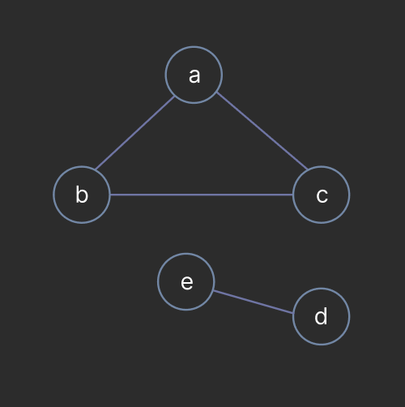

In the above example, the vertices are $`V = \{a, b, c, d, e\}`$ and the edges are $`E = \{\{a, b\}, \{b, c\}, \{c, d\}, \{d, e\}\}`$. Note that the edges are unordered pairs, meaning that the edge $`\{a, b\}`$ is the same as the edge $`\{b, a\}`$.

Consider the tree below:

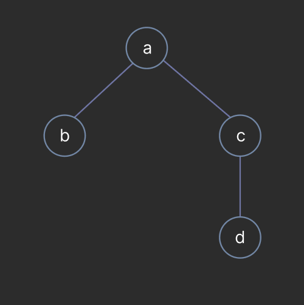

The set of vertices and edges are:

- A. $`V = \{a, b, c, d, e, f, g\},`$ $`E = \{\{a, b\}, \{a, c\}, \{d, c\}\}`$
- B. $`V = \{a, b, c, d\},`$ $`E = \{\{a, b\}, \{a, c\}, \{d, c\}, \{b, c\}\}`$
- C. $`V = \{a, b, c, d\},`$ $`E = \{\{a, b\}, \{c, b\}, \{c, d\}\}`$
- D. $`V = \{a, b, c, d\},`$ $`E = \{\{a, b\}, \{b, c\}\}`$

Answer

C.

### Undirected Graph

A graph is **undirected** if the edges are a set of *unordered* pairs. This means that if there is an edge between vertices $`a`$ and $`b`$, then there is also an edge between $`b`$ and $`a`$. The edges in an undirected graph are represented visually as lines.

### Directed Graph

A graph is **directed** if the edges are a set of *ordered* pairs. Unlike undirected graphs, an edge is an ordered pair $`(v_1, v_2)`$ meaning that there is an connection from $`v_1`$ to $`v_2`$ but not necessarily from $`v_2`$ to $`v_1`$. The edges in a directed grpah are represented as arrows starting from the source vertex and pointing to the destination vertex.

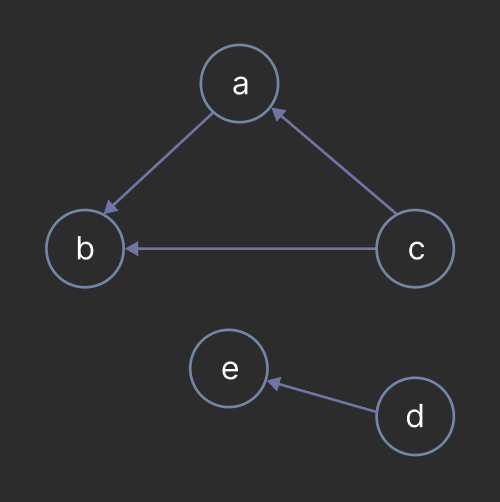

The set of vertices and edges are:

- $`V = \{a, b, c, d, e\}`$
- $`E = \{(a, b), (c, b), (c, a), (d, e)\}`$

## Terminology

Below are a list of common terms used when discussing graphs:

### Vertex (Node)

A single element in a graph.

### Edge

A connection between two vertices.

### Degree

The number of edges connected to a vertex. In a directed graph, the terminology is split into **in-degree** and **out-degree**. The in-degree of a vertex is the number of edges pointing to it and the out-degree is the number of edges pointing from it.

### Weight

A value assigned to an edge. Edges *only* have weights in weighted graphs. The graph below shows integer values associated with each edge. The notion of weights is important in many graph algorithms such as Dijkstra's algorithm for finding the shortest path between two vertices.

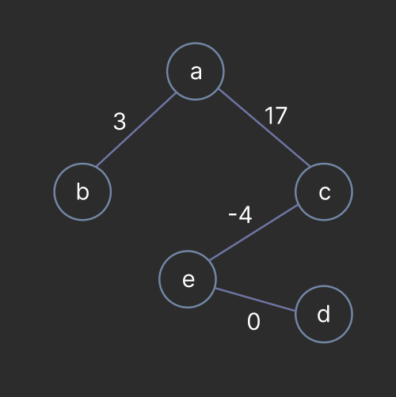

### Adjancency

Two vertices $`v_1`$ and $`v_2`$ are **adjacent** if there is an edge between them. In the directed graph on the right, the vertex $`a`$ is adjacent to $`b`$ but $`b`$ is not adjacent to $`a`$. However, on the right, $`a`$ and $`b`$ are adjacent to each other because an edge in an edge in an undirected graph is a symmetric relation between vertices.

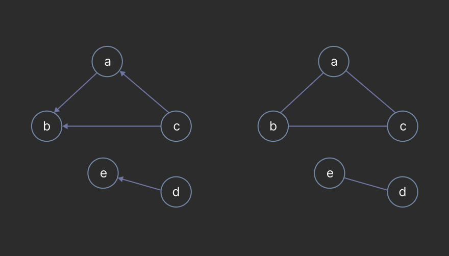

### Neighbor

A vertex $`v_2`$ is a **neighbor** of $`v_1`$ if $`v_1`$ is adjacent to $`v_2`$.

### Simple Graph

A **simple graph** is a graph with no self-loops or multiple edges between the same pair of vertices. In other words, there is at most one edge between any two vertices and no edge from a vertex to itself.

The graph below is not *simple* because there is a self-loop on vertex $`a`$. and two edges between vertices $`a`$ and $`b`$.

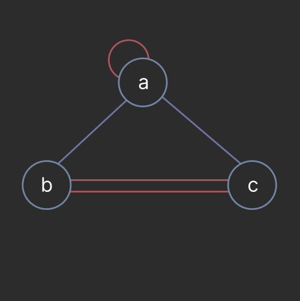

### Path

A **path** is a sequence of vertices in which each vertex is adjacent to the next. The length of a path is the number of edges in the path. Consider the graph below, a path highlighted by the green edges is $`a, b, d, f, b`$. Note that path is allowed to revisit vertices such.

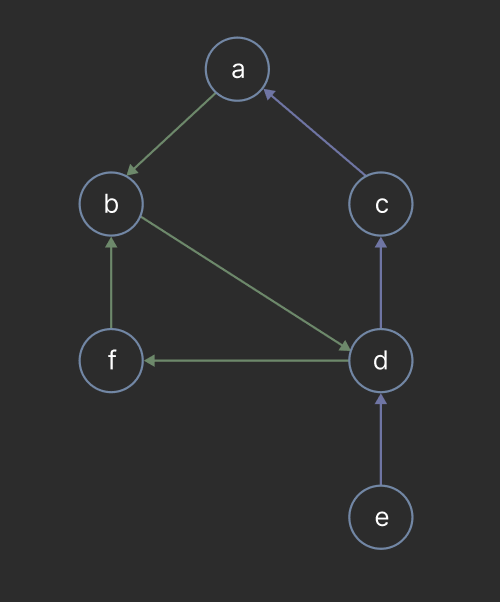

### Simple Path

A **simple path** is a path where *only* the first and last vertex may be the same.

Consider the graph on the left with the path $`a, b, d, f, b`$. This is *not* a simple path because the vertex $`b`$ appears twice but is not the first vertex. The path on the right, $`a, b, c, a`$ *is* a simple path. Although the vertex $`a`$ appears twice, it is the first and last vertex which is acceptable.

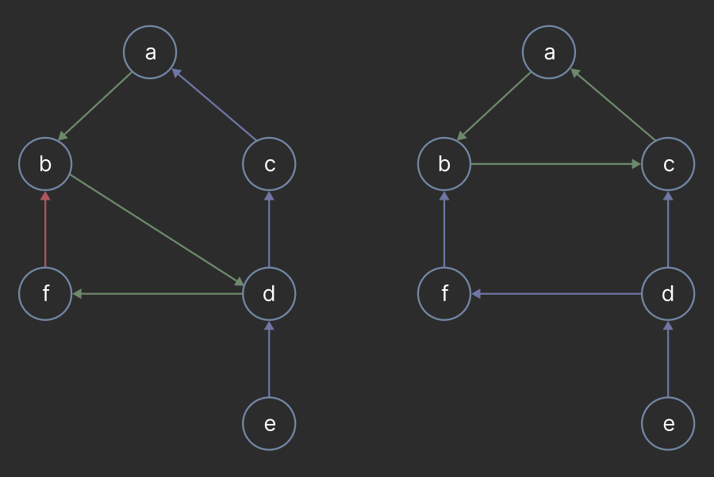

### Cycle

A **cycle** is a simple path where the first and last vertex are the same.

The graph below has a cycle $`a, b, c, a`$.

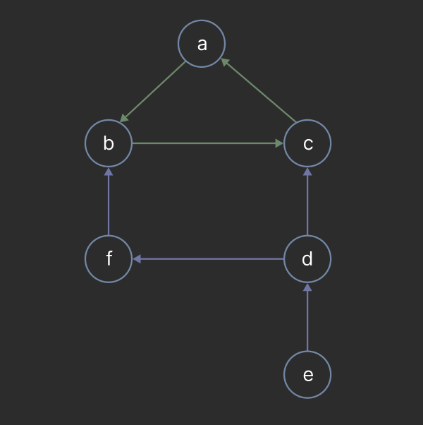

### Connected

Two vertices $`v_1`$ and $`v_2`$ are **connected** if there exists a path between them.

The vertices $`a`$ and $`b`$ are connected in the graph below because the path $`a, b`$ exists. However, the vertices $`a`$ and $`e`$ are not connected because there is no path between them.

## Graph Types

We've already discussed mentioned several graph types: directed, undirected, simple, and connected. We will discuss a few more now that we are familiar with the terminology.

### Weighted Graph vs Unweighted Graphs

Each edge in a weighted graph has a value associated with it. The graph below is a weighted graph where each edge has an integer value, but it is not imperative that the value be an integer it may be a float value as well. In this course, we will stick to integer values for simplicity.

An unweighted graph, on the other hand, does not have values associated with its edges. The graph below is an example of an unweighted graph.

### Connected vs Disconnected

A graph is **connected** if *every* pair of vertices is connected.

For example, the graph on the left is connected because there is a path between every pair of vertices. However there exists no path between $`a`$ and $`e`$ in the graph on the right, thus, it is disconnected.

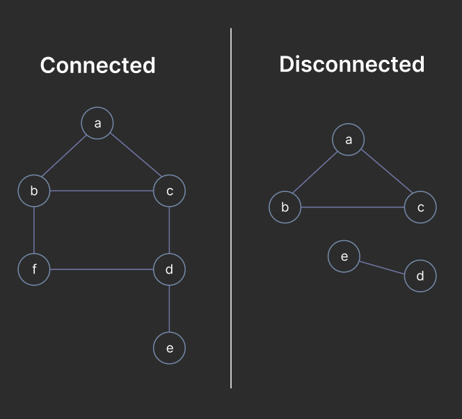

### Acyclic vs Cyclic

A graph is **acyclic** if it does not contain any cycles and is *cyclic* if it contains a cycle.

The graph on the left contains a cycle $`a, b, c, a`$ and is therefore cyclic. The graph on the right does not contain any cycles and is acyclic.

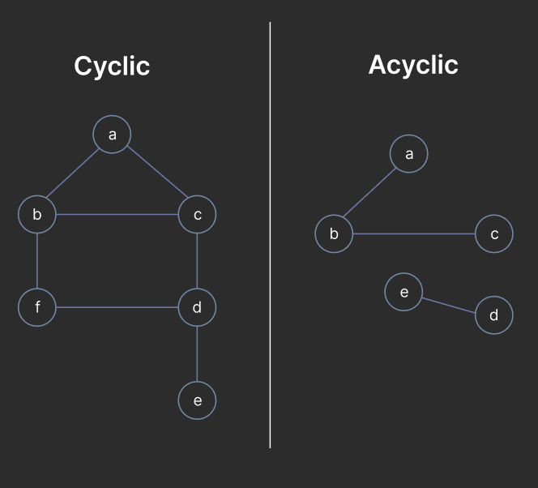

### Dense vs Sparse

The **density** of a graph is the ratio of the number of edges to the number of possible edges, $`|E| / |V|^2`$. A graph is **dense** if its density is near 1 and **sparse** if its density is near 0.

A dense graph implies that most vertices are connected to each other whereas a sparse graph implies that most vertices are not connected to each other. The density of a graph typically dictates the data structure used to represent it.

#### Proving the Maximum Number of Edges

Consider a graph $`G`$ with $`n=|V|`$ vertices, the maximum number of edges in $`G`$ occurs when each vertex is adjacent to every other vertex. Each vertices $`v`$ has a degree of $`n-1`$, thus, there are $`n(n-1)/2`$ edges in the graph. We divide by 2 because each edge is counted twice, once for each vertex it is adjacent to.

Note, in the case of a directed graph, the maximum number of edges is $`n(n-1)`$ because each vertex has an in-degree and out-degree of $`n-1`$.

Therefore, the maximum number of edges in a graph is ~$`|V|^2`$.

## Implementation

There are many ways to represent a graph, each with its own advantages and disadvantages. We will discuss 3 common implementations:

- Adjacency List
- Adjacency Matrix
- Edge List

There are several operations typically tested with graphs as well:

- connectedness
- adjacency

### Adjacency List

An **adjaceny list** associates a vertex $`v`$ with a list of its neighbors. Typically, the list is implemented as a map with the key being the vertex and the value being a list of vertices.

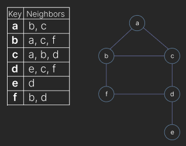

### Adjacency Matrix

### Edge List

## Traversals

Discuss the most common graph traversal algorithms: Depth-First Search (DFS) and Breadth-First Search (BFS). Explain how they work, their time and space complexity, and their use cases.

## Conclusion
