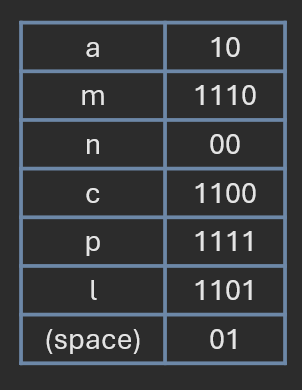

# Greedy Algorithms

**Author:** *Brian Magnuson*

In this lesson, we will be discussing greedy algorithms, an algorithmic paradigm that solves problems by using the locally optimal choice at each stage with hope of finding the global optimum. To help illustrate this concept, we will explore several classic problems where a greedy approach is applicable.

We will be covering the following:
- Introduction to greedy algorithms
- Coin change problem
- Activity selection problem
- Huffman coding
- Bin packing problem

# Introduction to Greedy Algorithms

Imagine you are in a cave. The cave has multiple branching paths, and each path has some amount of money at the end. You want to maximize the amount of money you can collect, but you only have enough time to take one path at each fork.


Since you are *greedy*, you decide to take the path that will give you the most money at each fork. You hope that by taking the path with the most money at each fork, you will end up with the most money overall.


A **greedy algorithm** is any algorithm that makes the locally optimal choice at each stage with the hope of finding the global optimum. In this case, you are making the locally optimal choice by taking the path with the most money at each fork.


Greedy algorithms have a few characteristics:
- They make a series of choices, each of which looks best at the moment.
- They do not look ahead to see if the current choice will lead to a better solution in the future.
- They do not backtrack to try other options if the current choice does not lead to the best solution.
- They tend to run faster than other algorithms because they do not explore all possible solutions.

As you may have guessed, the greedy approach does not always lead to the optimal solution. In our cave example, if we had more time to explore the paths, we might have found a path that led to more money overall.


The "greedy solution" may not always be optimal, but for certain problems, it can be a good approximation. Additionally, as mentioned before, greedy algorithms tend to run faster than other algorithms because they do not explore all possible solutions.

In the next sections, we will explore several classic problems where a greedy approach is applicable and see how they can be solved using this algorithmic paradigm.

# Coin Change Problem

The coin change problem is a classic example of a problem where the greedy approach usually leads to an optimal solution. It's a simple problem with which most people are familiar:

- Given a set of coin denominations and a target amount, find the minimum number of coins needed to make that amount.

For example, suppose we have the following coin denominations:


And suppose we want to make 68 cents. Think about how you would do this in real life. You would likely start with the largest denomination (the quarter) and work your way down to the smallest denomination (the penny).

To be more explicit, you would follow these steps:
1. Start with the largest denomination.
2. If the denomination is less than the remaining amount, move on to the next largest denomination.
3. Otherwise, subtract the denomination from the remaining amount and add it to your total count of coins.
4. Repeat from step 2 until the remaining amount is zero.
5. Return the total count of coins.


This approach is greedy, because at each iteration, we choose the largest denomination that "fits" into the remaining amount, hoping that we can minimize the total number of coins needed.

In the above example, we use the following coins to make 68 cents:
- 2 quarters (50 cents)
- 1 dime (10 cents)
- 1 nickel (5 cents)
- 3 pennies (3 cents)

This gives us a total of 7 coins.

For this example, the greedy solution happens to also be the optimal solution. You can try different combinations of coins, but you will find that no other combination will have fewer than 7 coins.

In fact, for this particular set of coin denominations, the greedy approach will *always* yield the optimal solution for *any* target amount. This is due to a special property of the set of coins.

A currency system is said to be **canonical** if the greedy algorithm always produces an optimal solution for any target amount. The above example was based on the US currency system, which is canonical. Most modern currency systems in the world are canonical.

Let's consider an example where the greedy approach does not yield the optimal solution:


In the above example, we use a set of coins with denominations of 1 cent, 7 cents, and 10 cents. The target amount is 14 cents. If we apply the greedy approach, we would first take a 10-cent coin (1 coin), then a 4-cent coin (4 coins), for a total of 5 coins.

However, the optimal solution is to take 2 coins: two 7-cent coins. This shows that the greedy approach does not always yield the optimal solution.

The set of coins is not canonical, because there are target amounts for which the greedy algorithm does not yield the optimal solution.

------

Given the coin denominations [1, 5, 10, 20, 50], find the minimum number of coins needed to make 132.
- 5 coins
- 6 coins
- 7 coins
- 8 coins
- 9 coins

<details>
<summary>Answer</summary>
6 coins 
</details>

------

Given the coin denominations [1, 5, 25, 40], use the greedy approach to find the number of coins needed to make 75.
- 3 coins
- 4 coins
- 5 coins
- 6 coins
- 7 coins

<details>
<summary>Answer</summary>
4 coins
</details>

------

# Activity Selection Problem

In this next problem, we'll see how a greedy algorithm can lead to an optimal solution, but the algorithm may not be obvious at first glance.

The activity selection problem is a classic optimization problem that can be solved using a greedy approach. The problem is as follows:
- Given a set of activities, each with a start time and an end time, select the maximum number of activities that can be performed by a single person, assuming that a person can only work on one activity at a time.

Let's use an example with the following set of activities:
- A: (0, 4)
- B: (3, 6)
- C: (9, 11)
- D: (5, 8)
- E: (10, 12)
- F: (8, 10)
- G: (4, 10)

We can visualize these activities on a timeline:


As you can see, some of these activities overlap with each other. The goal is to select the maximum number of non-overlapping activities.

There are a few different greedy approaches to solving this problem:
- At each iteration, select the activity with the shortest *duration* that does not overlap with the previously selected activities.
- At each iteration, select the activity that *starts the earliest* and does not overlap with the previously selected activities.
- At each iteration, select the activity that *ends the earliest* and does not overlap with the previously selected activities.

Let's explore each approach one at a time.

**Shortest Duration Approach**

The intuition behind this approach is that by selecting the shortest activity first, we leave more room for other activities to fit in.

When we order the activities by their duration, we get the following list:
- C: (9, 11) (length 2)
- E: (10, 12) (length 2)
- F: (8, 10) (length 2)
- B: (3, 6) (length 3)
- D: (5, 8) (length 3)
- A: (0, 4) (length 4)
- G: (4, 10) (length 6)


When using this approach, we end up selecting C and B, which gives us a total of 2 activities. But this obviously isn't the optimal solution. As seen in the diagram, we can select E and F instead of C, giving us an extra activity.

**Earliest Start Approach**

The intuition behind this approach is that by selecting the activity that starts the earliest, we minimize any gaps that might occur between activities, allowing more activities to fit in.

When we order the activities by their start time, we get the following list:
- A: (0, 4)
- B: (3, 6)
- G: (4, 10)
- D: (5, 8)
- F: (8, 10)
- C: (9, 11)
- E: (10, 12)


When using this approach, we end up selecting A, G, and E, which gives us a total of 3 activities. This leaves no gaps in our schedule. However, we can still do better; we can select D and F instead of G, giving us an extra activity.

**Earliest End Approach**

When we order the activities by their end time, we get the following list:
- A: (0, 4)
- B: (3, 6)
- D: (5, 8)
- F: (8, 10)
- G: (4, 10)
- C: (9, 11)
- E: (10, 12)


When we use this approach, we end up selecting A, D, F, and E, which gives us a total of 4 activities. This is the optimal solution!

Indeed, the earliest end approach is the correct greedy strategy for solving the activity selection problem. By always selecting the activity that ends the earliest, we leave as much room as possible for future activities, allowing us to maximize the total number of activities selected.

------

```
A: (0, 4)
B: (1, 3)
C: (2, 4)
D: (3, 6)
E: (4, 8)
F: (5, 8)
G: (6, 9)
```

Consider the above set of activities. Select the maximum number of activities that do not overlap.
- C and E
- A and D
- B, D, E, and F
- A, D, and G
- B, D, and G

<details>
<summary>Answer</summary>
B, D, and G
</details>

------

# Huffman Coding

Next, we will explore Huffman coding, a useful application of greedy algorithms in data compression.

Consider how text data is normally stored. Each character is typically represented by a fixed-length binary code. 
For example, the letter "a" might be represented by the binary code `01100001`.

If we want to encode the string "a man can plan", we would need to store bits for 14 characters, which would take up 14 * 8 = 112 bits. This isn't very efficient, considering that we only have 7 unique characters in the string (including spaces).

**Huffman coding** is a method of compressing data by using variable-length codes for different characters. The idea is to assign shorter codes to more frequently occurring characters and longer codes to less frequently occurring characters.

First, start by counting the frequency of each character in the string. Then, create a min-heap where each element is a node containing a character and its frequency.


Next, take the two nodes with the lowest frequencies, and assign them as the left and right children of a new node. The new node's frequency is the sum of the two nodes' frequencies.


Next, take the new node and insert it back into the min-heap. 


Repeat this process until there is only one node left in the min-heap. This node will be the root of the Huffman tree.


We use a greedy strategy to build the Huffman tree. At each step, we take the two nodes with the lowest frequencies and combine them into a new node.

The result is the following Huffman tree:


Huffman trees have a few important properties:
- Every node representing a character is a leaf node.
- Characters with a higher frequencies (like 'a') are closer to the root of the tree.

Every character in a Huffman tree can be assigned a unique binary code based on the path from the root to the leaf node.
Each time we traverse left, we add a `0` to the code, and each time we traverse right, we add a `1` to the code.
For example:
- The path to 'a' is right, left: `10`
- The path to 'm' is left, right, left: `010`
- The path to 'n' is right, right, left: `110`
- The path to 'c' is left, left, left: `000`
- The path to 'p' is left, right, right: `011`
- The path to 'l' is left, left, right: `001`
- The path to 'space' is right, right, right: `111`



Now that we have our codes, we can encode a different string. For example, "a panama canal" would be encoded as:

`10 111 011 10 110 10 010 10 111 000 10 110 10 001` 

ASCII encoding uses 8 bits per character (only 7 are needed for all 128 ASCII characters, but 8 is used for proper byte alignment).
If we had used regular ASCII encoding, it would have required 112 bits.
However, using Huffman coding, we only need 36 bits!

The **compression ratio** is the ratio of the compressed size to the uncompressed size (though some people use the inverse). In this case, the compression ratio is 36/112, which is approximately 0.321, or 32.1%.

------


Use the above Huffman tree to encode the string "BADCAFE".
- 0001101101000011
- 010000110101010111
- 010000111100011110
- 010100110111000011
- 11000111100100001010

<details>
<summary>Answer</summary>
010000111100011110
</details>

------

Using the answer from the previous question, determine the compression ratio of the string "BADCAFE" using Huffman coding.
- 0.285
- 0.321
- 0.357
- 1.000

<details>
<summary>Answer</summary>
0.321
</details>

------

Consider the following rules for building a Huffman tree:
- Nodes in the priority queue are sorted by frequency with the lower frequency having higher priority.
- If two nodes containing characters have the same frequency, then the node with the lower ASCII value has higher priority.
- If two nodes have the same frequency, but one or both nodes do not have a character, then the node with the smaller height has higher priority.

Use these rules to build a Huffman tree from the following string: "CATCHACAP", then use the tree to decode the bitset `011100011010`
- PATCH
- CHAT
- HATCH
- PACT
- PATHAT

<details>
<summary>Answer</summary>
PATCH
</details>

------

# Bin Packing Problem

For our last example, we will explore the bin packing problem.
The problem can be written as follows:
- Given a set of items, each with a positive volume, and a maximum capacity for a bin, find the minimum number of bins needed to pack all the items. Items cannot be split between bins, and there are no items too large for a single bin.

Let's use the following example:
- Items: 5, 7, 2, 3, 2, 6, 2, 3
- Bin capacity: 10


Similar to our activity selection problem from earlier, there are different greedy approaches to solving this problem. We'll explore two of them.
- First fit: At each iteration, place the item in the first bin that has enough capacity to hold it.
- Best fit: At each iteration, place the item in the bin that has the least amount of remaining capacity after placing the item.

**First Fit Approach**

Let's walk through the first fit approach step by step:
1. 5 will be placed in the 1st bin. Bin 1: 5/10
2. 7 will be placed in the 2nd bin. Bin 1: 5/10, Bin 2: 7/10
3. 2 will be placed in the 1st bin. Bin 1: 7/10, Bin 2: 7/10
4. 3 will be placed in the 1st bin. Bin 1: 10/10, Bin 2: 7/10
5. 2 will be placed in the 2nd bin. Bin 1: 10/10, Bin 2: 9/10
6. 6 will be placed in the 3rd bin. Bin 1: 10/10, Bin 2: 9/10, Bin 3: 6/10
7. 2 will be placed in the 3rd bin. Bin 1: 10/10, Bin 2: 9/10, Bin 3: 8/10
8. 3 will be placed in the 4th bin. Bin 1: 10/10, Bin 2: 9/10, Bin 3: 8/10, Bin 4: 3/10


4 bins are used in this case. This is a pretty good solution, but we ended up with a few bins that are not completely full and a bin that is nearly empty. Let's see if we can do better.

**Best Fit Approach**

Let's walk through the best fit approach step by step:
1. 5 will be placed in the 1st bin. Bin 1: 5/10
2. 7 will be placed in the 2nd bin. Bin 1: 5/10, Bin 2: 7/10
3. 2 fits best in the 2nd bin. Bin 1: 5/10, Bin 2: 9/10
4. 3 fits best in the 1st bin. Bin 1: 8/10, Bin 2: 9/10
5. 2 fits best in the 1st bin. Bin 1: 10/10, Bin 2: 9/10
6. 6 will be placed in the 3rd bin. Bin 1: 10/10, Bin 2: 9/10, Bin 3: 6/10
7. 2 fits best in the 3rd bin. Bin 1: 10/10, Bin 2: 9/10, Bin 3: 8/10
8. 3 will be placed in the 4th bin. Bin 1: 10/10, Bin 2: 9/10, Bin 3: 8/10, Bin 4: 3/10


In this case, we still ended up with 4 bins. Although we inserted the items in different order, we got a similar result. From the looks of things, we need a minimum of 4 bins to pack all the items.

However, there is a more optimal solution that uses only 3 bins:
- Bin 1: 5, 2, 3
- Bin 2: 7, 3
- Bin 3: 6, 2, 2


Unlike activity selection, the bin packing problem does not have a known greedy solution that is guaranteed to yield the optimal solution.

Bin packing has been proven to be NP-hard, meaning that there is no known polynomial-time algorithm that can solve it optimally. You can read more about the problem [here](https://en.wikipedia.org/wiki/Bin_packing_problem).

------

Given the following list of items: 4, 2, 3, 2, 5, and a bin capacity of 8, which of the following shows the arrangement of items in the bins using the first fit approach? Add the items in the order they are listed.
- 1: [4, 2], 2: [3, 2], 3: [5]
- 1: [4, 2, 3], 2: [2, 5]
- 1: [4, 2], 2: [3], 3: [2, 5]
- 1: [4], 2: [2, 3], 3: [2], 4: [5]

<details>
<summary>Answer</summary>
1: [4, 2], 2: [3], 3: [2, 5]
</details>

------

Given the following list of items: 4, 2, 3, 2, 5, and a bin capacity of 8, which of the following shows the arrangement of items in the bins using the best fit approach? Add the items in the order they are listed.
- 1: [4, 2], 2: [3, 2], 3: [5]
- 1: [4, 3], 2: [2, 5], 3: [2]
- 1: [4, 2, 2], 2: [3, 5]
- 1: [4], 2: [2, 3], 3: [2], 4: [5]

<details>
<summary>Answer</summary>
1: [4, 2, 2], 2: [3, 5]
</details>

------

# Conclusion

In this lesson, we explored the concept of greedy algorithms and how they can be used to solve various problems. We discussed the characteristics of greedy algorithms and how they do not always yield the optimal solution.

Greedy algorithms are only one of several algorithmic paradigms. In future lessons, you will learn about other paradigms, like dynamic programming, which can be used to solve problems more optimally.

# References

- [COP 3530 Instructional Content](https://github.com/COP3530/Instructional-Content)
- [Geeks for Geeks: Greedy Algorithms](https://www.geeksforgeeks.org/greedy-algorithms/)
- [Wikipedia: Greedy Algorithm](https://en.wikipedia.org/wiki/Greedy_algorithm)
- [Wikipedia: Change Making Problem](https://en.wikipedia.org/wiki/Change-making_problem)
- [Wikipedia: Activity Selection Problem](https://en.wikipedia.org/wiki/Activity_selection_problem)
- [Wikipedia: Huffman Coding](https://en.wikipedia.org/wiki/Huffman_coding)
- [Wikipedia: Bin Packing Problem](https://en.wikipedia.org/wiki/Bin_packing_problem)

Graphics by Brian Magnuson.

Lesson content written with AI assistance.

This work by Brian Magnuson is licensed under [CC BY-SA 4.0](https://creativecommons.org/licenses/by-sa/4.0/).

Find a mistake? Open an issue on [GitHub](https://github.com/COP3530/edugator-content/issues)!
