# Heaps

**Author:** *Brian Magnuson*

In this lesson, we'll discuss heaps, a data structure useful for implementing priority queues and heapsort, an "n log n" sorting algorithm.

We will be covering the following:
- Priority Queues
- Implementing a Priority Queue
- Introduction to Binary Heaps
- Heap Insertion and Heapify Up
- Heap Removal and Heapify Down
- Converting a List to a Heap
- Heap Sort
- C++ Heap Functions
- C++ Priority Queue
- D-Ary Heaps

# Priority Queues

A **priority queue** is a data structure that allows us to store elements with associated priorities. Elements with a higher priority are dequeued before those with a lower priority. This is different from a regular queue where elements are dequeued in the order they were enqueued.

How elements are prioritized may depend on the context. For example, if we are storing a list of tasks and want to complete the shortest tasks first, then the shorter tasks will have higher priority. We could also prioritize tasks based on their deadlines, with tasks that have the earliest deadlines having higher priority.

For simplicity, we will use integers for our elements since they can be easily compared.

Suppose we have a priority queue with the following elements:
```
[3, 1, 5, 2]
```

We can enqueue '4' into the queue:
```
[3, 1, 5, 2, 4]
```

When we want to dequeue an element, the highest priority element is removed from the queue. In this case, '5' is the highest priority element:
```
[3, 1, 2, 4]
```

When we dequeue again, '4' is the highest priority element:
```
[3, 1, 2]
```

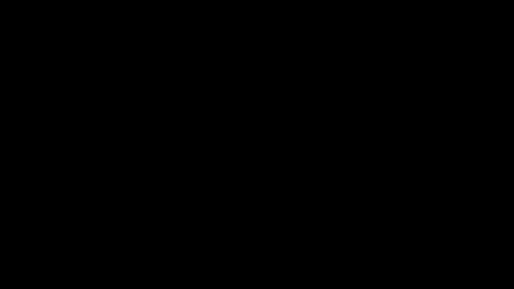

Notice how '4' is removed before '3' even though '3' was already in the container. This is because '4' has a higher priority than '3'.

Priority queues are useful when we want to keep track of the maximum element in a collection. We can also use them to keep track of the minimum element if we consider *smaller* elements to have *higher* priority. For priority queues, "priority" depends on how the queue is configured.

# Implementing a Priority Queue

You can probably already think of a few ways to implement this data structure. The simplest way is to use a regular list. We can add elements to the end of the list easily. Then, to remove the highest priority element, we can use linear search to find the maximum element.

```
[3, 1, 5, 2, 4]   5 is the highest priority element
[3, 1, 4, 2, 5]   Swap 5 with the end of the list
[3, 1, 4, 2]      Remove 5 from the list
```

Linear search takes O(n) time. To speed things up, we can swap 5 with the last element in the list, so elements don't need to be shifted around. However, this won't reduce our overall time complexity.

Another way might be to use a balanced binary search tree. Balanced binary search trees ensure that the elements are always ordered and that the tree is balanced. Thus, most operations will take only O(log n) time.


This works well, but there is a data structure that is even better suited for this task: the heap.

# Introduction to Binary Heaps

A **heap** is a data structure specialized for tracking the minimum or maximum element in a collection. Unlike balanced binary search trees, heaps use less overhead and can be stored in an array. This makes them faster for our purposes.

In this lesson, we'll be focusing on **binary heaps**, which specifically use complete binary trees. Recall from previous lessons:
- A **binary tree** is a tree where each node has at most two children.
- A **complete binary tree** is a binary tree where all levels are completely filled except possibly the last level, which is filled from left to right.

Note that complete binary trees are *inherently balanced* since the height of any two subtrees cannot be more than one.

A **max binary heap** adds these rules:
- For any node in the tree, the value of the node is greater than or equal to the values of its children.
- Elements are always inserted at the bottom of the tree, filling from left to right.
- Elements are always removed from the top of the tree.
- When an element is inserted or removed, the tree is restructured to maintain the properties of the heap.

These rules result in an interesting property of heaps: every subtree of a heap is also a heap. This will be useful later when we discuss converting a list to a heap.

Max heaps are useful for keeping the maximum element at the top of the tree. This is useful for priority queues where we want to dequeue the highest value first.

Here is an example of a max heap:

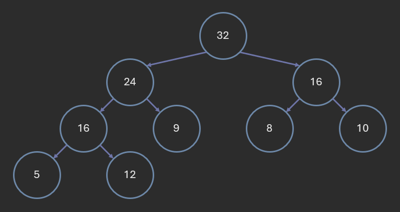

You'll notice a few interesting things:
- The elements do not appear to be sorted in any way.
- There are two '16' nodes located on different sides of the tree.
- The '12' node is on a lower level than the '10' node even though '12' is greater than '10'.

Despite these quirks, this is still a perfectly valid max heap. The important thing is that the parent node is always greater than or equal to its children.

You can also have a **min heap**. Min heaps are just like max heaps, except the parent node is always less than or equal to its children. Min heaps are useful for keeping the minimum element at the top of the tree.

Here is an example of a min heap:

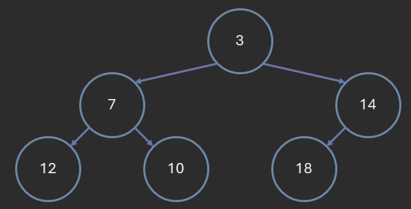

Earlier, we mentioned that heaps can be stored in an array. The array representation is the left-to-right level-order traversal of the tree.

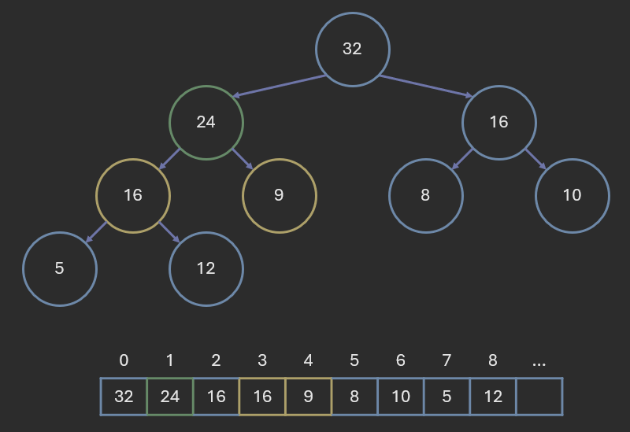

Using this representation, we can find the parent and children of any node given its index:
- The parent of a node at index `i` is at index `floor((i - 1) / 2)`.
- The left child of a node at index `i` is at index `2 * i + 1`.
- The right child of a node at index `i` is at index `2 * i + 2`.

In the above example, node '24' is at index 1. Its parent is at index floor((1 - 1) / 2), which is 0. Its left child is at index 2 * 1 + 1, which is 3. Its right child is at index 2 * 1 + 2, which is 4.

Notice how, because the tree is complete, there are no gaps between elements in the array. The last element in the array is always the rightmost element in the last row of the tree.

------

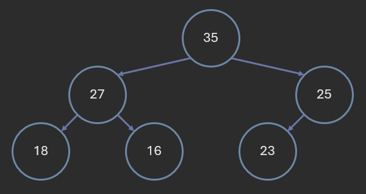

What is the array representation of the above heap?
- [35, 25, 27, 18, 16, 23]
- [35, 27, 25, 16, 18, 23]
- [35, 27, 18, 16, 25, 23]
- [35, 27, 18, 16, 23, 25]
- [35, 27, 25, 18, 16, 23]

<details>
<summary>Answer</summary>
[35, 27, 25, 18, 16, 23]
</details>

------

Consider the heap represented by the array [90, 78, 88, 23, 32, 57, 47, 10, 15, 29, 30].

What is the parent of '15'?
- 32
- 57
- 10
- 23
- 88

<details>
<summary>Answer</summary>
23
</details>

------

Consider the heap represented by the array [90, 78, 88, 23, 32, 57, 47, 10, 15, 29, 30].

What is the right child of '78'?
- 90
- 88
- 23
- 32
- '78' does not have a right child.

<details>
<summary>Answer</summary>
32
</details>

------

Consider the heap represented by the array [90, 78, 88, 23, 32, 57, 47, 10, 15, 29, 30].

What is the left child of '57'?
- 30
- 47
- 10
- 15
- '57' does not have a left child.

<details>
<summary>Answer</summary>
'57' does not have a right child.
</details>

------

# Heap Insertion and Heapify Up

When we insert an element into the heap, we add it to the end of the array. This ensures that the tree remains complete. However, this may violate the heap property, so we need to restructure the tree.

We do this using an operation called **heapify up**. We start with the newly added element and compare it to its parent. If the new element (the child) is greater than its parent, we swap them. If the new element is swapped up, we repreat the process, comparing it to its new element. This continues until the new element is less than or equal to its parent, or it reaches the root of the tree.

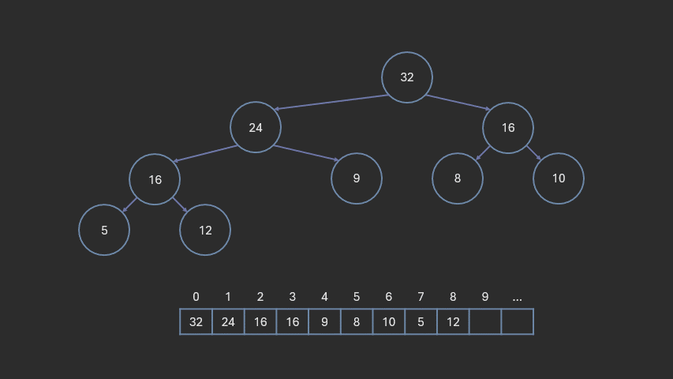

Here is the pseudocode for heapify up:
```
function heapify_up(index):
    parent_index = (index - 1) / 2
    while index > 0 and heap[index] > heap[parent_index]:
        swap(heap[index], heap[parent_index])
        index = parent_index
        parent_index = (index - 1) / 2
```

This is an iterative implementation, but you can also use recursion if you find that more intuitive.

Min-heaps follow a similar process, except we swap the child with its parent if the child is *less than* its parent.

Assuming the underlying array does not need to be resized, adding a new element to the end of the array takes O(1) time. In the worst case, we may need to swap the new element all the way up to the root of the tree. Since complete binary trees are always balanced, the height of the tree is proportional to the logarithm of the number of elements in the tree. Thus, heapify up takes O(log n) time.

Therefore, inserting an element into a heap takes O(log n) time.

------

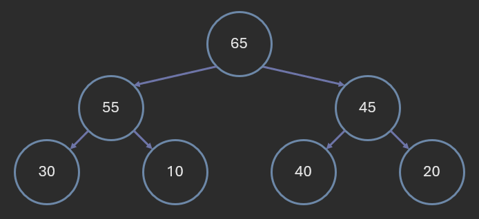

What is the array representation of the above heap after inserting '60' and restructuring the heap?
- [65, 60, 45, 55, 10, 40, 20, 30]
- [65, 55, 45, 60, 10, 40, 20, 30]
- [65, 55, 45, 30, 10, 40, 20, 60]
- [65, 60, 55, 30, 10, 45, 40, 20]
- [65, 55, 45, 30, 10, 40, 20, 60]

<details>
<summary>Answer</summary>
[65, 60, 45, 55, 10, 40, 20, 30]
</details>

------

# Heap Removal and Heapify Down

When we remove an element from the heap, we always remove the root element. This is because the root element is always the maximum element in a max heap (or minimum element in a min heap).

We do this by replacing the root with the last element in the array. This ensures that the tree remains complete. However, this may violate the heap property, so we need to restructure the tree.

We use an operation called **heapify down**. We start with the root element and compare it to its children. If the root is less than either of its children, we swap it with the larger child. If the root is swapped down, we repeat the process, comparing it to its new children. This continues until the root is greater than or equal to both of its children, or it reaches a leaf node.

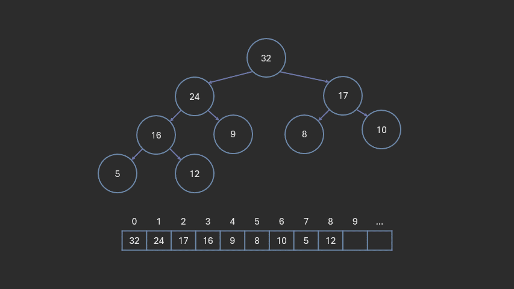

In a min heap, if the root is larger than either of its children, we swap it with the smaller child. 

When swapping during heapify down, it might be difficult to remember which element to swap with. An easy way to remember is to consider both swaps. It should be obvious which swap will maintain the heap property.

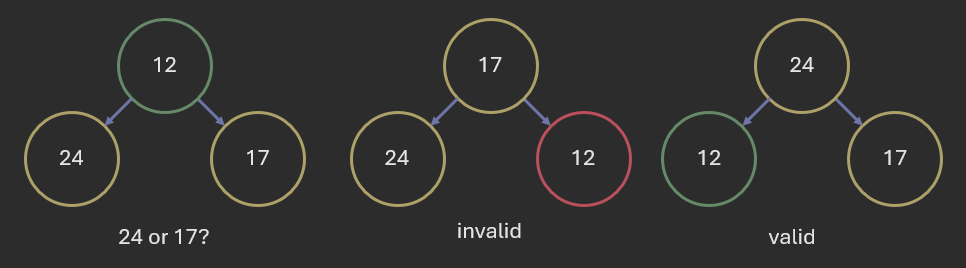

Here is the pseudocode for heapify down:
```
function heapify_down(index):
    left_child_index = 2 * index + 1
    right_child_index = 2 * index + 2
    largest_index = index
    largest = heap[index]
    if left_child_index < length(heap) and heap[left_child_index] > largest:
        largest_index = left_child_index
        largest = heap[left_child_index]
    if right_child_index < length(heap) and heap[right_child_index] > largest:
        largest_index = right_child_index
        largest = heap[right_child_index]
    if largest_index != index:
        swap(heap[index], heap[largest_index])
        heapify_down(largest_index)
```

Here, we use recursion to continue heapifying down until the heap property is restored.

Swapping the root element with the end of the array, then removing the root element takes O(1) time. In the worst case, we may need to swap the new root element all the way down to the bottom of the tree. Thus, heapify down takes O(log n) time.

Therefore, removing an element from a heap takes O(log n) time.

------


What is the array representation of the above heap after removing 1 element and restructuring the heap?
- [55, 45, 40, 30, 10, 20]
- [55, 30, 45, 20, 10, 40]
- [55, 30, 40, 45, 10, 20]
- [55, 45, 30, 40, 10, 20]

<details>
<summary>Answer</summary>
[55, 30, 45, 20, 10, 40]
</details>

------

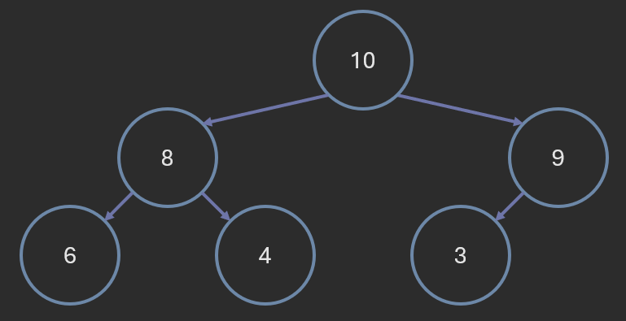

What is the array representation of this heap after removing 2 elements and restructuring the heap after each removal?
- [8, 6, 3, 4]
- [8, 6, 4, 3]
- [8, 4, 6, 3]
- [6, 8, 4, 3]

<details>
<summary>Answer</summary>
[8, 6, 3, 4]
</details>

------

# Converting a List to a Heap

Converting a list to a heap is easier than you might think. We simply perform the heapify down operation starting from the middle element of the list and working our way to the root. This ensures that all subtrees are already heaps when we heapify down.

```
function list_to_heap(list):
    for (int i = length(list) / 2; i >= 0; i--):
        heapify_down(i)
```

You could technically start at the end of the list, but this is unnecessary; the lower half of the list are the leaf nodes, so they can't be swapped down.

Heapify down is O(log n), and we perform it on n / 2 elements. Thus, we expect this to take O(n log n) time. However, this algorithm is actually O(n) time.

The reason this algorithm is O(n) is because heapify down takes less time near the bottom of the tree where the nodes are closer to the leaves. You won't need to know the exact proof for this; just know that it is O(n).

# Heap Sort

Heap sort (sometimes written as "heapsort") is an n log n sorting algorithm that uses heaps to sort elements.

Based on what we've covered, you might have an idea of how to use heaps to sort elements in ascending order:
1. Insert all elements into a min-heap.
2. Remove elements from the heap one-at-a-time and add them to the sorted list.

Heap sort follows a similar process, but it is more efficient:
1. Convert the list to a max-heap.
2. Remove elements from the heap one-at-a-time and add them to a sorted section at the end of the list.

This second method is faster than the first and does not require any additional space (aside from temporary variables).

Here is an animation of heap sort in action:

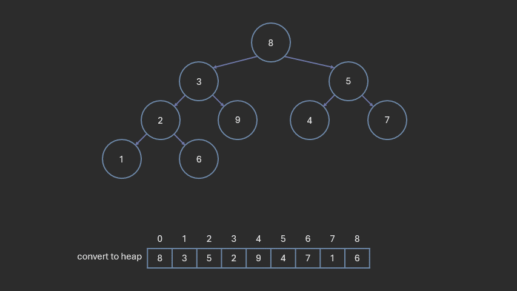

Notice how the list size does not change. The sorted section of the list grows from the end of the list while the unsorted section shrinks.

# C++ Heap Functions

C++ provides a few functions for working with heaps in the `<algorithm>` library:

- `make_heap(begin, end)`: Converts a range of elements into a heap.
- `push_heap(begin, end)`: Inserts the element at position `end - 1` into the heap `[begin, end - 1)`, resulting in the new heap `[begin, end)`.
- `pop_heap(begin, end)`: Removes the maximum element from the heap `[begin, end)`, resulting in the new heap `[begin, end - 1)` and moving the maximum element to position `end - 1`.
- `is_heap(begin, end)`: Checks if the range of elements is a heap.

These functions use *max heaps*. `begin` and `end` should be random access iterators, so using `std::vector` or `std::deque` should work fine.

# C++ Priority Queue

C++ also provides a `std::priority_queue` class for working with priority queues. This class uses a max heap by default.

```cpp
#include <queue>

int main() {
    std::priority_queue<int> pq;
    pq.push(3);
    pq.push(1);
    pq.push(5);
    pq.push(2);

    while (!pq.empty()) {
        std::cout << pq.top() << " ";
        pq.pop();
    }
    // Output: 5 3 2 1

    return 0;
}
```

`std::priority_queue` is not exactly a container; it is a container *adaptor*. That is, it wraps around another container and provides a specific interface. By default, it uses a `std::vector` as its underlying container, but any container that supports random access iterators will work (such as `std::deque`).

It takes 3 template parameters:
- `T`: The type of elements in the priority queue.
- `Container`: The underlying container type. Defaults to `std::vector<T>`.
- `Compare`: The comparison function. Defaults to `std::less<T>`, which results in a max heap.

The following lines of code are equivalent:
```cpp
std::priority_queue<int> pq;
std::priority_queue<int, std::vector<int>, std::less<int>> pq;
```

You can also use `std::greater` to create a min heap:
```cpp
std::priority_queue<int, std::vector<int>, std::greater<int>> pq;
```

`std::less` and `std::greater` are defined in the `<functional>` library.

## Custom Comparison Functions

`std::less` is a **function object**, also known as a **functor**. It is a class that overloads the `operator()` to provide a function-like interface. In this case, it compares two elements and returns true if the first element is less than the second element.

Its implementation goes something like this:
```cpp
template <typename T>
class less {
public:
    bool operator()(const T& a, const T& b) const {
        return a < b;
    }
};
```

If we want to use elements that are not directly comparable, we can create our own functor class. For example, suppose we have a list of coordinates and want to prioritize them based on their distance from the origin. We can create a functor class that calculates the distance and compares it to another coordinate.

```cpp
#include <queue>
#include <iostream>
#include <vector>

struct Coordinate {
    int x;
    int y;
};
struct CompareDistance {
    bool operator()(const Coordinate& a, const Coordinate& b) const {
        return a.x * a.x + a.y * a.y > b.x * b.x + b.y * b.y;
    }
};
int main() {
    std::priority_queue<Coordinate, std::vector<Coordinate>, CompareDistance> pq;
    pq.push({3, 4});
    pq.push({1, 2});
    pq.push({5, 6});
    pq.push({2, 1});

    while (!pq.empty()) {
        Coordinate c = pq.top();
        std::cout << "(" << c.x << ", " << c.y << ") ";
        pq.pop();
    }
    // Output: (1, 2) (2, 1) (3, 4) (5, 6)

    return 0;
}
```

If we don't want to define an entire class, we can also use a C++ lambda function combined with `decltype` to create a functor on the fly:
```cpp
int main() {
    auto compare = [](const Coordinate& a, const Coordinate& b) {
        return a.x * a.x + a.y * a.y > b.x * b.x + b.y * b.y;
    };
    std::priority_queue<Coordinate, std::vector<Coordinate>, decltype(compare)> pq(compare);
    pq.push({3, 4});
    pq.push({1, 2});
    pq.push({5, 6});
    pq.push({2, 1});

    while (!pq.empty()) {
        Coordinate c = pq.top();
        std::cout << "(" << c.x << ", " << c.y << ") ";
        pq.pop();
    }
    // Output: (1, 2) (2, 1) (3, 4) (5, 6)

    return 0;
}
```

# D-Ary Heaps

This last section is optional, but useful to be aware of.

A **d-ary heap**, sometimes called a **k-ary heap**, is a generalization of a binary heap. In a d-ary heap, each node has d children.

D-ary heaps are also represented using arrays. The parent and children of a node at index `i` are at the following indices:
- The parent of a node at index `i` is at index `floor((i - 1) / d)`.
- The children of a node at index `i` are at indices `d * i + 1`, `d * i + 2`, ..., `d * i + d`.

Here is an example of a ternary heap (d = 3), also called a 3-heap:

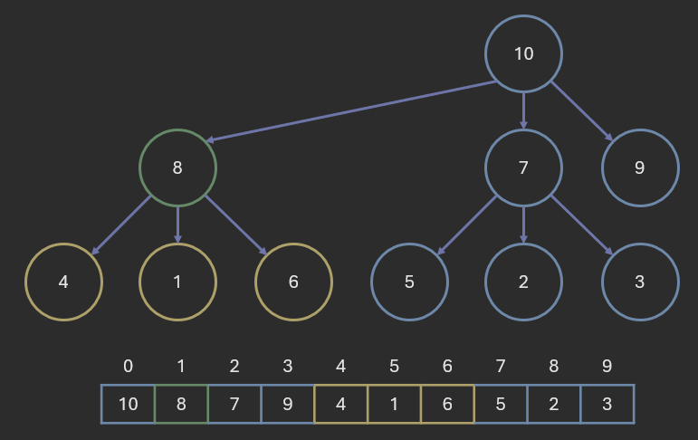

As shown in the above example, '8' is at index 1. Its children are at indices 4, 5, and 6, which are '4', '1', and '6' respectively.

Although d-ary heaps have a shorter height (when d > 2), heapify down requires more comparisons. Thus "extract min" operations are slower. 

d-ary heaps tend to be faster when more "decrease priority" operations are performed (where the priority of an element is decreased). This is the case for Dijkstra's algorithm, which uses a priority queue to find the shortest path in a graph.

# Conclusion

In this lesson, we covered heaps, a data structure useful for implementing priority queues and heapsort. We discussed the properties of heaps, how to insert and remove elements, and how to convert a list to a heap. We also discussed the time complexity of these operations.
Finally, we covered the C++ functions and classes available for working with heaps and priority queues.

# References

- [Cppreference](https://en.cppreference.com/)
- [COP 3530 Instructional Content](https://github.com/COP3530/Instructional-Content)
- [Wikipedia: d-ary heap](https://en.wikipedia.org/wiki/D-ary_heap)

Graphics by Brian Magnuson.

Lesson content written with AI assistance.

This work by Brian Magnuson is licensed under [CC BY-SA 4.0](https://creativecommons.org/licenses/by-sa/4.0/).

Find a mistake? Open an issue on [GitHub](https://github.com/COP3530/edugator-content/issues)!
