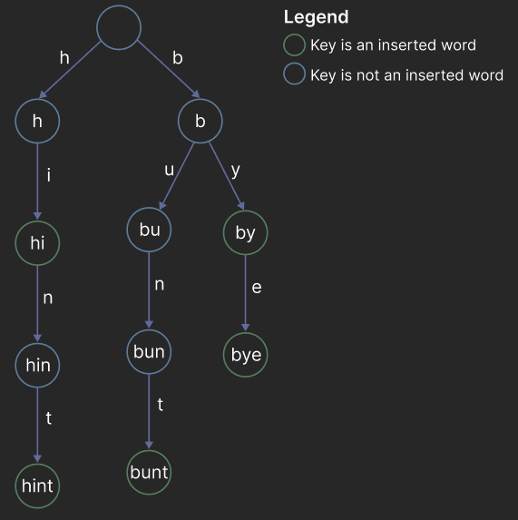

# Tries

## Definition

A __trie__ (pronounced "try") is an N-ary tree primarily used for string storage and retrieval. Unlike binary search trees where the node's key dictates its position, in a trie, the position of the node dictates its key. Additionally, connections between nodes are defined by individual characters rather than the key.



Consider the trie above. We previously stated that the position of a node dictates its key. Consider the key `bu` and trace the path from the root to the node. The edges contain the letters `b` and `u` — concatenated they form `bu`, the node's key. This is true for all nodes in the trie.

Each key is a prefix of an _inserted_ word or an _inserted_ word (or both!). We emphasize _inserted_ because although a key may form a valid word such as `bun`, since we did not explicitly insert it into the trie, it is only considered a prefix. Further, consider the keys `hi` and `by` — both are inserted words _and_ prefixes to the words `hint` and `bye`, respectively.

Lastly, note that the words `bunt`, `bye`, and `by` all share the prefix `b` and that the prefix only appears _once_ in the trie. This is one of the trie's largest benefits, the ability to reduce space used by exploiting redundancies.

__Fun Fact__: The name trie is derived from the word "retrieval" and was originally pronounced tree. However, "try" became the common pronunciation to distinguish it from the word tree.

## Motivation

In the 1960s, various data structures for string storage and retrieval existed such as hash tables and binary search trees which translate to `unordered_set` and `set` in C++.

### Time Complexity of Hash Tables and BSTs

Analyzing the time complexity for insertion and search, a hash table has `O(n)` average time complexity because the entire string needs to be hashed where `n` is the size of the target string.

A BST has `O(n · log m)` average time complexity where `n` is the length of the shortest string in the tree and `m` is the number of strings in the tree. The tree must be traversed to find the string for search and insertion, a BST typically has a height of `log m`. Additionally, the target string msut be compared to each node to determine the next node to traverse to which is `O(n)`. Note that if the BST is unbalanced, the worst case time complexity is `O(n*m)`.

| __Insertion__ | Best Case | Worst Case |
| --- | --- | --- |
| Hash Table | `O(n)` | `O(n)` |
| BST | `O(n · log m)`| `O(n·m)` |

| __Search__ | Best Case | Worst Case |
| --- | --- | --- |
| Hash Table | `O(n)` | `O(n)` |
| BST | `O(n · log m)`| `O(n·m)` |

### Space Complexity of Hash Tables and BSTs

Both hash tables and BSTs have best and worst `O(n·s)` space complexity where `n` is the length of the longest string and `s` is the number of strings in the table. Each string must be stored in the table.

| __Space__ | Best Case | Worst Case |
| --- | --- | --- |
| Hash Table | `O(n·s)` | `O(n·s)` |
| BST | `O(n·s)`| `O(n·s)` |

### Shortcoming of Hash Tables and BSTs

The time complexities for insertion and search for a BST are much slower than a hash table. Additionally, the space complexity for both data structures is the same and does not take advantage of redundancies in the data. For example, the strings `flower` and `float` have the same prefix `flo` but both prefixes would be stored twice.

### Benefits of Tries

Tries relieve the shortcomings of hash tables and BSTs for string storage and retrieval. The time complexity for insertion and search in a trie is `O(n)` where `n` is the length of the target string. The space complexity is `O(n·s)` in where `n` is the length of the longest string and `s` is the number of strings in the trie. However, tries take advantage of redundancies so the strings `flower` and `float` would only have their prefix stored once in the trie -- allowing for more efficient space usage. Additionally, tries allow for efficient string operations such as prefix search and auto-completion -- operations that would be inefficient in a hash table or BST.

Additionally, tries are __simple__ to implement. Hash tables generally require a good hashing algorithm, container resizing, and a collision resolultion protocol. A BST is also simple but runs the risk of being unbalanced, so a self-balancing BST is more commonly used which are more complex to implement (remember the AVL tree?).

Below are the time complexities of the basic operations for tries where `n` is the length of the target string and `l` is the length of the longest string in the trie.

| Operation | Best Case | Worst Case |
| --- | --- | --- |
| Insertion | `O(n)` | `O(n)` |
| Search | `O(min(n,l)`| `O(min(n,l))` |
| Deletion | `O(n)`| `O(n)` |

In summary, the main benefits of tries are:

1. Efficient storage and retrieval
2. Takes advantage of data redundancies
3. Simple implementation

__Note__: These are only 3/5 of the listed benefits of tries listed in the [original paper](https://dl.acm.org/doi/10.1145/367390.367400). The other two are more advanced topics that are beyond the scope of this lesson.

__Note__: If you are _only_ concerned about speed, a hash table may be the better choice.

### Drawbacks of Tries

Tries are not without their drawbacks. One drawback is that tries are not as space efficient as hash tables or BSTs because they store each character of the string in a node, whereas hash tables and BSTs only store the string once. The overhead of a node's memory may decreases as the number of strings increases because the trie takes advantage of redundancies.

Another drawback is that tries may incur some lookup overhead because the data is not contiguous like an array and may be scattered across memory. If a node has not been accessed recently, it may cause a cache miss and must be fetched from main memory -- slowing down the lookup time.

In summary, the main drawbacks of tries are:
1. Not as space efficient as hash tables or BSTs for small data sets
2. May incur lookup overhead due to scattered data

## Structure

A basic trie node node contains a container (often a hash map or an array) mapping a character to a child node and a boolean indicating whether a node markse the end of a word. For simplicity, we will only consider lowercase alphabetic characters for this lesson, but note that the trie can be extended to any character set.

```cpp
struct TrieNode {
    array<TrieNode*, 26> children; // 26 letters a-z
    bool isWord;
};
```

## Insertion

To insert a string into a trie, we start at the root node and traverse down the tree, creating new nodes as needed. Each character in the string corresponds to a child node in the trie. If a child node does not exist for a character, we create a new node and continue traversing down the tree. Once we reach the end of the string, we mark the last node as a word by setting the `isWord` boolean to `true`. This indicates that the string is a valid word in the trie.

The insertion algorithm is as follows:

```cpp
void TrieNode::insert(const string& target) {
    TrieNode* current = this;
    for (char c : target) {
        if (current->children[c - 'a'] == nullptr) {
            current->children[c - 'a'] = new TrieNode();
        }
        current = current->children[c - 'a'];
    }
    current->isWord = true;
}
```

<insert_animation>

### Time complexity

The time complexity for insertion is `O(n)` where `n` is the length of the target string because we must traverse each character in the string and create a new node if it does not exist. We do several operations in the loop:

1. Check if the child node exists - This is `O(1)` because we are accessing an array.
2. Create a new node if the child node does not exist - This is `O(1)` because we are creating a new node.
3. Set the current node to the child node - This is `O(1)` because we are setting a pointer.

Therefore, we do `n` `O(1)` operations in the loop, resulting in a total time complexity of `O(n)`.

## Search

Search in a trie is similar to insertion. We begin at the root and traverse down the tree, following the child nodes corresponding to each character in the string. If we reach a node that does not exist, we return `false` because the string is not in the trie. If we reach the end of the string and the last node is marked as a word, we return `true`. Otherwise, we return `false`.

```cpp
bool TrieNode::search(const string& target) {
    TrieNode* current = this;
    for (char c : target) {
        if (current->children[c - 'a'] == nullptr) {
            return false;
        }
        current = current->children[c - 'a'];
    }
    return current->isWord;
}
```

__Note__: Even if a word appears in the trie, it may only be a prefix of another word. For example, if we insert the words `flower` and `float`, searching for `flo` will return `false` because it is not a complete word in the trie.

<search_animation>

### Time complexity

The time complexity for search is `O(min(n,l))` where `n` is the length of the target string and `l` is the length of the longest string in the trie. We must traverse each character in the string and check if the child node exists. If the string is not in the trie, we will stop traversing as soon as we reach a node that does not exist. If the string is in the trie, we will traverse all `n` characters otherwise we traverse at _most_ `l` characters.

## Conclusion

The trie is a simple but powerful data structure which allows for efficient string storage and retrieval. It is a great choice for applications that require fast prefix search, auto-completion, and other string operations. The trie is also simple to implement and can be extended to any character set. However, it is not as space efficient as hash tables or BSTs for small data sets and may incur lookup overhead due to scattered data.
