# Hash Tables

**Author:** *Brian Magnuson*

In this lesson, we will be covering hash tables, a powerful data structure used for storing key-value pairs and providing fast insertion, deletion, and lookup operations.

We will be covering the following:
- Introduction to key storing
- Hash functions
- Reducing hash codes to array indices
- Collision resolution
- Load factor and resizing
- Computational complexity
- An example of a hash function

# Introduction to Key Storing

Given a set of unique data items, how can we store them such that new items may be added and existing items may be retrieved as quickly as possible?

Throughout this course, you've learned a few data structures that can be used to store and retrieve data. 

You could store these items in an array. Inserting new items would be fast, but retrieving items would be slow. You would have to search through the entire array to find the item you're looking for.

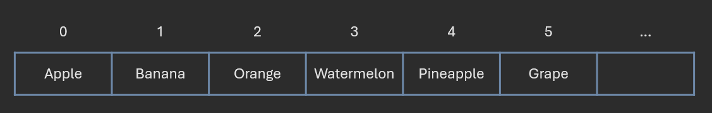

You could instead store these items in a balanced binary search tree. Although the tree would take up more space, insertion, search, and deletion operations would be very fast.

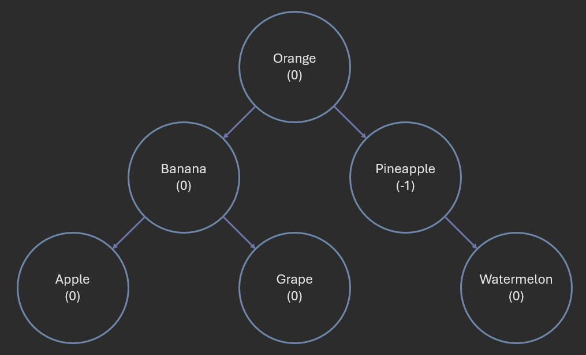

For a balanced BST like an AVL tree, insertion, search, and deletion operations are O(log n) where n is the number of items in the tree. This is already very fast. For a tree of 8 billion items, you would only need 33 comparisons at maximum to find the item you're looking for. Thus, balanced BSTs are used to implement sorted maps and sets.

However, balanced BSTs still have some drawbacks:
- They take up more memory due to the pointers required to maintain the tree structure.
- They only work if the data is comparable.

This is where hash tables come in. Hash tables not only take up less memory than balanced BSTs, but they are also even more efficient at storing and retrieving data.

# Exploiting Array Random Access

Let's start by revisiting arrays. Arrays are a data structure that stores a collection of items in contiguous memory locations. Each item in the array is accessed by an index. Array random access is O(1). That is, if you know the index, you can access the item in the array in constant time.

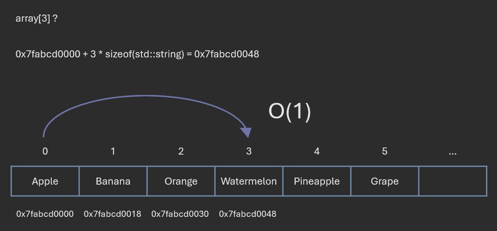

Earlier, we mentioned that searching for items in an array is slow. This is because we don't know the index of the item we're looking for. We have to search through the entire array to find the item.

What if we created a *rule* that allows us to derive the index of an item from the item itself?
Here's an example:

> A string is stored at the index corresponding to the length of the string.

Under this rule, the string "apple" would be stored at index 5. Then, when we later want to find the string "apple", we can check its length, which is 5, and immediately know that it is stored at index 5:
- If we find it there, we're done.
- If we don't find it there, we know that the string "apple" is not in the array since "apple" is only ever stored at index 5.

Under this rule, we would store "banana" at index 6, "pear" at index 4, and so on.

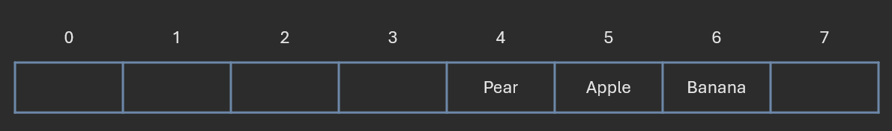

This is the essense of hash functions. 

# Hash Functions

A **hash function** is a deterministic function that converts an input into a fixed-size value, typically a number. The output of a hash function is called a **hash code** or **hash value**.

Please note that this definition of a hash function is different from the cryptographic hash functions used in cryptography. Cryptographic hash functions typically have a few additional properties that make them more secure.

In the example above, the hash function is `f(x) = len(x)`. Given a string `x`, the hash function returns the length of the string.

Under our definition, hash functions technically have only one requirement: they must be **deterministic**. That is, given the same input, a hash function must always produce the same output. That is, for a hash function f, x = y implies f(x) = f(y).

Examples of valid hash functions include:
- `func f(x) { return len(x); }`
  - Returns the length of the input.
- `func f(x) { return x[0]; }`
  - Returns the first character of the input if the input is a string.
- `func f(x) { return 42; }`
  - Technically, this is a valid hash function, but as we'll see later, it's not a very good one.

Functions fail to be deterministic when they rely on external factors, such as the current time or the state of the system. For example, a function that returns the current time would not be deterministic. Functions that rely on random number generators are also not deterministic.

Examples of invalid hash functions include:
- `func f(x) { return Date.now(); }`
  - Returns the current time in nanoseconds.
- `func f(x) { return rand(); }`
  - Returns a random number.
- `func f(x) { return x % global_variable; }`
  - Returns the input modulo a global variable
  - This function depends on values outside of the input, so it is not deterministic.

A *good* hash function, in addition to being deterministic, should also have the following properties:
- **Uniformity**: The hash function should distribute the keys uniformly across the hash table. That is, each bucket should have roughly the same number of keys.
- **Efficiency**: The hash function should be fast to compute. If the hash function is slow, then the benefits of using a hash table are lost.
- **Minimization of collisions**: The hash function should minimize the number of collisions.

A collision occurs when two items have the same hash code or are mapped to the same index.

To make use of hash functions in our data structure, we need to tackle 3 problems:
- How do we convert hash codes to valid array indices?
- How do we handle collisions?
- What happens when the array is full?

We'll cover each problem in the next few sections.

# Reducing Hash Codes to Array Indices

The goal is to map our data items to indices in an array. However, the hash code produced by the hash function may not be a valid index in the array.

In our previous example, we used a hash function that returns the length of a string. So "apple" has a hash code of 5 and "pineapple" has a hash code of 9. However, if our array has a size of 8, we can't store "pineapple" at index 9.

The solution is simple: we can *reduce* the hash code to a valid index. One common technique is to use the modulo operator:
- `index = hash_code % array_size`

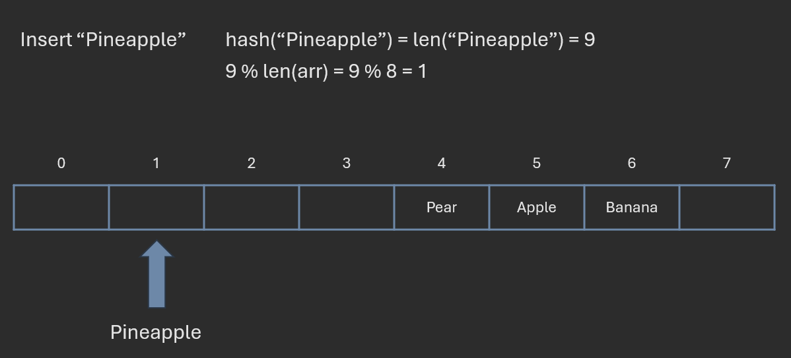

This ensures that the index is always within the bounds of the array. This works for basic hash table implementations.

However, there are more advanced techniques for reducing hash codes to valid indices. One way is to ensure that the array size is some power of 2. This allows us to use the bitwise AND operator instead of the modulo operator:
- `index = hash_code & (array_size - 1)`
  - This only works if `array_size` is a power of 2.

The bitwise AND operator is faster than the modulo operator, so this technique is more efficient.

# Collision Resolution

A **collision** occurs when two items have the same hash code or are mapped to the same index.

Ideally, we would like a hash function that never produces collisions. Maybe for strings, we can somehow combine the ASCII values of the characters in a unique way:
```cpp
int hash(string s) {
    int hash_code = 0;
    for (size_t i = 0; i < s.size(); i++) {
        hash_code += s[i] * pow(128, i);
    }
    return hash_code;
}
```

However, this function does not always work. It assumes (1) that the string's characters are limited to ASCII characters and (2) that the resulting number fits within a 32-bit integer.

The fact is that creating a collision-free hash function is not always possible. Our only option is to somehow deal with collisions when they occur.

There are two common techniques for resolving collisions:
- Separate chaining
- Open addressing

## Separate Chaining

Separate chaining essentially allows multiple items to be stored at the same index. Each bucket in the hash table is a linked list. When a collision occurs, the new key-value pair is added to the linked list at that bucket.

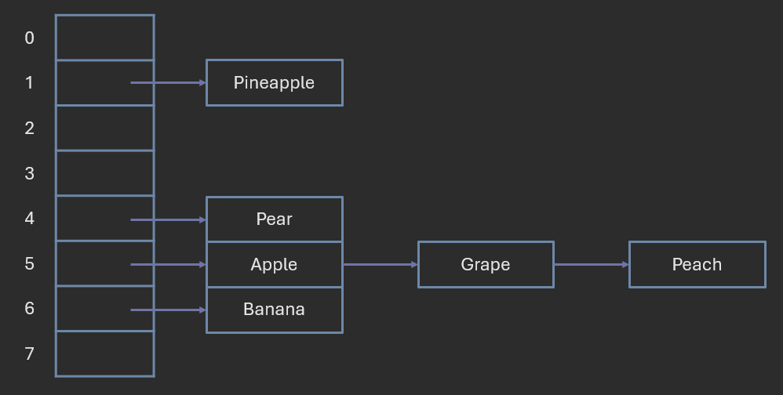

Now, whenever we need to find a key, we first hash the key to find the bucket. Then, we linearly search the linked list at that bucket for the key.

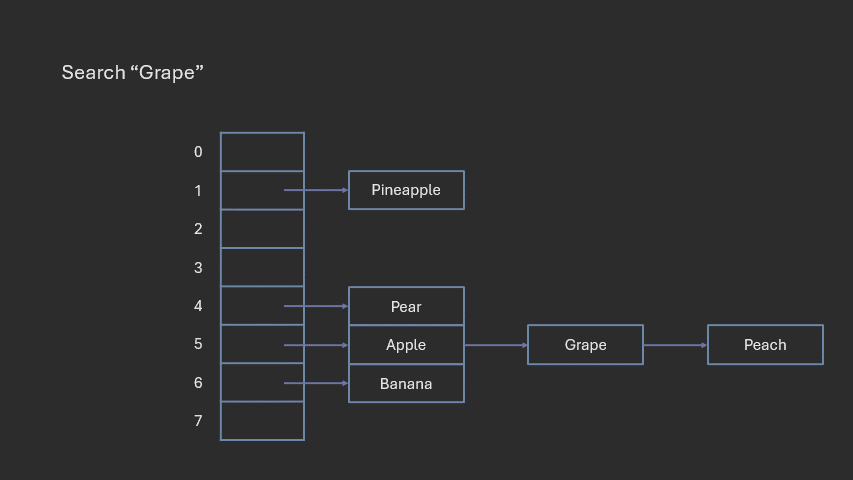

As mentioned previously, a good hash function should minimize collisions. If there are many collisions, the linked lists will become longer, resulting in slower performance.

## Open Addressing

Open addressing, in short, means that when a collision occurs, we place the item in the next available slot. The method of finding the next available slot is called **probing**.

### Linear Probing

When we say "next available slot", you may think of literally checking the next index in the array. This is specifically called **linear probing**.

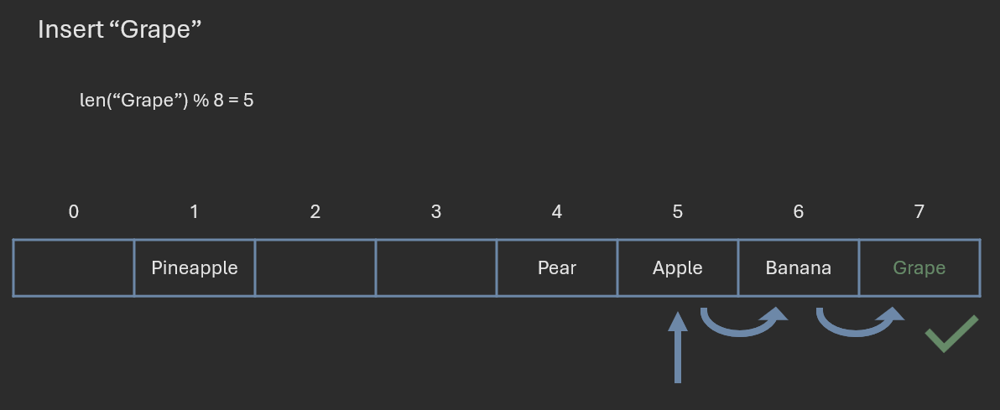

Now, when we want to find a key, we hash the key to find the bucket. If the key is not at that bucket, we check the next index in the array. We continue checking the next index until we find the key or an empty slot. If we find an empty slot, then the key is not in the hash table.

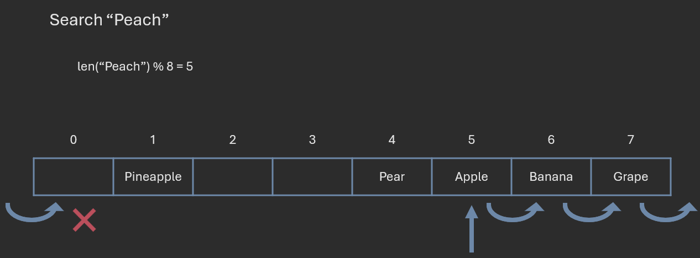

Linear probing works for simple hash tables. However, it has a major drawback: clustering. **Clustering** occurs when items are placed close together in the array. Clustering increases the likelihood of more collisions, which in turn increases the likelihood of even more clustering. This can result in slower performance.

### Quadratic Probing

An alternative to linear probing is **quadratic probing**. Instead of checking sequential indices, we check indices using a quadratic function:
- `index = (hash_code + i^2) % array_size`
  - `i` is the number of probes.

This means that after checking the first index `i`, we check the index at `(i + 1) % size`, then `(i + 4) % size`, then 9, then 16, then 25, and so on.

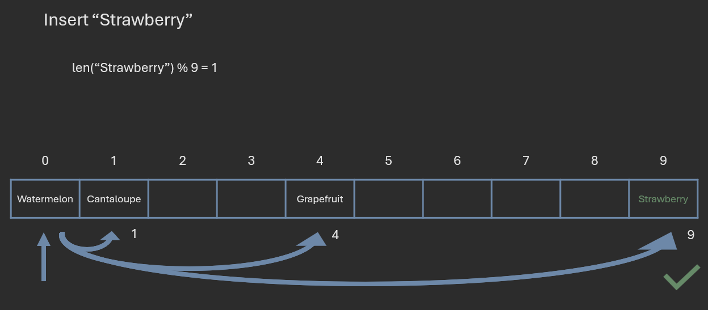

Quadratic probing helps to reduce clustering by spreading out the items in the array.

### Deleting Items

When using open addressing, deleting items can be tricky. If we simply set the item to `null`, then we may not be able to find other items that were placed after the deleted item.

To illustrate this, consider a hash table with string keys and the hash function `f(x) = len(x)`. We then insert the following items in this order:
1. "apple"
2. "banana"
3. "grape"

If we use linear probing, the items will be placed in the array as follows:
1. "apple" is placed at index 5.
2. "banana" is placed at index 6.
3. "grape" is placed at index 7 (the next available slot after index 5).

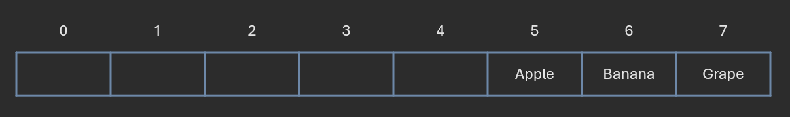

Consider what would happen when we set "banana" to `null`. If we then search for "grape":
1. We hash "grape" to find that it should be at index 5.
2. We find that "apple" is at index 5, so we continue to the next index.
3. We find an empty slot at index 6, so we stop searching.

Even though "grape" is in the hash table, the empty slot at index 6 caused us to stop searching prematurely.

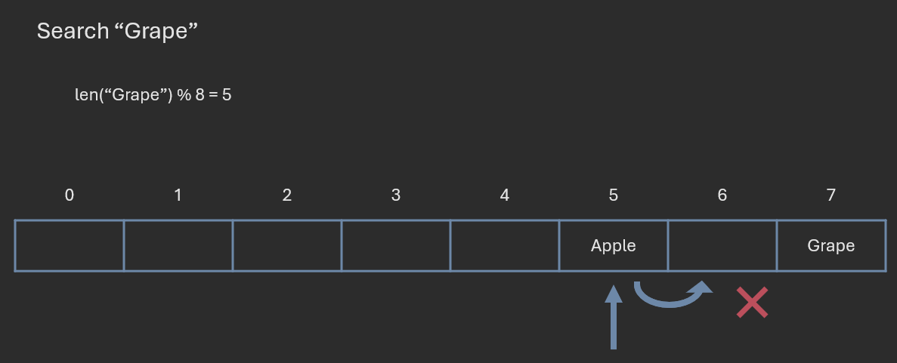

To solve this problem, we need a way to differentiate between a deleted item and a slot that has never been used. One common technique is to use a special value, such as `null`, to indicate that the slot has been deleted. Another way is to store a boolean flag with each item to indicate whether the item has been deleted.

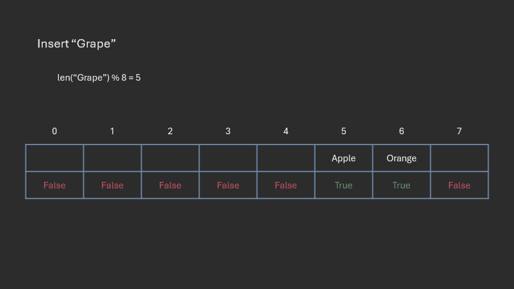

# Load Factor and Resizing

Since our array is finite in size, we need to consider what happens when the array becomes full. As we insert more and more items, the likelihood of collisions increases more and more. This results in slower performance.

To keep our hash table efficient, we keep track of how full the hash table is. The **load factor** is defined as:
- `load_factor = number_of_items / array_size`

We also define a threshold load factor, or "maximum load factor", which determines when the array is "too full". When the load factor *reaches* the threshold load factor, we resize the array.

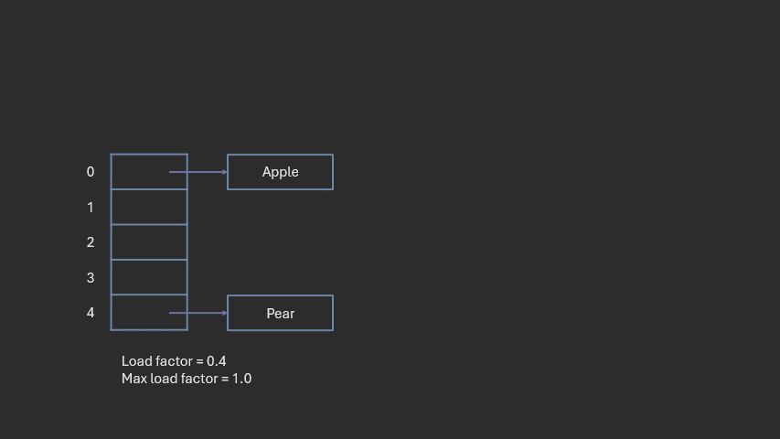

Resizing the array involves creating a new array with a larger size and *rehashing* all the items in the old array to the new array. This is necessary because our reduction function depends on the size of the array. If we change the size of the array, we need to rehash all the items to ensure they are placed in the correct buckets.

Hash tables that use *open addressing* are particularly sensitive to the load factor. As the load factor increases, the likelihood of clustering increases, which in turn increases the likelihood of more collisions. Hash tables that use *separate chaining* are work well even at high load factors (assuming we use a good hash function). Additionally, due to the nature of separate chaining, the load factor can exceed 1.

Some programming languages, including C++, provide functions that expose the number of buckets, load factor, and maximum load factor. These functions allow you to tune the hash table to your specific needs.
```cpp
#include <iostream>
#include <unordered_set>

int main() {
  std::unordered_set<int> mySet = {1, 2, 3, 4, 5};

  std::cout << "Number of buckets: " << mySet.bucket_count() << std::endl;
  std::cout << "Load factor: " << mySet.load_factor() << std::endl;
  std::cout << "Max load factor: " << mySet.max_load_factor() << std::endl;

  return 0;
}
```

The exact value for the maximum load factor may be implementation-specific.

------

Which of the following is NOT a property of a good hash function?
- The function gives the same output for the same input.
- The function runs in exponential time.
- The function evenly distributes keys across the hash table.
- The function minimizes collisions.

<details>
<summary>Answer:</summary>
The function runs in exponential time.
</details>

------

Suppose a hash table has 25 buckets and 20 items. What is the load factor of the hash table?
- 20
- 25
- 0.8
- 1.25
- 0.2

<details>
<summary>Answer:</summary>
0.8
</details>

------

Suppose a hash table has 25 buckets has a maximum load factor of 0.8. At what point should the hash table be resized?
- When the 19th item is inserted
- When the 20th item is inserted
- When the 21st item is inserted
- When the 25th item is inserted

<details>
<summary>Answer:</summary>
When the 20th item is inserted
</details>

------

```
func f(x) { return x[0] % Date.now(); }
func g(x) { return 42; }
func h(x) { return rand(); }
func j(x) { int sum = 0; for (char c : x) sum += c; return sum; }
```

Consider the above functions. Which would make the best hash function for a hash table?
- Function f
- Function g
- Function h
- Function j

<details>
<summary>Answer:</summary>
Function j
</details>

------

Which of the following is NOT an effect of increasing the max load factor of a hash table?
- The hash table will be resized more frequently.
- Collisions are more likely to occur as more items are inserted.
- The hash table can hold more items relative to its capacity at a time.
- Performance may improve or degrade depending on the use case of the hash table.

<details>
<summary>Answer:</summary>
The hash table will be resized more frequently.
</details>

------

# Computational Complexity

Hash tables generally take no additional space beyond the space required to store the items themselves. The space complexity of a hash table is O(n), where n is the number of items in the hash table.

For insertion, search, and deletion operations, the best-case and average-case time complexity is O(1). This is because the hash function allows us to immediately find the bucket where the item should be stored or retrieved. However, the worst-case time complexity is O(n) if the hash function produces many collisions or the operation triggers a resize. 

You can claim that the worst-case time complexity is O(1) if you assume that:
- The hash function evenly distributes the keys across the hash table
- The load factor of the hash table is maintained such that collisions are negligible
- Resizing does not occur

Worst-case time complexity can make hash tables appear slower than they actually perform in practice. Thus, it is sometimes more useful to consider the **amortized time complexity**, which is the average time taken per operation over a sequence of operations.

Assuming a good hash function and well-chosen maximum load factor (which may be implicitly assumed in some cases), the amortized time complexity of insertion, search, and deletion operations is O(1).

In summary:
- Space complexity: O(n)
- Time complexity:
  - Best-case: O(1)
  - Average-case: O(1)
  - Worst-case: O(n)
  - Amortized: O(1)

# An Example of a Hash Function

This section is optional, but you might find it interesting.
In this section, we'll go over a well-known hash function called FNV-1a.

FNV-1a is part of a a series of non-cryptographic hash functions created by Glenn Fowler, Landon Curt Noll, and Phong Vo (hence the name FNV). This function is very simple and fast.
```cpp
#define FNV_OFFSET_BASIS 14695981039346656037
#define FNV_PRIME 1099511628211

uint64_t fnv1a(const std::string& key) {
  uint64_t hash = FNV_OFFSET_BASIS;
  for (char c : key) {
    hash ^= c;
    hash *= FNV_PRIME;
  }
  return hash;
}
```

`FNV_OFFSET_BASIS` and `FNV_PRIME` are chosen based on the size of the hash code. You can read more about this function [here](https://en.wikipedia.org/wiki/Fowler%E2%80%93Noll%E2%80%93Vo_hash_function).

You'll notice two things about this function:
- It uses a combination of bitwise XOR and multiplication to generate the hash code.
  - These operations are fast and efficient.
- Its time complexity is dependent on the length of the key.
  - This is because the function iterates over each character in the key.

Many hash functions work by "hashing" every byte of the input. For a string of length t, the time complexity of the hash function is O(t).

You can read more about non-cryptographic hash functions [here](https://en.wikipedia.org/wiki/List_of_hash_functions).

# Conclusion

Hash tables are a powerful data structure that allow for fast insertion, deletion, and lookup operations. They are particularly useful when we need to store key-value pairs and when we need to quickly find items in a large collection.

# References

- [Cppreference](https://en.cppreference.com/)
- [COP 3530 Instructional Content](https://github.com/COP3530/Instructional-Content)
- [Wikipedia: Fowler-Noll-Vo hash function](https://en.wikipedia.org/wiki/Fowler%E2%80%93Noll%E2%80%93Vo_hash_function)
- [Wikipedia: List of hash functions](https://en.wikipedia.org/wiki/List_of_hash_functions)

Graphics by Brian Magnuson.

Lesson content written with AI assistance.

Find a mistake? Open an issue on [GitHub](https://github.com/COP3530/edugator-content/issues)!
