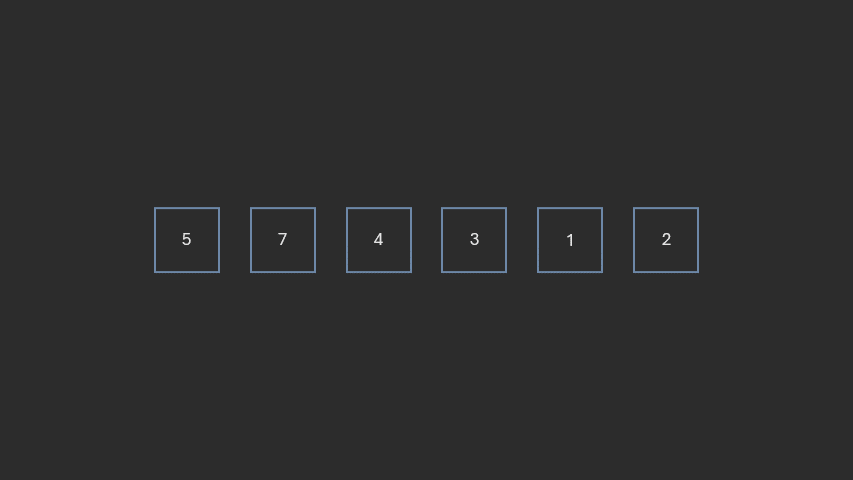
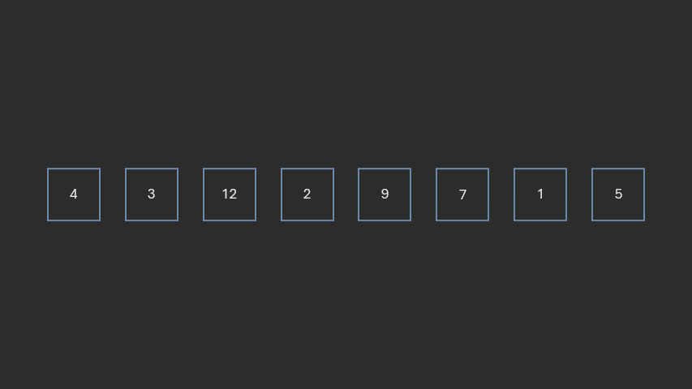
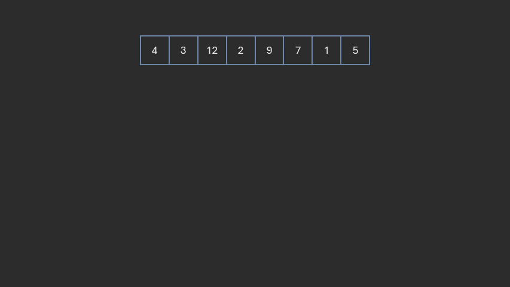
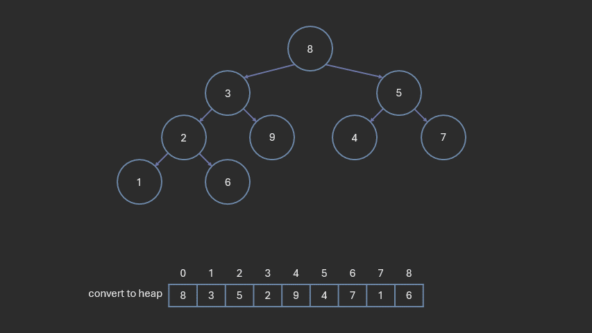

# Sorting

**Author:** *Brian Magnuson*

In this lesson, we will cover sorting algorithms. Sorting is a fundamental operation in computer science and is used in many applications.

We will cover the following:
- Introduction to Sorting
- Selection Sort
- Bubble Sort
- Insertion Sort
- Shell Sort
- Merge Sort
- Quick Sort
- Heap Sort

# Introduction to Sorting

Sorting is the process of arranging the elements of a list or array in a specific order. 
Sorting is important, because many algorithms and data structures rely on sorted data to function efficiently.
Problems such as finding the median or finding the K largest numbers are easier to solve when the data is sorted.
Sorting is also important for searching algorithms, such as binary search, which can only be used on sorted data.

Many programming languages provide some built-in sorting algorithm in their standard libraries. 
In C++, the `std::sort` function is used to sort a range of elements in ascending order.

```cpp
#include <iostream>
#include <vector>
#include <algorithm> // for std::sort

int main() {
    std::vector<int> arr = {5, 2, 9, 1, 5, 6};
    std::sort(arr.begin(), arr.end()); // sort the array in ascending order

    for (int i : arr) {
        std::cout << i << " "; // 1 2 5 5 6 9
    }
    return 0;
}
```

For a list to be sortable via `std::sort`, the elements must be *comparable*. This can be done by overloading the `operator<` for the class of the elements in the list.

Alternatively, you can provide a custom comparison function to `std::sort` that defines how the elements should be compared.

```cpp
#include <iostream>
#include <vector>
#include <algorithm> // for std::sort
#include <string> 

struct Person { std::string name; int age; };

int main() {
    std::vector<Person> people = {{"Alice", 30}, {"Bob", 25}, {"Charlie", 35}};

    // Sort by age
    std::sort(people.begin(), people.end(), [](const Person& a, const Person& b) {
        return a.age < b.age;
    });

    for (const auto& person : people) {
        std::cout << person.name << " ";
        // Bob Alice Charlie
    }
    return 0;
}
```

Here, we use a lambda function. You can also use a function pointer or a functor (a class that overloads the `operator()`) to define the comparison function.

If you need to sort in descending order, you can reverse the comparison in the function or functor.

For simplicity, we will stick to sorting integers in ascending order in this lesson.

# Selection Sort

Selection sort is a simple sorting algorithm that divides the input list into two parts: a sorted part and an unsorted part. The algorithm can be described as follows:

1. Linearly search the unsorted part of the list to find the smallest element.
2. Swap the smallest element with the first element of the unsorted part.
3. Mark the first element of the unsorted part as sorted.
4. Repeat steps 1-3 until the entire list is sorted.

There are also variations of selection sort where the largest element is selected instead of the smallest.



Here is the pseudocode for selection sort:
```
func selection_sort(arr):
    n = length(arr)
    for i from 0 to n-1:
        min_index = i
        for j from i+1 to n-1:
            if arr[j] < arr[min_index]:
                min_index = j
        swap arr[i] and arr[min_index]
```

The first pass will make n-1 comparisons, the second pass will make n-2 comparisons, the third n-3, and so on.
This series of comparisons can be expressed as the sum of the first n-1 integers, which is equal to (n-1)(n)/2.

The time complexity of selection sort is O(n^2) in the average and worst case.

The auxiliary space complexity is O(1), since the algorithm can sort the list in place without using any additional memory.

# Bubble Sort

Bubble sort is another simple sorting algorithm. It works by comparing adjacent elements and swapping them if they are in the wrong order. The algorithm can be described as follows:

1. Compare the first two adjacent elements in the unsorted part of the list.
2. If the first element is greater than the second, swap them.
3. Move to the next pair of adjacent elements and repeat step 2 until the end of the list is reached.
4. Mark the last element of the unsorted part as sorted.
5. If there were no swaps in the previous pass, the list is sorted.
6. Otherwise, repeat steps 1-5 until the entire list is sorted.

When performing a pass of bubble sort, the largest element in the unsorted part of the list will "bubble" to the end of the list.

If there no swaps in a pass, that can only mean that every pair of elements was in the correct order. Therefore, we can stop the algorithm early.


Here is the pseudocode for bubble sort:
```
func bubble_sort(arr):
    n = length(arr)
    for i from 0 to n-1:
        swapped = false
        for j from 0 to n-i-2:
            if arr[j] > arr[j+1]:
                swap arr[j] and arr[j+1]
                swapped = true
        if not swapped:
            break
```

In the worst case, the list will be reversely sorted. In this case, the algorithm will make i=n-1 passes, and each pass will make n-i-1 comparisons. Much like selection sort, this series of comparisons can be expressed as the sum of the first n-1 integers, which is equal to (n-1)(n)/2.

In the best case, the list is already sorted. In this case, the algorithm will make one pass and will not make any swaps. The time complexity of bubble sort is O(n^2) in the average and worst case, and O(n) in the best case.

The auxiliary space complexity is O(1), since the algorithm can sort the list in place without using any additional memory.

# Insertion Sort

Insertion sort works by taking each element from the unsorted part of the list and inserting it into the correct position in the sorted part of the list. The algorithm can be described as follows:

1. Mark the first element of the list as sorted.
2. Take the first element of the unsorted part of the list.
3. Compare it with the elements in the sorted part of the list from right to left.
4. If the element is smaller than the current element in the sorted part, shift the current element to the right.
5. Insert the element in the correct position in the sorted part of the list.
6. Mark the element as sorted.
7. Repeat steps 2-6 until the entire list is sorted.


Similar to bubble sort, in the worst case, the list will be reversely sorted, and its time complexity will be O(n^2). In the best case, the list is already sorted, and its time complexity will be O(n).

The auxiliary space complexity is O(1), since the algorithm can sort the list in place without using any additional memory.

Here is the pseudocode for insertion sort. This code *shifts* the element in the sorted part over before inserting the new element.
```
func insertion_sort(arr):
    n = length(arr)
    for i from 1 to n-1:
        key = arr[i]
        j = i - 1
        while j >= 0 and arr[j] > key:
            arr[j + 1] = arr[j]
            j = j - 1
        arr[j + 1] = key
```

Insertion sort has a tendency to perform well in lists that are *almost* sorted. Because of this, it is often used in combination with other sorting algorithms to improve their performance.

# Shell Sort

Shell sort is similar to insertion sort. However, instead of comparing adjacent elements, it starts by comparing elements that are far apart, then reduces the gap between the elements to be compared at each pass.

1. Let h be half the length of the list.
2. For each element in the list, starting at index h-1, compare it with the element h positions before it.
3. If the element is smaller than the element h positions before it, swap them.
4. Continue comparing the element with the element h positions before it until the beginning of the list is reached or the element is in the correct position.
5. Divide h by 2.2 and repeat steps 2-4 until h is less than 1.

2.2 may seem like an arbitrary number, but it is a good choice for reducing the gap between elements.

Note that when h=1, steps 2-4 are equivalent to insertion sort.



Shell sort has been proven to have the following time complexities:
- O(n^2) in the worst case
- O(n^(5/4)) in the average case
- O(n^(7/6)) in the best case

You will not need to worry about the exact proofs of these time complexities.

Shell sort also has an auxiliary space complexity of O(1), since the algorithm can sort the list in place without using any additional memory.

# Merge Sort

Merge sort is a divide-and-conquer sorting algorithm. Divide-and-conquer algorithms work by dividing the problem into smaller subproblems, solving each subproblem, and then combining the solutions to solve the original problem.

Before we get into the details of the algorithm, consider the following:
- Suppose you have a list of unsorted integers.
- Suppose also that you have an algorithm that can sort the left and right halves separately.
- How can you combine the two sorted halves into a single sorted list?

Merging two lists is easy. If you have two pointers, you can compare first elements of each list and add the smaller one to the merged list.



So now you might be asking, how do we sort the left and right halves?

We can take the left half, split it into two halves, sort each half, and then merge the two sorted halves. We can do the same for the right half. In other words, we can apply the same algorithm recursively to the left and right halves.

This is the essence of the divide-and-conquer algorithm. We can run our algorithm recursively on the left and right halves until we reach a base case, which is when the list has one or zero elements. A list with one or zero elements is already sorted.

Here are the basic steps:
1. If the list has one or zero elements, consider the list already sorted.
2. Otherwise, split the list into two halves and run steps 1-3 recursively on each half.
3. Merge the two sorted halves into a single sorted list.

And here is the pseudocode for merge sort:
```
func merge(arr, start, mid, end):
    left = arr[start:mid+1]
    right = arr[mid+1:end+1]
    i = 0
    j = 0
    k = start
    while i < length(left) and j < length(right):
        if left[i] <= right[j]:
            arr[k] = left[i]
            i += 1
        else:
            arr[k] = right[j]
            j += 1
        k += 1
    while i < length(left):
        arr[k] = left[i]
        i += 1
        k += 1
    while j < length(right):
        arr[k] = right[j]
        j += 1
        k += 1

func merge_sort_helper(arr, start, end):
    if start >= end:
        return
    mid = (start + end) / 2
    merge_sort_helper(arr, start, mid)
    merge_sort_helper(arr, mid + 1, end)
    merge(arr, start, mid, end)

func merge_sort(arr):
    merge_sort_helper(arr, 0, length(arr)-1)
```

Here, we use 3 functions:
- `merge` is used to merge two sorted halves into a single sorted list.
- `merge_sort_helper` is a recursive function that splits the list into two halves and calls `merge` to merge the two sorted halves.
- `merge_sort` is a wrapper function that calls `merge_sort_helper` with the start and end indices of the list.

The merge step takes O(n) time since we have to copy the elements from the left and right halves into a new list. The recursive step takes O(log n) time since we are dividing the list in half at each step.

The total time complexity of merge sort is O(n log n) in the average and worst case. The auxiliary space complexity is O(n) since we need to create a new list to store the merged elements.

The typical implementation of merge sort creates a new list at each merge step. Implementations exist that reuse the original list to save space. Thus, a space complexity of O(1) is possible. For this course, please consider the space complexity of merge sort to be O(n).

# Quick Sort

Quick sort (sometimes written as "quicksort") is another divide-and-conquer sorting algorithm. It works by selecting a *pivot* element from the list and partitioning the other elements into two sublists, according to whether they are less than or greater than the pivot. The sublists are then sorted recursively. The algorithm can be described as follows:

1. If the list has one or zero elements, consider the list already sorted.
2. Otherwise, select a pivot element from the list.
3. Partition the list into two sublists:
    - Elements less than the pivot
    - Elements greater than the pivot
4. Run steps 1-4 recursively on each sublist.

There are different methods for choosing the pivot. One way is to simply pick the first element of the list.

As for partitioning, most implementation utilize two pointers. The left pointer moves right until it finds an element greater than the pivot. The right pointer moves left until it finds an element less than the pivot. When both pointers have found such elements, they are swapped. This process continues until the left and right pointers cross.


Here is the pseudocode for quick sort:
```
func partition(arr, low, high):
    pivot = arr[low]
    left = low + 1
    right = high
    while true:
        while left <= right and arr[left] <= pivot:
            left += 1
        while left <= right and arr[right] >= pivot:
            right -= 1
        if left > right:
            break
        swap arr[left] and arr[right]
    swap arr[low] and arr[right]
    return right

func quick_sort_helper(arr, low, high):
    if low < high:
        pivot_index = partition(arr, low, high)
        quick_sort_helper(arr, low, pivot_index - 1)
        quick_sort_helper(arr, pivot_index + 1, high)

func quick_sort(arr):
    quick_sort_helper(arr, 0, length(arr) - 1)
```

Ideally, the pivot will be close to the median of the list, resulting in the two sublists being roughly equal in size. Since the pointers are visiting each element in the sublists, the partition step takes O(n) time. The recursive step takes O(log n) time since we are dividing the list in half at each step. Thus, the total time complexity of quick sort is O(n log n) in the average case and best case.

Quick sort works well as long as we choose a good pivot. But there are cases where the pivot chosen is not close to the median. This results in one sublist being much larger than the other. The larger sublist will take more time to sort, which will impact performance.

If we choose the first element as our pivot each time, then the algorithm performs poorly when the list is sorted or almost sorted. Thus, the time complexity of quick sort is O(n^2) in the worst case.

There *are* pivot selection algorithms that can choose a good pivot each time. One such algorithm is the "median of medians" algorithm, which attempts to estimate the median of the list. This algorithm has a time complexity of O(n). When used for quick sort, the time complexity becomes O(n log n) in the worst case.

Median of medians is beyond the scope of this course, but you can read about it [here](https://en.wikipedia.org/wiki/Median_of_medians).
For this course, assume that only simple pivot selection algorithms are used, and the worst case time complexity for quick sort is O(n^2).

Since quick sort is usually implemented using recursion, the auxiliary space complexity is O(log n) due to the recursion stack.

# Heap Sort

Heap sort is a comparison-based sorting algorithm that uses a binary heap data structure. We discuss heaps in more detail in our lesson on heaps.

The algorithm can be described as follows:

1. Convert the list to a max-heap.
2. Remove elements from the heap one-at-a-time and add them to a sorted section at the end of the list.
3. Repeat step 2 until the heap is empty.



Here is the pseudocode for heap sort:
```
func heapify_down(arr, end):
    root = 0
    while true:
        child = 2 * root + 1
        if child > end:
            break
        if child + 1 <= end and arr[child] < arr[child + 1]:
            child += 1
        if arr[root] < arr[child]:
            swap arr[root] and arr[child]
            root = child
        else:
            break

func extract_max(arr, end):
    max_value = arr[0]
    arr[0] = arr[end]
    arr[end] = max_value
    heapify_down(arr, 0, end - 1)

func make_heap(arr):
    start = (length(arr) - 2) / 2
    for i from start down to 0:
        heapify_down(arr, i, length(arr) - 1)

func heap_sort(arr):
    make_heap(arr)
    end = length(arr) - 1
    while end > 0:
        extract_max(arr, end)
        end -= 1
```

Here, we use 4 functions:
- `heapify_down` is used to maintain the max-heap property by moving the root down the heap until it is in the correct position.
- `extract_max` is used to remove the maximum element from the heap and place it at the end of the list.
- `make_heap` is used to convert the list to a max-heap by calling `heapify_down` on each non-leaf node in the heap.
- `heap_sort` is the main function that calls `make_heap` and `extract_max` to sort the list.

Since the heap is a complete binary tree, the height of the heap is O(log n). The time complexity of building a max-heap is O(n). The time complexity of removing an element from the heap is O(log n). Since we need to remove n elements from the heap, the total time complexity of heap sort is O(n log n) in the average and worst case.

Unlike merge sort, heap sort does not require any additional memory to store the merged elements. The auxiliary space complexity is O(1) since the algorithm can sort the list in place without using any additional memory.

------

Here is a summary of the time complexities of the sorting algorithms we have covered so far:

- Selection sort:
  - Best case: O(n^2)
  - Average case: O(n^2)
  - Worst case: O(n^2)
  - Auxiliary space complexity: O(1)
- Bubble sort and insertion sort:
  - Best case: O(n)
  - Average case: O(n^2)
  - Worst case: O(n^2)
  - Auxiliary space complexity: O(1)
- Shell sort:
  - Best case: O(n^(7/6))
  - Average case: O(n^(5/4))
  - Worst case: O(n^2)
  - Auxiliary space complexity: O(1)
- Merge sort:
  - Best case: O(n log n)
  - Average case: O(n log n)
  - Worst case: O(n log n)
  - Auxiliary space complexity: O(n)
- Quick sort:
  - Best case: O(n log n)
  - Average case: O(n log n)
  - Worst case: O(n^2)
  - Auxiliary space complexity, average case: O(log n)
  - Auxiliary space complexity, worst case: O(n)
- Heap sort:
  - Best case: O(n log n)
  - Average case: O(n log n)
  - Worst case: O(n log n)
  - Auxiliary space complexity: O(1)

------

In which scenario would bubble sort have a time complexity of O(n)?

- When the list is shuffled uniformly.
- When the list has only one element.
- When the list is already sorted.
- When the list is reversely sorted.

<details>
<summary>Answer</summary>
When the list is already sorted.
</details>

------

If partitioning can be done in place, why is quick sort's auxiliary space complexity O(log n) in the average case?

- Splitting the list into two halves at each step takes O(log n) time.
- Partitioning is usually not done in place.
- The pivot selection algorithm usually takes O(log n) space.
- The algorithm is typically implemented using recursion, which requires additional stack frames.

<details>
<summary>Answer</summary>
The algorithm is typically implemented using recursion, which requires additional stack frames.
</details>

------

Of the following sorting algorithms, which one typically performs in O(n^2) time, even in the best case?

- Selection sort
- Bubble sort
- Insertion sort
- Shell sort

<details>
<summary>Answer</summary>
Selection sort
</details>

------

```
Initial: [5, 4, 6, 3, 2, 1]
1st pass: [4, 5, 6, 3, 2, 1]
2nd pass: [4, 5, 6, 3, 2, 1]
3rd pass: [3, 4, 5, 6, 2, 1]
4th pass: [2, 3, 4, 5, 6, 1]
5th pass: [1, 2, 3, 4, 5, 6]
```

The above shows the results of a sorting algorithm after each pass. Which sorting algorithm was used?

- Selection sort
- Bubble sort
- Insertion sort
- Merge sort
- Quick sort

<details>
<summary>Answer</summary>
Insertion sort
</details>

------

Consider the list: [68, 43, 16, 36, 20, 83, 94, 77, 82, 47].
If we choose the first element as the pivot, which of the following is not a possible result of the partition step of quick sort?

- [16, 20, 36, 43, 83, 68, 94, 77, 82, 47]
- [20, 16, 36, 47, 43, 68, 83, 94, 77, 82]
- [36, 43, 16, 47, 20, 68, 83, 77, 94, 82]
- [47, 36, 20, 16, 43, 68, 83, 94, 77, 82]

<details>
<summary>Answer</summary>
[16, 20, 36, 43, 83, 68, 94, 77, 82, 47]
</details>

------

Consider the list: [68, 43, 16, 36, 20, 83, 94, 77, 82, 47].
What will the list look like after 1 pass of bubble sort?

- [43, 16, 20, 36, 68, 77, 83, 82, 47, 94]
- [43, 16, 36, 20, 68, 83, 94, 77, 82, 47]
- [43, 16, 36, 20, 68, 83, 82, 83, 77, 94]
- [68, 43, 16, 36, 20, 83, 77, 82, 47, 94]
- [43, 16, 36, 20, 68, 83, 77, 82, 47, 94]

<details>
<summary>Answer</summary>
[43, 16, 36, 20, 68, 83, 77, 82, 47, 94]
</details>

------

# Conclusion

In this lesson, we covered sorting in C++.
We then covered seven different sorting algorithms: selection sort, bubble sort, insertion sort, shell sort, merge sort, quick sort, and heap sort.
We also discussed the pseudocode for each algorithm and the time and space complexities of each algorithm.

# References

- [Cppreference](https://en.cppreference.com/)
- [COP 3530 Instructional Content](https://github.com/COP3530/Instructional-Content)
- [Wikipedia: Median of medians](https://en.wikipedia.org/wiki/Median_of_medians)

Graphics by Brian Magnuson.

Lesson content written with AI assistance.

This work by Brian Magnuson is licensed under [CC BY-SA 4.0](https://creativecommons.org/licenses/by-sa/4.0/).

Find a mistake? Open an issue on [GitHub](https://github.com/COP3530/edugator-content/issues)!
