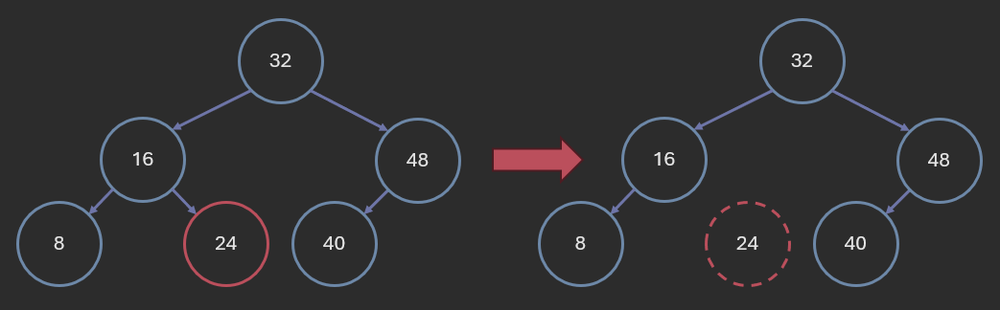
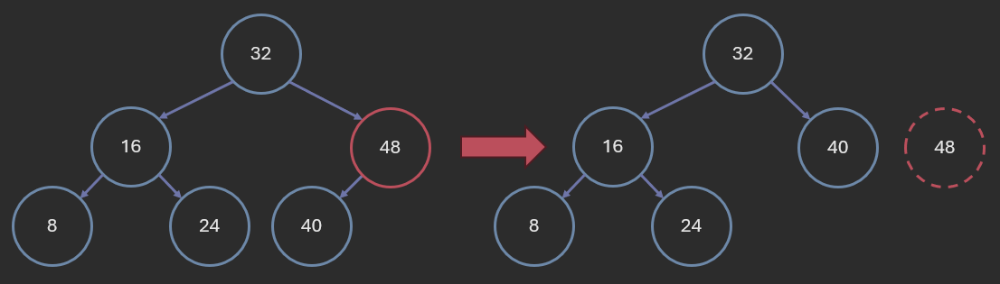
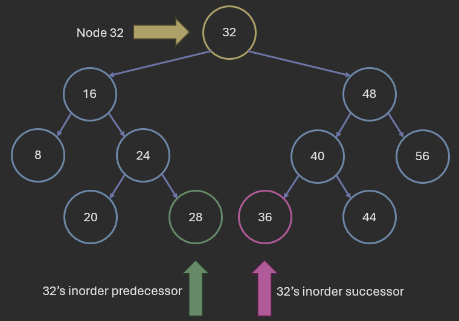
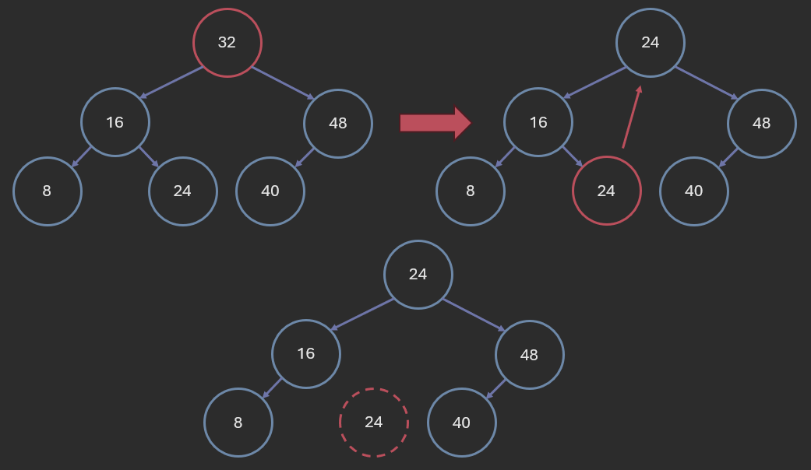
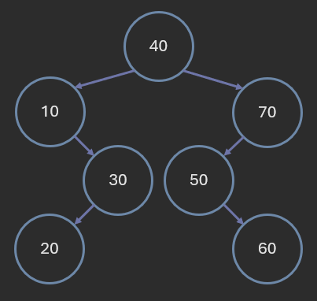
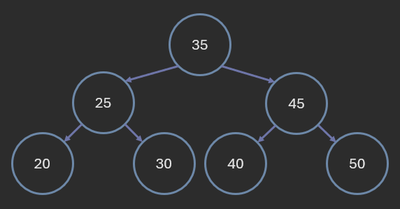
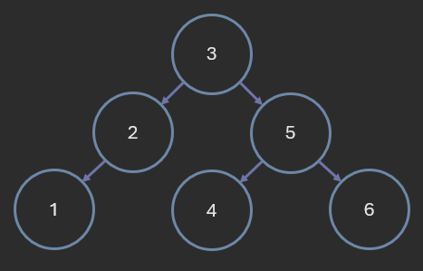
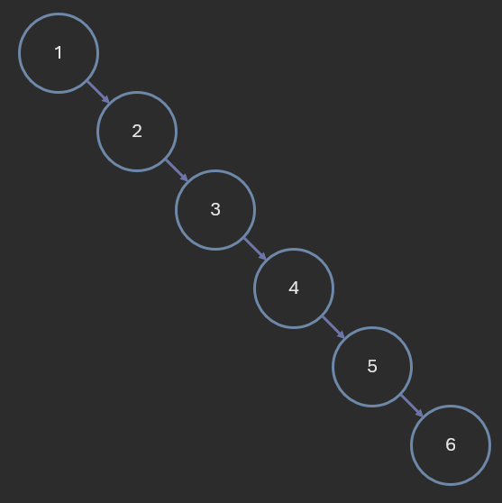

# Binary Search Trees

**Author:** *Brian Magnuson*

In this lesson, we will learn more about Binary Search Trees (BSTs), a special type of binary tree used for searching and storing data.

We will cover the following topics:
- Introduction to binary search trees
- BST search
- BST insertion
- BST deletion
- Deleting the entire BST
- BST verification
- Time complexity of BST operations

This lesson assumes you are already familiar with the basics of trees and tree traversals. If you need a refresher, please review the previous lessons on trees.

# Introduction to Binary Search Trees

Recall the definition of a binary tree:
- A binary tree is a tree data structure in which each node has at most two children.

The two children are often referred to as the left child and the right child.

A binary search tree (BST) adds the following rule:
- For any node, all nodes in its left subtree have keys less than the node's key, and all nodes in its right subtree have keys greater than the node's key.

By "key", we mean the value stored in the node. Keys are generally unique, but we can allow duplicates in some implementations.
For this lesson, we will assume that all keys are unique.

The keys in a BST must be comparable in some way, so that we can determine whether one key is less than, greater than, or equal to another key.

Here is an example of a binary search tree:


In the above tree, we use numbers as keys, but we could use any comparable data type, such as strings.


In C++, a binary tree node may look like this:
```cpp
struct Node {
    int key;
    Node* left;
    Node* right;

    Node(int k) : key(k), left(nullptr), right(nullptr) {}
};
```

This node uses an integer for the key, but we could use any comparable data type. You could also use a template to make the node generic.

# BST Search

As the name suggests, binary search trees allow for efficient searching of keys. If we want to search for a key in a BST, we can use the following algorithm:
1. Start at the root node.
2. If the key is equal to the key of the current node, return the current node.
3. If the key is less than the key of the current node, recursively search the left subtree.
4. If the key is greater than the key of the current node, recursively search the right subtree.
5. If the current node is null, return null (the key is not in the tree).

Note that this and the other algorithms we will discuss in this lesson are recursive. Iterative versions of these algorithms are also possible, but we will only focus on the recursive versions since they tend to be more intuitive and easier to implement.


BST search is efficient because it only needs to traverse one path from the root to a node. We don't have to check every node in the tree. If we end up at a null node, we can safely assume the key is not in the tree.

The pseudocode for the search algorithm looks like this:
```
func search(node, key):
    if node is null:
        return null
    if node.key == key:
        return node
    if key < node.key:
        return search(node.left, key)
    else:
        return search(node.right, key)
```

The number of operations in BST search is proportional to the height of the tree. In the worst case, the height of the tree is O(n), making the worst-case time complexity of the insertion algorithm O(n).

# BST Insertion

Inserting a key into a binary search tree is similar to searching for a key. The algorithm is as follows:
1. Start at the root node.
2. If the current node is null, create a new node with the key and return it.
3. If the current node's key is equal to the key, do nothing and return the current node (or handle duplicates as desired).
4. If the key is less than the current node's key, recursively insert the key into the left subtree.
5. If the key is greater than the current node's key, recursively insert the key into the right subtree.
        
In this algorithm, we return the nodes at the end of each recursive call. When we add a new node, we need to make sure the parent node's pointer is updated to point to the new node. If we don't have a parent pointer, we can accomplish this by assigning the pointer from the previous recursive call.


Here is the pseudocode for the insertion algorithm:

```
func insert(node, key):
    if node is null:
        return new Node(key)
    if key < node.key:
        node.left = insert(node.left, key)
    else if key > node.key:
        node.right = insert(node.right, key)
    return node
```

Note that if we do not allow duplicates, then inserting a duplicate key will fail.
A user may be interested in knowing whether the insertion was successful or not.
There are a few ways to handle this:
- We can return a boolean as part of the return value to indicate whether a new node was inserted.
- We can use a boolean reference in the parameters to indicate whether a new node was inserted.
- We can return null if the insertion was not successful. We'll also need to check if the return values are null before assigning them to the parent node's left or right pointer.
- We keep track of the size of the tree and check if it has changed after the insertion.

Which strategy you use depends on how you want to build your API.

Here is another version of the algorithm that uses the first approach:
```
func insert(node, key):
    if node is null:
        return (new Node(key), true)
    if key < node.key:
        (node.left, inserted) = insert(node.left, key)
    else if key > node.key:
        (node.right, inserted) = insert(node.right, key)
    else:
        return (node, false)
```

For C++, you can use `std::pair` to return both the node and a boolean value.

You can also try an iterative version of the algorithm and store the parent node in a variable.

The number of operations in BST insertion, like search, is proportional to the height of the tree. In the worst case, the height of the tree is O(n), making the worst-case time complexity of the insertion algorithm O(n).

# BST Deletion

Deleting a node from a binary search tree is a bit more complicated.
First, we need to find the node we want to delete. We can use the same search algorithm we used before.

Once we find the node, we need to consider three cases:
- The node has no children (it is a leaf node).
- The node has one child (either left or right).
- The node has two children.

If the node has no children, we can simply delete the node and set its parent's pointer to null.



If the node has one child, we can delete the node and set its parent's pointer to point to the child.



Finally, if the node has two children, we need to find the in-order predecessor or in-order successor of the node we want to delete.
- The **in-order predecessor** is the largest node in the left subtree of the node we want to delete.
- The **in-order successor** is the smallest node in the right subtree of the node we want to delete.



Next, we need to replace the key of the node to delete with either the key of the in-order predecessor or the in-order successor. Then we can delete the in-order predecessor or in-order successor. We can choose either one, but we must be consistent in our choice.



If the in-order predecessor or in-order successor has one child, we can delete it and set its parent's pointer to point to the child.

The in-order predecessor will not have a right child; otherwise, it would not be the largest node in the left subtree. Similarly, the in-order successor will not have a left child; otherwise, it would not be the smallest node in the right subtree.

Because of this, we don't have to worry about the case where either node has two children.

Here is the pseudocode for the deletion algorithm:
```
func get_max(node):
    while node.right is not null:
        node = node.right
    return node

func delete(node, key):
    if node is null:
        return null # Key not found
    if key < node.key:
        node.left = delete(node.left, key)
    else if key > node.key:
        node.right = delete(node.right, key)
    else:
        if node.left is null:
            let temp = node.right # Still works if node.right is null
            delete node
            return temp
        else if node.right is null:
            let temp = node.left
            delete node
            return temp
        else:
            let temp = get_max(node.left)
            node.key = temp.key
            node.left = delete(node.left, temp.key)
    return node
```

In the first if-else-if block, we handle the case where the current node is null. In such a case, we do nothing and return null. This leaves the parent pointer unchanged.

In the next two blocks, we handle the case where the key is less than or greater than the current node's key. We recursively call the delete function on the left or right subtree, respectively.

In the last block, we handle the case where the key is equal to the current node's key. The first two inner if-else-if blocks handle the case where the node has no children or one child (both cases may be handled the same way). Finally, we handle the case where the node has two children. We find the in-order predecessor, replace the key of the current node with the key of the in-order predecessor, and delete the in-order predecessor.

The number of operations in BST deletion, like search and insertion, is proportional to the height of the tree. In the worst case, the height of the tree is O(n), making the worst-case time complexity of the insertion algorithm O(n).

------

Insert the following numbers into a BST in the order given:
14, 6, 8, 20, 2, 4, 12, 10, 16, 18

What is the left-to-right level-order traversal of the tree?
- 14, 6, 20, 2, 8, 12, 16, 4, 10, 18
- 14, 6, 8, 20, 2, 4, 12, 10, 16, 18
- 14, 6, 20, 2, 4, 8, 12, 10, 16, 18
- 14, 6, 20, 2, 8, 16, 4, 12, 18, 10
- 14, 6, 20, 2, 8, 12, 4, 10, 16, 18

<details>
<summary>Answer</summary>
14, 6, 20, 2, 8, 16, 4, 12, 18, 10
</details>

------



Consider the above binary search tree. Which of the following correctly lists both the in-order predecessor and in-order successor of the root node?
- 10, 50
- 30, 50
- 30, 70
- 10, 70
- 20, 60
- These nodes do not exist since this is not a binary search tree.

<details>
<summary>Answer</summary>
30, 50
</details>

------



Consider the above binary search tree. Delete the root node, then delete the root node again. Use the in-order predecessor each time to replace the deleted node. What is the left-to-right level-order traversal of the tree after both deletions?
- 20, 25, 45, 40, 50
- 25, 20, 45, 40, 50
- 30, 25, 45, 20, 50
- 40, 25, 45, 20, 50
- 45, 25, 50, 20, 30

<details>
<summary>Answer</summary>
25, 20, 45, 40, 50
</details>

------

# Deleting the Entire BST

There may be times when we want to delete the entire binary search tree. For example, if we are managing memory manually, we may want to free the memory used by the tree.

If memory is managed automatically, like in Java or Python, we may not need to worry about this. The garbage collector will automatically free the memory used by the tree when it is no longer needed.

Otherwise, there are a few strategies we can use.

We can use a post-order traversal to delete the entire tree. In a post-order traversal, we visit the nodes children before visiting the node itself. This means we can delete the children before deleting the parent node.
```
func delete_tree(node):
    if node is null:
        return
    delete_tree(node.left)
    delete_tree(node.right)
    delete node
```

This algorithm has a time complexity of O(n), where n is the number of nodes in the tree. This is because we need to visit every node in the tree to delete it.

Another way to delete the entire tree is to store every node in a list, then delete each node in the list one-by-one. This can potentially take more space than the post-order traversal algorithm, but it may be easier to implement.
```
func delete_tree(node):
    if node is null:
        return
    list = []
    post_order(node, list)
    for n in list:
        delete n
```

Another way is to use a special destructor in the node class that recursively deletes its children. Then, all the user has to do is delete the root node.
```cpp
Node::~Node() {
    if (left) delete left;
    if (right) delete right;
}
```

Use this with caution! Recall what happens when we only want to delete one node in the tree; if the node to be deleted has children, we may accidentally delete nodes we don't want to delete.

Another way is to use smart pointers instead of raw pointers. Smart pointers automatically manage memory for you, so you don't have to worry about deleting nodes manually. And if you do want to delete the tree manually, you can just set the root pointer to null. The smart pointers will automatically delete the nodes for you.
```cpp
#include <memory>
struct Node {
    int key;
    std::shared_ptr<Node> left;
    std::shared_ptr<Node> right;

    Node(int k) : key(k), left(nullptr), right(nullptr) {}
};
```

# BST Verification

There are a few ways to verify that a binary tree is also a binary search tree. One way is to use a recursive algorithm that checks every node in the tree to see if it is within the correct range of values:

```
func is_bst(node, min, max):
    if node is null:
        return true
    if node.key < min or node.key > max:
        return false
    return is_bst(node.left, min, node.key) and is_bst(node.right, node.key, max)
```

This technique assumes that the keys are unique. If we allow duplicates, we may need to modify the algorithm depending on how duplicates are stored in the tree.

We can also verify that a binary tree is a BST using a special property of BSTs:
- If the in-order traversal of a binary tree produces a list of keys in strictly increasing (or decreasing) order, then the tree is a BST.

```
func in_order(node, list):
    if node is null:
        return
    in_order(node.left, list)
    list.append(node.key)
    in_order(node.right, list)

func is_bst(node):
    list = []
    in_order(node, list)
    for i in range(1, len(list)):
        if list[i] <= list[i-1]:
            return false
    return true
```

If the order is not strictly increasing, it may still be a BST, but we need to check how duplicates are stored.

Both of these approaches have a time complexity of O(n), where n is the number of nodes in the tree. This is because we need to visit every node in the tree to verify that it is a BST.

It may be tempting to try and verify if a binary tree is a BST by only checking the left and right children of each node. However, this is NOT sufficient. For example, consider the following tree:


For every node, the left child is less than the node and the right child is greater than the node. However, this tree is NOT a binary search tree because '4' is in the left subtree of '3' but is greater than '3'.

# Time Complexity of BST Operations

You might have noticed a pattern in the time complexity of the BST operations we have discussed so far. Consider insertion, search, and deletion:
- Search follows a path from the root to a node. In the worst case, search will reach the leaf nodes of the tree.
- Insertion follows a path from the root to a node. In the worst case, insertion will reach the leaf nodes of the tree.
- Deletion follows a path from the root to a node. In the worst case, deletion will either reach the leaf nodes of the tree, or it will find the in-order predecessor or successor, which may also be a leaf node.

All three operations have this in common: the number of operations is proportional to the height of the tree.

If the tree is *balanced*, the height of the tree is proportional to log(n), where n is the number of nodes in the tree. 



A tree is considered balanced if, for every node, the heights of the left and right subtrees differ by at most 1. You'll learn more about this when we discuss balanced trees.

Complete binary trees are examples of balanced trees. A complete binary tree is a binary tree in which every level is completely filled, except possibly the last level. Since all perfect binary trees are complete, perfect trees, by transitive property, are also balanced.

Full trees are not necessarily balanced.

If the tree is *unbalanced*, the height of the tree may potentially be as large as n, where n is the number of nodes in the tree. This can happen if we insert keys in sorted order, for example.



Because of this, the time complexity of search, insertion, and deletion is O(log n) in the average case, and O(n) in the worst case.

# Conclusion

In this lesson, we learned about binary search trees, a special type of binary tree used for searching and storing data. We learned how to search for keys, insert keys, and delete keys from a binary search tree. We learned how to delete the entire tree and verify that a binary tree is a binary search tree. Finally, we learned about the time complexity of the operations we discussed and how unbalanced trees can lead to poor performance.

In a future lesson, we will learn about balanced trees, which guarantee that the height of the tree is O(log n) in the worst case. This will allow us to perform search, insertion, and deletion in O(log n) time.

# References

- [COP 3530 Instructional Content](https://github.com/COP3530/Instructional-Content)

Graphics by Brian Magnuson.

Lesson content written with AI assistance.

Find a mistake? Open an issue on [GitHub](https://github.com/COP3530/edugator-content/issues)!
