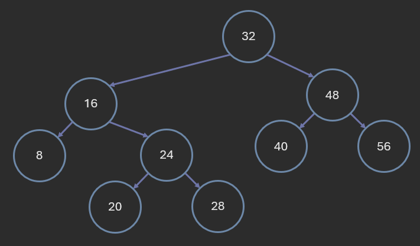
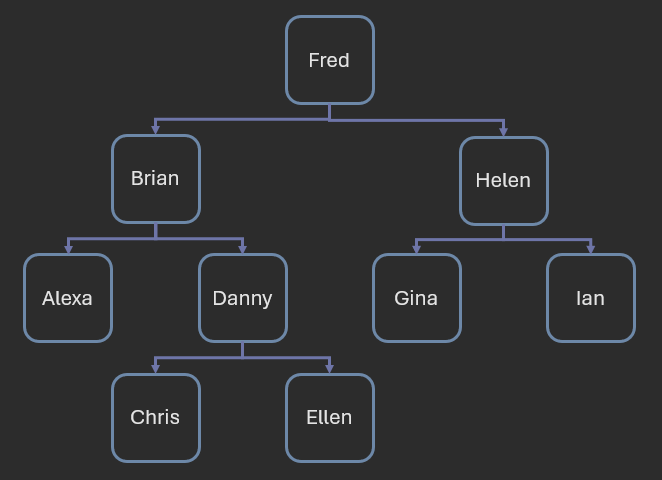
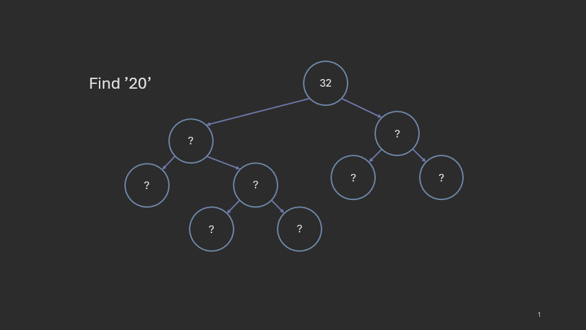
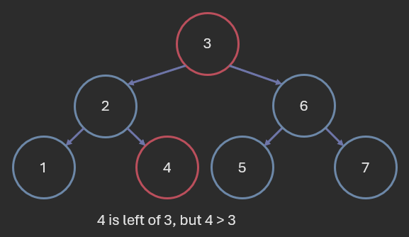

# Binary Search Trees

**Author:** *Brian Magnuson*

In this lesson, we will learn more about Binary Search Trees (BSTs), a special type of binary tree used for searching and storing data.

We will cover the following topics:
- Introduction to binary search trees
- BST verification
- BST search
- BST insertion
- BST deletion
- Time complexity of BST operations

This lesson assumes you are already familiar with the basics of trees and tree traversals. If you need a refresher, please review the previous lessons on trees.

# Introduction to Binary Search Trees

Recall the definition of a binary tree:
- A binary tree is a tree data structure in which each node has at most two children.

The two children are often referred to as the left child and the right child.

A binary search tree (BST) adds the following rule:
- For any node, all nodes in its left subtree have keys less than the node's key, and all nodes in its right subtree have keys greater than the node's key.

By "key", we mean the value stored in the node. Keys are generally unique, but we can allow duplicates in some implementations.
For this lesson, we will assume that all keys are unique.

The keys in a BST must be comparable in some way, so that we can determine whether one key is less than, greater than, or equal to another key.

Here is an example of a binary search tree:



In the above tree, we use numbers as keys, but we could use any comparable data type, such as strings.



In C++, a binary tree node may look like this:
```cpp
struct Node {
    int key;
    Node* left;
    Node* right;

    Node(int k) : key(k), left(nullptr), right(nullptr) {}

    ~Node() {
        if (left) delete left;
        if (right) delete right;
    }
};
```

This node uses an integer for the key, but we could use any comparable data type. You could also use a template to make the node generic.

Since we use raw pointers, we need to make sure we free any memory we allocate for the tree. One way to easily do this is to use a destructor that recursively deletes the left and right children (as shown above). This way, when we delete any node, all of its descendants are also deleted.

Alternatively, we could use smart pointers (like `std::shared_ptr`) to automatically manage memory. As long as we don't create any cycles in the tree (which shouldn't happen anyway), the smart pointers will automatically free the memory when the last reference to the node is deleted.

# BST Search

As the name suggests, binary search trees allow for efficient searching of keys. If we want to search for a key in a BST, we can use the following algorithm:
1. Start at the root node.
2. If the key is equal to the key of the current node, return the current node.
3. If the key is less than the key of the current node, recursively search the left subtree.
4. If the key is greater than the key of the current node, recursively search the right subtree.
5. If the current node is null, return null (the key is not in the tree).

Note that this and the other algorithms we will discuss in this lesson are recursive. Iterative versions of these algorithms are also possible, but we will only focus on the recursive versions since they tend to be more intuitive and easier to implement.



BST search is efficient because it only needs to traverse one path from the root to a node. We don't have to check every node in the tree. If we end up at a null node, we can safely assume the key is not in the tree.

The pseudocode for the search algorithm looks like this:
```
func search(node, key):
    if node is null:
        return null
    if node.key == key:
        return node
    if key < node.key:
        return search(node.left, key)
    else:
        return search(node.right, key)
```

# BST Insertion

# BST Deletion

# BST Verification

There are a few ways to verify that a binary tree is also a binary search tree. One way is to use a recursive algorithm that checks every node in the tree to see if it is within the correct range of values:

```
func is_bst(node, min, max):
    if node is null:
        return true
    if node.key < min or node.key > max:
        return false
    return is_bst(node.left, min, node.key) and is_bst(node.right, node.key, max)
```

This technique assumes that the keys are unique. If we allow duplicates, we may need to modify the algorithm depending on how duplicates are stored in the tree.

We can also verify that a binary tree is a BST using a special property of BSTs:
- If the in-order traversal of a binary tree produces a list of keys in strictly increasing (or decreasing) order, then the tree is a BST.

```
func in_order(node, list):
    if node is null:
        return
    in_order(node.left, list)
    list.append(node.key)
    in_order(node.right, list)

func is_bst(node):
    list = []
    in_order(node, list)
    for i in range(1, len(list)):
        if list[i] <= list[i-1]:
            return false
    return true
```

If the order is not strictly increasing, it may still be a BST, but we need to check how duplicates are stored.

Both of these approaches have a time complexity of O(n), where n is the number of nodes in the tree. This is because we need to visit every node in the tree to verify that it is a BST.

It may be tempting to try and verify if a binary tree is a BST by only checking the left and right children of each node. However, this is NOT sufficient. For example, consider the following tree:



For every node, the left child is less than the node and the right child is greater than the node. However, this tree is NOT a binary search tree because '4' is in the left subtree of '3' but is greater than '3'.

# Time Complexity of BST Operations

# Conclusion

# References

- [COP 3530 Instructional Content](https://github.com/COP3530/Instructional-Content)

Graphics by Brian Magnuson.

Lesson content written with AI assistance.

Find a mistake? Open an issue on [GitHub](https://github.com/COP3530/edugator-content/issues)!
