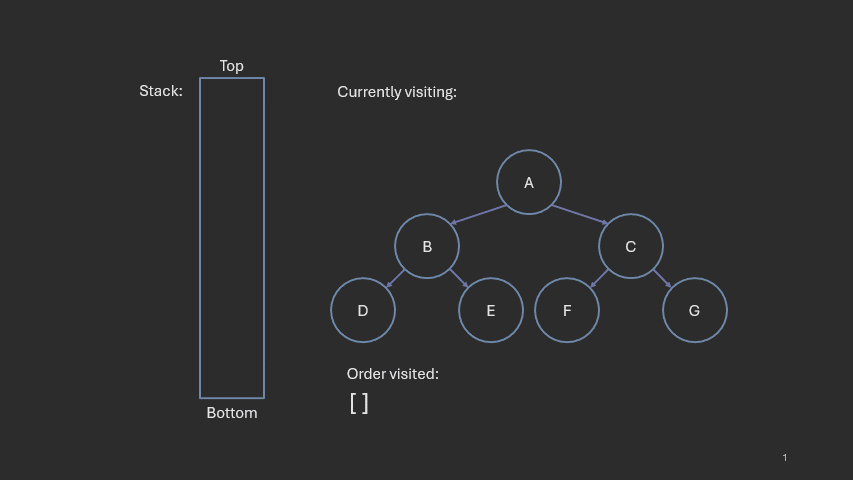

# Trees

**Author:** *Brian Magnuson*

In this lesson, we will be covering tree data structures. Trees are a fundamental data structure in computer science used to represent hierarchical relationships between data. 

We will cover the following topics:
- Introduction to Trees
- Tree Terminology
- Tree Types
- Tree Representation
- Tree Search and Traversal

# Introduction to Trees

A **tree data structure** is a rooted, hierarchical data structure where data is stored in nodes, ane each node can have zero or more child nodes but only one parent node (except the root).


In a tree:
- There is one node called the **root** node, which has no parent.
- All other nodes have one parent node and can have zero or more child nodes.
- There are no cycles in a tree, meaning there is no way to traverse back to a parent node from its child.

Throughout this lesson, we use the term "tree" to refer to the *tree data structure*. In graph theory, a tree is considered a special kind of graph that is connected and acyclic. Trees in graph theory are often undirected, meaning the edges have no direction. You will learn more about graphs in a later lesson.
In this lesson, we will focus on the tree data structure and its properties.

Trees can be used to represent hierarchical data, such as file systems, organizational charts, and family trees. They are also used in various algorithms and data structures, such as binary search trees, heaps, and tries.

The Linux file system can be represented as a tree. The root directory `/` is the root node, and each subdirectory and file is a child node of its parent directory.


Trees can also be used to represent expressions. This allows computers to evaluate expressions in a way that respects operator precedence and associativity. 
The expression `3 + 4 * 5 * (1 + 2)` can be represented as a tree, where the root node is the `+` operator, and its children are the operands `3` and `4 * 5 * (1 + 2)`.


Trees can also be used for:
- Decision trees, which are used in machine learning to make decisions based on input data.
- Search trees, which are used to store and retrieve data efficiently.
- Heaps, which are used to implement priority queues.
- Tries, which are used to store strings and perform prefix searches.
- And more!

# Tree Terminology

## Node Relationships

Nodes that have no children are called **leaf nodes**. Nodes that are not leaf nodes are called **internal nodes**.


In the above example, 'A', 'B', and 'C' are internal nodes, while 'D', 'E', and 'F' are leaf nodes. A root node can be either an internal node or a leaf node depending on whether it has children or not.

The relationships among nodes in a tree can be described using terminology similar to family relationships. In the following diagram, we'll focus on node 'E' and its relationship with other nodes:


A node is said to be an **ancestor** of another node if it is on the path from the root to that node. It can also be defined as all the nodes reachable by traversing upwards from the node. In the above example, 'A' and 'C' are ancestors of 'E'.

The direct predecessor of a node is called its **parent**. 'C' is the parent of 'E'. The parent of a node's parent is that node's **grandparent**. 'A' is the grandparent of 'E'.

The nodes that share a parent with a node are that node's **siblings**. 'D' and 'E' are siblings.

A node is a **descendant** of another node if it is on the path from that node to a leaf. It can also be defined as all the nodes reachable by traversing downwards from the node. In the above example, 'F', 'G', 'H', and 'I' are descendants of 'E'.

The direct successor of a node is called its **child**. 'F' and 'G' are children of 'E'. The child of a node's child is that node's **grandchild**. 'H' and 'I' are grandchildren of 'E'.

The set of a single node and all of its descendants is a **subtree**.


In the above example, 'A' has two children, 'B' and 'C'. 'B' and all of its descendants form one subtree where 'B' is the root. 'C' and all of its descendants form another subtree where 'C' is the root.

## Depth and Height

The **depth** or **level** of a node is the number of edges from the root to that node. The root node is considered to have a depth of 0.


The **height** of a node describes its distance from its deepest leaf. Height can also be used to describe trees and subtrees; the height of a tree is the height of its root node.


Unlike depth, siblings do not necessarily have the same height. As shown in the diagram, 'B' and 'C' are siblings, but 'B' has a height of 1 while 'C' has a height of 0.

In the above example, we specifically use the **0-based** definition of height, which is the number of edges from the node to its deepest leaf. Leaf nodes have a height of 0. In this case, 'A' has a height of 3, 'B' has a height of 1, and 'C' has a height of 0. Null nodes and empty trees are considered to have a height of -1.

There is also a **1-based** definition of height. 
It is the number of nodes from the node to its deepest leaf, counting the node itself. Leaf nodes have a height of 1. Null nodes and empty trees are considered to have a height of 0.
A node's *1-based height* is equivalent to its *0-based height* plus 1.


In your projects, you can choose which definition of height to use as long as you are consistent.

The height of a node can also be defined recursively. The height of a node is the maximum height of its children plus one. The height of a null node is -1 when using the 0-based definition, and 0 when using the 1-based definition.
```
func height(node):
    if node is null:
        return -1  # or 0 for 1-based height
    else:
        return 1 + max(height(node.children[0]), height(node.children[1]), ...)
```

# Tree Types

An **n-ary tree**, also called an **m-ary tree** or **k-ary tree**, is a tree where each node can have at most n children, where n is some non-negative integer. For example, a 2-ary tree is a tree where each node can have at most 2 children. A 3-ary tree is a tree where each node can have at most 3 children.

Here is an example of a 4-ary tree:


In this tree, some nodes have 1, 2, 3, or 4 children, but not 5 or more children.

The definition of n-ary trees comes with some weird quirks. You won't need to worry about them in this course, but it's good to know about them:
- n can be 0, which means the tree either has 1 root node or is empty.
- n can be 1, which means the tree behaves like a linked list. As a tree, it is not very useful, but it is a valid tree.
- An n-ary tree is a valid m-ary tree for *any* m >= n. For example, a 2-ary tree is also a valid 3-ary tree, and a 3-ary tree is also a valid 4-ary tree.

Some n-ary trees are known by other names:
- A 2-ary tree is also called a **binary tree**.
- A 3-ary tree is also called a **ternary tree**.
- A 4-ary tree is also called a **quaternary tree**.

Binary trees are especially important in computer science. They are used in many algorithms and data structures.

Here is an example of a binary tree:


In binary trees, a node's children are commonly referred to as its **left child** and **right child**.
In the above example 'A' is the root node with left child 'B' and right child 'C'. 'b' has left child 'D' and right child 'E'. 'C' has no left child and right child 'F'. 'D', 'E', and 'F' are leaf nodes.

Next, we'll cover some special types of binary trees. However, the terms we use here may be generalized to other n-ary trees. In this course, we will only focus on these terms in the context of binary trees.

A **full binary tree** is a binary tree where every non-leaf node has exactly two children. This can also be defined as a tree where every node has either 0 or 2 children.

Here are two examples of full binary trees:


In the left tree, 'A', 'B', 'C', 'E', and 'G' are all internal nodes, and all have two children. 'D', 'H', 'I', 'J', and 'K' are all leaf nodes and have no children.

In the right tree, 'A', 'C', 'E', and 'G' are all internal nodes, and all have two children. 'B', 'D', 'F', 'H', and 'I' are all leaf nodes and have no children.

A **complete binary tree** is a binary tree where every level is completely filled except possibly for the last level, which is filled from left to right.


In the above example, level 0 has 1 node, level 1 has 2 nodes, and level 2 has 4 nodes; these levels are completely filled. The last level is level 3, which only has 3 nodes. All of the nodes in level 3 are filled from left to right, so this is a complete binary tree.

Note that the above tree is not a full binary tree because 'E' has only one child.

A **perfect binary tree** is a binary tree where every internal node has exactly two children and all leaf nodes are at the same level.


Here, 'A', 'B', and 'C' are all internal nodes, and all have two children. 'D', 'E', 'F', and 'G' are all leaf nodes and have no children. All leaf nodes are at the same level.

Perfect binary trees have the following properties:
- It has exactly 2^h - 1 nodes, where h is the 0-based height of the tree.
- It is also a full binary tree.
- It is also a complete binary tree.

Binary trees that are perfect are also complete and full. However, the converse is not true. That is, a tree that is both complete and full is not necessarily perfect. For example, the tree below is both complete and full, but not perfect.


A **binary search tree (BST)** is a binary tree that satisfies the following property:
- For any node, all nodes in its left subtree have keys less than the node's key, and all nodes in its right subtree have keys greater than the node's key.

We use the term "key" to refer to the value stored in a node. The keys of a BST are comparable in some way. Keys are generally unique, but some BST implementations allow duplicate keys. For simplicity, we will assume that all keys are unique.


Binary search trees, as the name implies, allow for efficient searching of keys.
In the above example, if our target is less than 32, then we can search the left subtree since all the keys less than 32 are in the left subtree. If our target is greater than 32, then we can search the right subtree since all the keys greater than 32 are in the right subtree.


This strategy is similar to binary search, which is a searching algorithm that works on sorted arrays.

One thing to be careful about BSTs is that it is NOT sufficient to only check the left and right children of a node when checking if a tree is a BST. Consider the following example:


At first glance, this tree looks like a binary search tree. However, '4' is in the left subtree of '3' despite being greater than '3'. This means that this tree is not a binary search tree.

There are more things we can do with binary search trees such as inserting nodes, deleting nodes, and balancing the tree. We will cover these topics in later lessons.

# Tree Representation

There are several ways to represent trees in programming languages. The most common way is to use a **node** class or struct that contains a value and a list of child nodes.
```cpp
class Node {
    int value; // The value stored in the node
    vector<Node*> children; // The list of child nodes

    Node(int value) {
        this->value = value;
    }
};
```


This representation is simple and easy to understand. It is especially useful for:
- Trees with an arbitrary number of children or trees where the number of children is not known in advance.
- Sparse trees where most nodes have few children.
- Trees where upward traversal is not needed.

The main drawback of this representation is that it requires extra memory to store the pointers to child nodes. Additionally, upward traversal is more difficult.

An alternative way to represent trees is to use an array. There is a simple technique to map every node to an index in the array:
- The root node is at index 0.
- For any node at index i, its jth child (starting at 1) is at index i * n + j, where n is the number of children per node.
  - In the case of binary trees, the left child is at index 2 * i + 1 and the right child is at index 2 * i + 2.

This technique also ensures that every node's parent is at index floor((i - 1) / n).


In the above example, we use a binary tree with 'A' at index 0. The nodes in level 1, 'B' and 'C', are at indices 1 and 2. The nodes in level 2, 'D', 'E', 'F', and 'G', are at indices 3, 4, 5, and 6.

'C' is at index 2, so its children are at indices 2 * 2 + 1 = 5 and 2 * 2 + 2 = 6, which are 'F' and 'G'. If we take the index of 'F', which is 5, we can find the index of its parent, 'C', at index floor((5 - 1) / 2) = 2.

This representation is especially useful for:
- Trees with a fixed number of children per node.
- Trees where the number of children is known in advance.
- Trees that are complete or nearly complete.
- Trees where upward traversal is needed.

Array representations are only more memory efficient when the tree is complete or nearly complete. If the tree is sparse, the array representation can waste a lot of memory. Binary heaps, which are always complete binary trees, are commonly represented using arrays. You will learn more about heaps in a later lesson.

# Tree Search and Traversal

In this last section, we will discuss ways to search and traverse trees. Searching a tree is the process of finding a node with a specific value. Traversing a tree is the process of visiting each node in the tree in a specific order. Both searching and traversing use similar algorithms, which is why we we cover them together.

## Breadth-First Search and Traversal

In a **breadth-first search (BFS) or traversal**, nodes are visited level by level, starting from the root node. This means that all nodes at depth 0 are visited first, then all nodes at depth 1, and so on. A breadth-first traversal is also called a **level-order traversal**.


Breadth-first searches and traversals are commonly implemented using a queue. The algorithm works as follows:
1. Create an empty queue and add the root node to it.
2. Remove the first node from the queue and visit it.
3. Add all of the node's children to the end of the queue.
4. Repeat steps 2 and 3 until the queue is empty.

```
func bfs(root):
    queue = new Queue()
    queue.enqueue(root)

    while not queue.empty():
        node = queue.dequeue()
        visit(node)  # Visit the node

        for child in node.children:
            queue.enqueue(child)  # Add the child to the queue
```

Here is an animation of a breadth-first traversal:


In the above example, we start by enqueuing the root node 'A'. We then dequeue 'A' and visit it. Next, we enqueue 'B' and 'C', which are the children of 'A'. We then dequeue 'B' and visit it, and enqueue its children 'D' and 'E'. We repeat this process until all nodes have been visited.

## Depth-First Search and Traversal

In a **depth-first search (DFS) or traversal**, nodes are visited as deep as possible before backtracking. This means that all nodes in a subtree are visited before moving on to the next sibling node.


In the above example, we start by visiting 'A'. We then visit 'B' and all of its descendants before moving on to 'C'. This is a depth-first traversal.

Depth-first searches and traversals are commonly implemented using a stack. The algorithm works as follows:
1. Create an empty stack and add the root node to it.
2. Remove the first node from the stack and visit it.
3. Add all of the node's children to the top of the stack.
4. Repeat steps 2 and 3 until the stack is empty.

Notice how this algorithm is almost identical to the breadth-first search algorithm. The only difference is that we use a stack instead of a queue. 
```
func dfs(root):
    stack = new Stack()
    stack.push(root)

    while not stack.empty():
        node = stack.pop()
        visit(node)  # Visit the node

        for child in node.children:
            stack.push(child)  # Add the child to the stack
```

Here is an animation of a depth-first traversal:



In the above example, we start by pushing the root node 'A' onto the stack. We then pop 'A' and visit it. Next, we push 'B' and 'C'. To make sure we visit nodes left-to-right, we actually push the children in reverse order, pushing 'C' first and then 'B'. We then pop 'B' and visit it, and push its children 'D' and 'E'. We repeat this process until all nodes have been visited.

Although we visited nodes left-to-right, we could also visit them right-to-left. Either way is valid. What matters is that we visit all the nodes in one subtree before moving on to the next sibling node. In the above example, if we visit 'B' first, then we must visit 'D' and 'E' in some order before moving on to 'C'.

## Recursive Depth-First Traversals

There is another way to implement depth-first traversals that is more elegant and perhaps easier to understand: using recursion. The algorithm can be written like this:

```
func dfs(node):
    if node is null:
        return

    visit(node)  # Visit the node

    for child in node.children:
        dfs(child)  # Visit the child
```

This recursive algorithm takes advantage of the idea that every node can be considered the root of a smaller tree (a subtree).

You can think of it as a version of the previous algorithm that leverages the *call stack* instead of an explicit stack. When we call `dfs(child)`, we are pushing the child node onto the call stack. When the function returns, we pop the child node off the call stack and continue with the next sibling node.

The recursive version of the algorithm allows us to do something the iterative version cannot (at least not easily): we can visit a node *after* visiting its children.

In all of the previous examples, we "visit" a node as soon as we reach it. This is called a **pre-order traversal**. In a pre-order traversal, we visit the node before visiting its children. When we "visit" a node, we can do anything we want with it. For example, we can print its value, add it to a list, or perform some other operation. However, we can also save that operation until *after* we visit the node's children.

With binary trees, there are three ways to traverse a tree:
- **Pre-order traversal**: Visit the node, then visit the left and right subtrees.
- **In-order traversal**: Visit the left subtree, then visit the node, then visit the right subtree.
- **Post-order traversal**: Visit the left and right subtrees, then visit the node.

The pseudocode for these traversals is as follows:
```
func pre_order(node):
    if node is null: 
        return
    visit(node)
    pre_order(node.left)
    pre_order(node.right)

func in_order(node):
    if node is null: 
        return
    in_order(node.left)
    visit(node)
    in_order(node.right)

func post_order(node):
    if node is null: 
        return
    post_order(node.left) 
    post_order(node.right
    visit(node)
```

Notice how the order of the `visit` function changes in each traversal.

There is an easy technique to visualize each traversal: draw tightly-bound line around the tree starting from the root node. For pre-order, each time the line passes the left side of a node, we visit it.


For in-order, we visit the node when the line passes the bottom side of the node.


And for post-order, we visit the node when the line passes the right side of the node.


Notice how each kind of traversal yields a different order of nodes.

Binary search trees have a special property regarding in-order traversals:
- If a binary tree is a binary search tree, then its in-order traversal will yield a sorted list of keys.
- If an in-order traversal of a binary tree yields a sorted list of unique keys, then the binary tree is a binary search tree.

This property is useful for checking if a binary tree is a binary search tree.

# Conclusion

In this lesson, we discussed tree data structures and tree terminology. We discussed the different types of trees, different ways to represent trees, and different ways to search and traverse trees.

In the next lesson, we will explore binary search trees in more detail as they are very important in implementing efficient data structures.

# References

- [Cppreference](https://en.cppreference.com/)
- [Wikipedia: Tree (abstract data type)](https://en.wikipedia.org/wiki/Tree_(abstract_data_type))
- [Wikipedia: Tree Traversal](https://en.wikipedia.org/wiki/Tree_traversal)
- [COP 3530 Instructional Content](https://github.com/COP3530/Instructional-Content)

Graphics by Brian Magnuson.

Lesson content written with AI assistance.

Find a mistake? Open an issue on [GitHub](https://github.com/COP3530/edugator-content/issues)!
