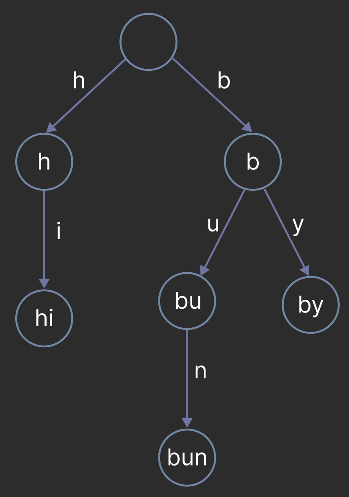

# Tries

## Definition

A __trie__ (pronounced "try") is an N-ary tree used for string storing and retrieval. Unlike binary search trees where the node's key dictates its position, in a trie, the position of the node dictates its key. Additionally, connections between nodes are defined by individual characters rather than the key.

Consider they key `bu` in the trie above. If we trace the path from the root to the node, we see that the characters along the edges are `b` and `u` -- which, when concatenated, form the key of the node. This is true for all nodes in the trie and demonstrates how the position of the node dictates its key. Note how the keys `by`, `bu`, and `bun` share the same prefix `b`. This is a key features of tries that allows for efficient string storage and retrieval which we'll discuss more in-depth in the next section.

__Fun Fact__: The name trie is derived from the word retrieval and was originally pronounced tree. However, try became the common pronunciation to distinguish it from the word tree.

## Motivation

In the 1960s, various data structures for string storage and retrieval existed such as hash tables and binary search trees which translate to `unordered_set` and `set` in C++.

### Time Complexity of Hash Tables and BSTs

Analyzing the time complexity for insertion and search, a hash table has `O(n)` average time complexity because the entire string needs to be hashed where `n` is the size of the target string.

A BST has `O(n · log m)` average time complexity where `n` is the length of the shortest string in the tree and `m` is the number of strings in the tree. The tree must be traversed to find the string for search and insertion, a BST typically has a height of `log m`. Additionally, the target string msut be compared to each node to determine the next node to traverse to which is `O(n)`. Note that if the BST is unbalanced, the worst case time complexity is `O(n*m)`.

| __Insertion__ | Best Case | Worst Case |
| --- | --- | --- |
| Hash Table | `O(n)` | `O(n)` |
| BST | `O(n · log m)`| `O(n·m)` |

| __Search__ | Best Case | Worst Case |
| --- | --- | --- |
| Hash Table | `O(n)` | `O(n)` |
| BST | `O(n · log m)`| `O(n·m)` |

### Space Complexity of Hash Tables and BSTs

Both hash tables and BSTs have best and worst `O(n·s)` space complexity where `n` is the length of the longest string and `s` is the number of strings in the table. Each string must be stored in the table.

| __Space__ | Best Case | Worst Case |
| --- | --- | --- |
| Hash Table | `O(n·s)` | `O(n·s)` |
| BST | `O(n·s)`| `O(n·s)` |

### Shortcoming of Hash Tables and BSTs

The time complexities for insertion and search for a BST are much slower than a hash table. Additionally, the space complexity for both data structures is the same and does not take advantage of redundancies in the data. For example, the strings `flower` and `float` have the same prefix `flo` but both prefixes would be stored twice.

### Benefits of Tries

Tries relieve the shortcomings of hash tables and BSTs for string storage and retrieval. The time complexity for insertion and search in a trie is `O(n)` where `n` is the length of the target string. The space complexity is `O(n·s)` in where `n` is the length of the longest string and `s` is the number of strings in the trie. However, tries take advantage of redundancies so the strings `flower` and `float` would only have their prefix stored once in the trie -- allowing for more efficient space usage. Additionally, tries allow for efficient string operations such as prefix search and auto-completion -- operations that would be inefficient in a hash table or BST.

Additionally, tries are __simple__ to implement. Hash tables generally require a good hashing algorithm, container resizing, and a collision resolultion protocol. A BST is also simple but runs the risk of being unbalanced, so a self-balancing BST is more commonly used which are more complex to implement (remember the AVL tree?).

In summary, the main benefits of tries are:

1. Efficient storage and retrieval
2. Takes advantage of data redundancies
3. Simple implementation

__Note__: These are only 3/5 of the listed benefits of tries listed in the [original paper](https://dl.acm.org/doi/10.1145/367390.367400). The other two are more advanced topics that are beyond the scope of this lesson.

__Note__: If you are _only_ concerned about speed, a hash table may be the better choice.

### Drawbacks of Tries

Tries are not without their drawbacks. One drawback is that tries are not as space efficient as hash tables or BSTs because they store each character of the string in a node, whereas hash tables and BSTs only store the string once. The overhead of a node's memory may decreases as the number of strings increases because the trie takes advantage of redundancies.

Another drawback is that tries may incur some lookup overhead because the data is not contiguous like an array and may be scattered across memory. If a node has not been accessed recently, it may cause a cache miss and must be fetched from main memory -- slowing down the lookup time.

In summary, the main drawbacks of tries are:
1. Not as space efficient as hash tables or BSTs for small data sets
2. May incur lookup overhead due to scattered data

## Insertion

## Search

## Conclusion
